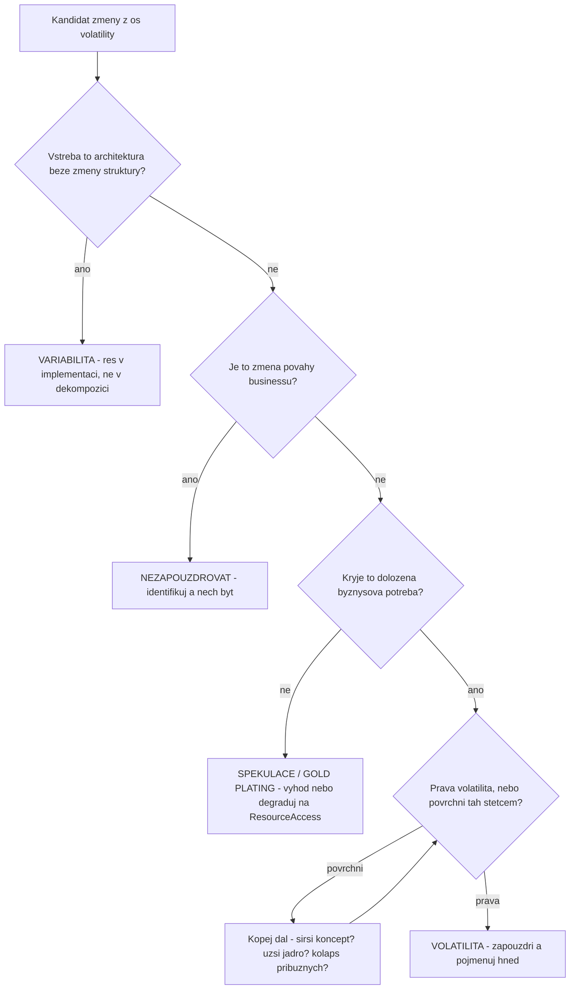

# Dekompozice podle volatility

Zdroj: díl 1. Jádro Metody: „**Decompose problem domain based on identifying volatilities.**"
Každá volatilní oblast se zapouzdří do komponenty; chování systému vzniká interakcí komponent.
„Encapsulate change to insulate — do not resonate with change."

## Anti-vzory dekompozice (co nikdy)

- **Funkcionální dekompozice** — komponenta per funkce / krok use case. Struktura kopíruje
  požadavky a s každou změnou rezonuje. Diagnóza: „Was cooking ever a requirement?" —
  funkce v zadání bývají řešení maskovaná jako požadavky.
- **Doménová dekompozice** — táž chyba o úroveň hrubší („functional decomposition in
  disguise"). Detekce: Manager per doménová čára vedle sebe (Gym/Pool/Courts Manager),
  duplikované metody napříč nimi. Legitimní jen pokud je doména sama volatilní.
- **Handicap principle:** snadno obhajitelný návrh (zrcadlí zadání) = návrh bez přidané
  hodnoty. „Proving the merit of your design should be difficult."

## Dvě osy hledání volatilit

Každá myslitelná změna leží na jedné ze dvou os:

1. **Týž zákazník v čase** — co se u jednoho zákazníka změní za 1–7 let?
2. **Napříč zákazníky teď** — co je už dnes různé mezi dvěma zákazníky?

Kontroly: osy jsou nezávislé; **stejná položka na obou osách = podezření na funkcionální
dekompozici** (nebo dvě různé volatility slepené do jedné — rozděl). Filtr dlouhověkosti:
„What has changed over the past 5–7 years? Will change in the next 5–7 years."

## Rozhodovací strom kandidáta

Každý kandidát změny projde tímto sítem:

**Tři povinné otázky ke každému kandidátovi:** (1) Co přesně je volatilní? (2) Proč?
(3) Jaká je pravděpodobnost × dopad? Nelze-li odpovědět jasně — „dig deeper".

### Rozlišení variabilita vs. volatilita

- **Variabilita** = změna vstřebatelná bez změny struktury (atribut, číselník, if-else,
  konfigurace). Patří do implementace. Zapouzdřená variabilita = zbytečné komponenty.
- **Volatilita** = změna, která by bez mitigace znamenala „substantial expense" a ripple
  efekty. Patří do dekompozice. Nezapouzdřená volatilita = rezonující systém.
- Past: povrchně „měnlivá" věc bývá variabilní atribut; **pravá volatilita leží
  o abstrakci výš** (ne certifikace řemeslníka, ale kombinace regulace + matching;
  ne turniket, ale odbavení; ne menu terminálu, ale prostředí).

### Horní hranice: povaha businessu

Podstata toho, čím firma je, se téměř nemění — **neZapouzdřovat**, jen identifikovat
(aby se nepletla s funkcionalitou). Spekulativní design („co kdyby dělali kino") odmítat:
„Not on the horizon." Změna povahy businessu je jediný legitimní důvod pro clean slate.
Postoj: „Design both for you and your competitor" — obecnost skrz širší pravou volatilitu,
ne skrz spekulaci.

### Dolní hranice: gold plating

Komponenta bez doložené byznysové potřeby = pozlacování (Currency Engine bez měnového
požadavku). Rozhodčí je seznam business objectives (viz [vize-cile-mise](vize-cile-mise.md)).
Protipól: **vracející se doložená potřeba se pojmenuje hned** („Call out the Education
Manager immediately") — pojmenování prázdné komponenty nestojí nic a chrání budoucí trhání.

## Transformace požadavků: swim lanes

„You should never directly use the requirements." Activity diagramy use cases rozděl do
plaveckých drah podle **oblastí odpovědnosti** (ideálně = oblasti volatility). Dráhy →
kandidáti subsystémů; zpětně: z dekompozice vygeneruj dráhy a porovnej se zadáním (pokrytí).
Smells: use case bez drah = „community swimming pool" (big ball); dráha bez komponenty
v call chainu = díra v dekompozici. „A good mapping does not assure a good design" —
ale nemožnost mapování je problém.

## Ekonomika: U-křivka

S počtem komponent klesá cena za komponentu a roste cena integrace → celkové náklady mají
minimum. Cíl: „**the minimal set of interacting services that satisfy use cases**" —
současné i budoucí. Extrémy: God Service (levý konec — boj s komplexitou uvnitř) vs. hadí
hnízdo mikroslužeb s orchestrací v klientovi (pravý konec). Táž křivka platí pro počet
komponent, počet kontraktů komponenty i granularitu obecně. Empirie: správná architektura
bývá i nejlevnější.

## Features = produkt integrace

„**Features are always and everywhere product of integration, not implementation.**"
Lakmus: jde-li na feature ukázat prstem v jedné komponentě, návrh je podezřelý
z funkcionální dekompozice. Změna use case má měnit **workflow** (Manager), ne komponenty
pod ním. Manager je „almost expendable" — nese nejvolatilnější, nejlevněji nahraditelnou
část.

## Test odolnosti (povinný závěr návrhu)

Vyber 3–5 realistických změn (z obou os + jedna amorfní) a ověř: každá změna zůstane
zadržena v jedné komponentě. Zasáhne-li změna 3+ komponent, vrať se k hledání volatilit.
A epistemická pojistka: „**The fact that it wasn't difficult should be a red flag.**"
