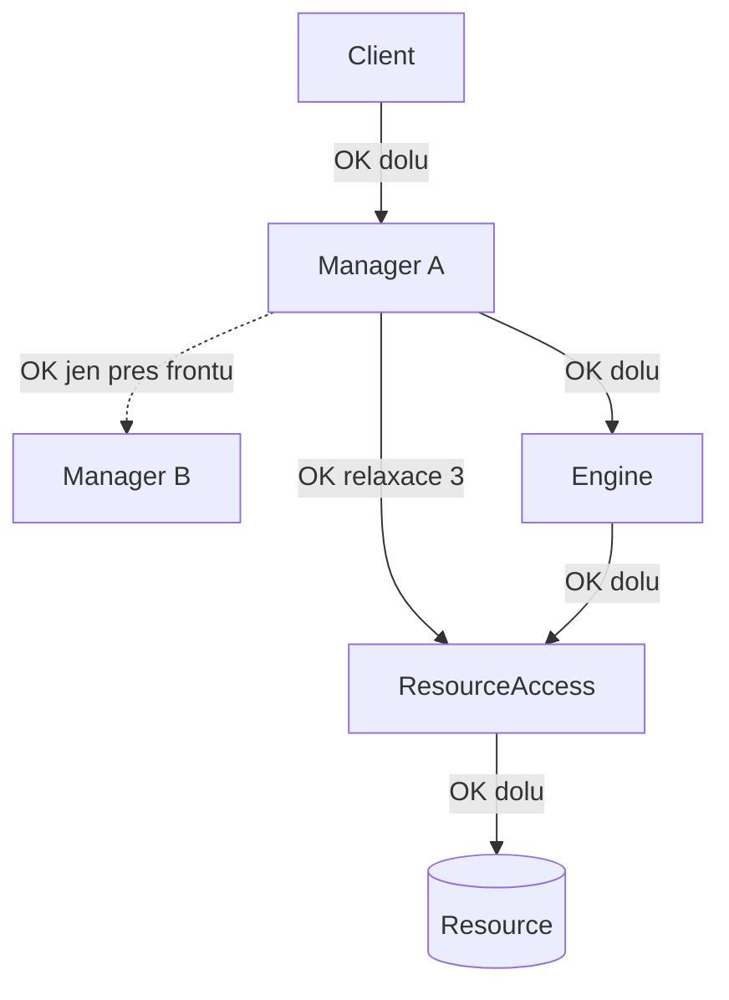

# Uzavřená architektura a pravidla interakce

Zdroj: díl 2. Nejstabilnější část celé doktríny (beze změny 2008–2015).

## Uzavřená architektura

Tři režimy volání mezi vrstvami: **otevřená** (kdokoli kohokoli — vrstvy ztrácejí smysl),
**uzavřená** (jen do vrstvy bezprostředně pod sebou — nikdy nahoru, nikdy do stran),
**polouzavřená** (kamkoli níž — jen pro infrastrukturu). Doktrína:
„**Always strive for closed architecture.**"

Synchronní volání do stran = **coupled use cases**: dva Manageři volající se navzájem jsou
jeden propletený subsystém (příznak funkcionální dekompozice).

## Čtyři povolené relaxace

1. **Utility volatelné odkudkoli** — neobsahují doménu.
2. **Manager → Manager do stran jen přes frontu** (queued call) — viz Law of 0,1 níže.
3. **Manager smí přeskočit Engine a volat ResourceAccess přímo** — „not all steps in use
   case are volatile".
4. Engines a ResourceAccess jsou „thin" vrstvy — jejich přeskočení neeroduje zapouzdření.

Zakázané směry (nekresli je, kontroluj je): Manager → Manager synchronně; Engine → Engine;
ResourceAccess → ResourceAccess; Client → Engine/RA (přeskočení Manageru); cokoli nahoru.

## 17 pravidel interakce („Method Don'ts")

1. Manager používá nula či více Engines.
2. Manageři sdílejí Engines a ResourceAccess — E a RA jsou primární jednotky reuse.
3. Manageři volají do stran **pouze přes frontu**; „Do not queue calls to more than one
   manager."
4. Manageři volají Engines a ResourceAccess synchronně.
5. Klient by neměl volat více Managerů v jednom use case (jinak jsou Manageři coupled).
6. Nikdy nefrontovat volání na Engines.
7. Nikdy nefrontovat volání na ResourceAccess.
8.–11. Události nepublikují: Engines, Clients, ResourceAccess, Resources —
   **publikovat smí jen Manager**.
12. Engines nesubscribují události.
13. Engines nikdy nevolají jiné Engines.
14. ResourceAccess nikdy nevolá jiný ResourceAccess.
15. Mezi vrstvami se předávají pouze: primitiva, pole primitiv, data contracts, pole data
    contracts; každá vrstva smí mít vlastní interpretaci.
16. Nikdy nesdílet logiku za data contracts mezi vrstvami: „'Business Entities' break
    encapsulation."
17. Utility a iFX jsou ubiquitní; mohou být layer specific.

### Law of 0,1 (k pravidlu 3)

Manager frontuje do stran buď žádnému, nebo **vždy témuž jednomu** Manageru. Nejde jen
o počet, ale o identitu: „Is it always those two? Encapsulate the volatility."
Kolísá-li cíl, patří tam pub/sub, ne fronta.

### „There are no gremlins" (k pravidlům 8–12)

Události nevznikají samy: jediným publisherem je Manager, protože jen on zná kontext use
case. Engine, který publikuje, si osobuje znalost workflow, která mu nepatří.

### Data mezi vrstvami (k pravidlům 15–16)

Jen hodnoty — DTO bez chování. Sdílená doménová entita s metodami rozprostírá logiku
po systému a coupluje vrstvy na jedinou interpretaci dat.

## Použití jako kontrola sekvencí (QA)

Při kontrole sequence/call chain diagramu ověř pro každou zprávu: (a) směr jen dolů nebo
povolená relaxace; (b) frontované jen Manager→Manager a vždy týž cíl; (c) publikace
událostí jen z Managerů; (d) klient v jednom use case mluví s jedním Managerem.
Porušení hlas jako smell s odkazem na číslo pravidla — a pamatuj: potřeba systém „otevřít"
typicky indikuje potřebu pub/sub nebo queuingu, ne výjimku z pravidel.
