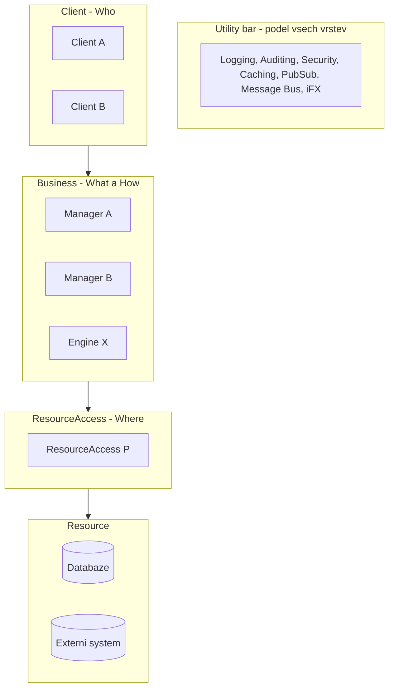

# Taxonomie komponent

Zdroj: díl 2. Role jsou definovány „loosely" — vodítko, ne dogma; každá zapouzdřuje jednu
klasickou oblast volatility. „Layers encapsulate top-down. Services inside layers
encapsulate sideways."

## Vrstvená šablona

Mapování **Who/What/How/Where**: Clients = Who, Managers = What (use cases),
Engines = How (aktivity), ResourceAccess = Where (zdroje). Gradient: **volatilita klesá
shora dolů, znovupoužitelnost roste** — opačný gradient je příznak funkcionálního návrhu.

## Role

### Client (Who)
Člověk i jiný systém. Zapouzdřuje volatilitu klientských technologií. Jediný vstupní bod
do systému. Smí: validace vstupů, jednoduché transformace. **Nesmí: business logika**
(množství kódu v klientovi = univerzální diagnostika špatného designu; terminální stádium
= Big Client).

### Manager (What) — kontextová orchestrace
- Kolekce **souvisejících use cases**; orchestruje workflow voláním Engines a ResourceAccess.
- „Workflow varies, BL does not" — Manager nese volatilní sekvenci, ne pravidla.
- Čtyřnásobná hranice: transakce, security, primární fault boundary, **scale unit**.
- Jediná role s awareness user session a app kontextu. Instance: **per-call**.
- „Almost expendable" — velmi lehký, nízké TCO, při změně smí být total loss.
- Kontrakty hrubozrnné, byznysové; smějí být kontextově specifické — ale Manager per
  klientská platforma (iPad/iPhone Manager) je selhání.
- **Jméno = podstatné jméno.** Sloveso ve jménu = funkcionální smell.

### Engine (How) — jednotka znovupoužitelnosti
- Provádí atomické aktivity a pravidla: Validate, Rate, Calculate, Transform, Search…
- **Jméno = sloveso / slovesné podstatné jméno** (Validation, Scheduling). Čisté podstatné
  jméno = smell.
- Není session/context aware — proto je reusable; sdílí ho více Managerů (Strategy pattern:
  Manager volí, Engine o Managerech neví).
- Nikdy nevolá jiný Engine, nepublikuje ani nesubscribuje události.
- „**Engines are somewhat rare**" — mnoho Engines = podezření (rozmazaná odpovědnost, nebo
  nová-funkce-nový-engine = funkcionální dekompozice).

### ResourceAccess (Where) — „where the SQL lives"
- Zapouzdřuje přístup ke zdroji; decoupluje systém od technologie, umístění i schématu.
- Kontrakty = **business slovesa, ne CRUD** („Resist the RAD temptation! Especially for
  Read"); use-case-informed, never context specific.
- Smell: zrcadlení schématu (service per tabulka, veřejný CRUD) = data-centric anti-pattern.
- Nikdy nevolá jiný ResourceAccess. Jméno = podstatné jméno dle core entity.

### Resource
Fyzický zdroj (DB, fronta, externí systém — i platební systém třetí strany je Resource
za ResourceAccess, ne Manager). Bez kontraktů. **Žádná business logika ve stored
procedures.** Instance: singleton. Pojmenování věcně dle core entit.

### Utility a iFX
- Utility: Logging, Auditing, Security, Caching, Pub/Sub, Message Bus — černé skříňky bez
  domény, **volatelné z jakékoli vrstvy** (jediná plošná výjimka uzavřenosti). Smějí být
  layer specific. V integračním plánu se stavějí první.
- iFX = doménou informovaná infrastruktura: jednotný programovací model pro vývojáře
  systému; neobsahuje doménový kód, přesto není generický framework. Heuristika:
  „Keep domain-specific abstract. Keep abstract infrastructure specific."
- Logbook: „Cannot do too much logging"; propagace activity ID napříč komponentami.

## Logická služba

Koherentní trojice Manager + Engines + ResourceAccess navenek tvoří **logickou službu**:
implementuje sadu use cases, je cílem vertikálního řezu a přirozenou etapou projektu.

## Workflow Manager

Manager, který workflow create/store/load/execute (typicky nad workflow enginem).
Nasazení jen když **rychlost změn chování překročí schopnost tým Manager přepisovat** —
a zdůvodňuje se objectives, ne vkusem. Pasti: workflow manager jako všelék na všechny
volatility; přebytek workflow managerů kopírujících doménové linie = doménová dekompozice
jiným jménem.

## Kalibrace počtů (TradeMe empirie)

Průměrné zralé řešení: **3,4 Manageru, 3,8 Engine, 4,0 ResourceAccess**. Výrazně víc
komponent v kterékoli roli = důvod k přezkoumání (viz [design-smells](design-smells.md)).
