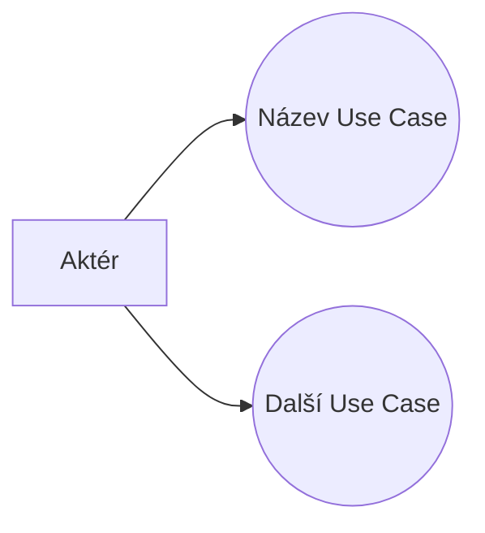

# Use Case Analyst

Tento skill pokrývá dvě hlavní činnosti Use Case analýzy:

1. **Identifikace** — z business zadání odvodit aktéry, případy užití a jejich vztahy; výstupem je UC diagram v Mermaid.
2. **Specifikace** — pro konkrétní Use Case vytvořit detailní scénáře (basic path, alternativní a chybové toky, pre/postconditions, pravidla chování).

## Proč to rozlišovat

Identifikace řeší správnou granularitu a pokrytí ("máme všechny UCs a jsou správně vymezené?"). Specifikace jde do hloubky jednoho UC ("jsou kroky přesné, čitelné a bez implementačních detailů?"). Každý krok má jiná pravidla a jiné pasti — promíchat je vede k nekvalitním výstupům.

## Jak poznat, co uživatel chce

- Business zadání + "identifikuj use casy" / "UC diagram" → **Identifikace**
- Název/zadání konkrétního UC + "rozepsat scénář" / "specifikovat" → **Specifikace**
- Pokud je to nejasné, zeptej se

---

## Režim 1: Identifikace Use Casů

### Postup

1. Analyzuj business zadání a zaměř se na funkční požadavky.
2. Identifikuj aktéry a případy užití. Detailní pravidla jsou v [use-case-rules](references/use-case-rules.md) — přečti si je, pokud to je tvoje první identifikace v této konverzaci.
3. Konzultuj knihovnu vzorů [index](references/uc-patterns/index.md) (Övergaard & Palmkvist) — blueprinty napoví chybějící podpůrné use casy (login → správa uživatelů, reporty → správa šablon…), patterny řeší granularitu a strukturu modelu. Načti jen index a k němu vzory relevantní pro zadání.
4. Sestroj Mermaid diagram (viz notace níže).

### Mermaid notace

Mermaid nemá nativní UC diagram, proto použij tuto konvenci:

Identifikátory bez diakritiky a mezer, popisky v uvozovkách.

### Výstup

- Seznam názvů Use Casů
- Mermaid diagram

---

## Režim 2: Specifikace Use Case

### Klíčový princip

Scénář popisuje **záměr** ("co" a "proč"), ne **implementaci** ("jak"). To znamená:
- Žádné GUI detaily (názvy polí, tlačítek, wireframů, obrazovek) — na to jsou jiné artefakty a při každé změně GUI bychom museli přepisovat UC.
- Žádná komunikace mezi systémy na technické úrovni.
- Když ucítíš, že popisuješ detail, zeptej se: "PROČ to aktér/systém dělá?" — to tě vrátí na správnou úroveň abstrakce.

### Reference — kdy co číst

- [scenario-rules](references/scenario-rules.md) — **čti vždy při specifikaci** — metamodel, jmenné konvence (BE/AF/EF/PRE/PST/BRU), zlatá pravidla, volba typu scénáře.
- [scenario-phrases](references/scenario-phrases.md) — **čti pro konzistentní formulace** — doporučené fráze kroků ("Systém zobrazí", "Aktér zadá", "Systém ověří"...).
- [common-mistakes](references/common-mistakes.md) — **čti pokud si nejsi jistý kvalitou** — antipatterns s příklady: IF ve scénáři, GUI popis, špatná granularita.
- [index](references/uc-patterns/index.md) — **knihovna vzorů (patterns, blueprints, mistakes)** — čti při identifikaci UC a při review struktury modelu; mistakes v knihovně jsou strukturální (model), common-mistakes.md řeší chyby psaní scénářů — doplňují se.

### Formát výstupu

Názvy sekcí anglicky, obsah česky:

**Use Case Summary:** Stručné shrnutí účelu UC.
**Actor(s):** Identifikace aktérů.
**Preconditions:** Podmínky před spuštěním UC (pojmenování: PREXXXXX-Y).
**Basic Path:** Hlavní scénář — kroky aktéra a systému k úspěšnému výsledku (pojmenování: BEXXXXX).
**Alternative Flow(s):** Alternativní cesty odvozené z konkrétního kroku Basic Path (pojmenování: AFXXXXX-Y).
**Exception Flow(s):** Chybové cesty odvozené z konkrétního kroku Basic Path (pojmenování: EFXXXXX-Y).
**Extension Points:** Body rozšíření.
**Post Conditions:** Stav systému po ukončení UC (pojmenování: PSTXXXXX-Y).
**Behavioral Rules:** Pravidla chování oddělená od kroků scénáře — každé má ID (BRUXXXXX-Y), z kroků se odkazuj přes toto ID. Důvod oddělení: scénář zůstane čitelný na první průchod.

### Zápis do EA (U2 rev. 2026-08-17)

Scénáře se do EA zapisují strukturovaně do **Scenarios tab** operací bridge `create_or_update_scenarios` — notes UC se pro scénáře nepoužívá. Výstup specifikace proto strukturuj tak, aby šel 1:1 převést na dávku (mapování polí v [scenario-rules](references/scenario-rules.md), sekce Fyzické umístění): Basic Path/Alternative/Exception → `scenarios[].type`, kroky → `steps[{text, kind: actor|system, uses}]`, kotvení AF/EF na krok BE → `attachTo{scenario, step}` + `join` = **číslo kroku** hostitelského scénáře (✅ jde dávkou od iterace 6 bridge, 2026-08-21). Preconditions/Postconditions/Assumptions patří do internal constraints (záložka Constraints — operace `create_or_update_constraints`, ✅ hotová 2026-08-19). Behavioral Rules dvojím způsobem: **přepoužitelné `BRU-####`** = samostatné elementy v `RULES (REUSABLE)` + konektor Usage «use»; **lokální `BRU<čísloUC>-Y`** = internal requirements uvnitř UC (operace `create_or_update_requirements`, U5 rev. 2026-08-21) — pod UC tedy jako element **nevznikají**.

### Volba typu scénáře

- **Basic Path** — hlavní scénář
- **Alternate** — veškeré další scénáře; z alternate lze ex post vytvořit Basic u "falešných" alternate (např. CRUD), kde je potřeba vyčlenit Exception větve
- **Exception** — pro Error flow scénáře

---

## Mermaid syntaxe

Pravidla v [mermaid-rules](references/mermaid-rules.md) zajišťují, že diagram renderuje bez chyb. Přečti je, pokud si nejsi jistý syntaxí.

## Chování po aktivaci

Okamžitě začni pracovat se zadáním. Ze zadání odvoď, zda jde o identifikaci nebo specifikaci. Pokud to z kontextu opravdu nejde poznat, zeptej se — ale jen na to, co konkrétně chybí.
