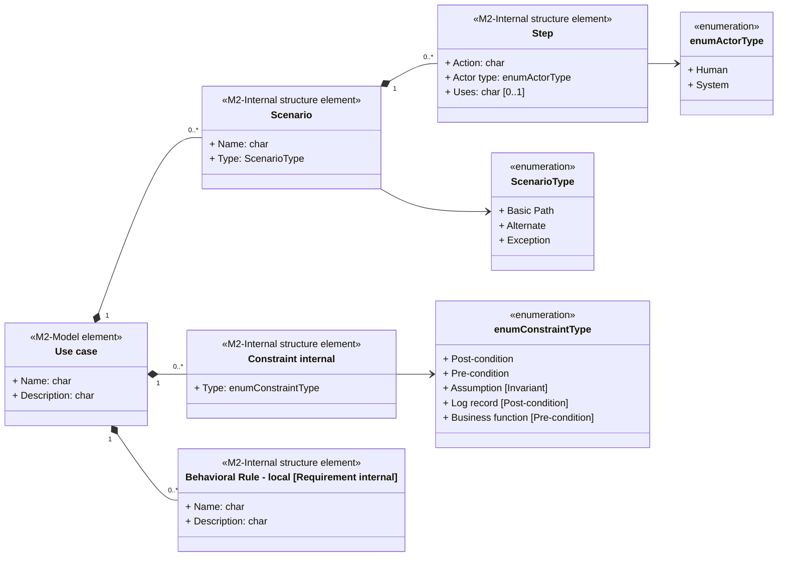

## Zlatá pravidla

1. Nikdy "nešpiníme" kroky scénáře specifickými pravidly - scénář musí být na první přečtení čitelný
2. Nikdy nepopisujeme ve scénáři GUI - na to máme jiné artefakty a nechceme přece kvůli každé změně v GUI přešvalovávat Use Case
3. Když se dostaneme do pasti popisu GUI či čítíme, že popisuje detail, který při implementaci může nakonec vypadat úplně jinak, odpověď na otázku "PROČ to Actor/Systém dělá?" vás vrátí zpátky na správnou kolej.
4. Aktivity diagram generujeme jen v případě, že to má přidanou hodnotu:
   a. z pohledu autora jako kontrolu správného větvení  
   b. z pohledu čtenáře pro snadnější pochopení

## Metamodel

## Jmenné konvence
| ID      | Pravidlo                   | Popis                                                                                                                                                                                                                                                                                 |
| ------- | -------------------------- | ------------------------------------------------------------------------------------------------------------------------------------------------------------------------------------------------------------------------------------------------------------------------------------- |
| N-SCN01 | Vazba na číslo UC          | Všechny níže uvedené vnitřní struktury jsou vázány na číslo Use case, které je reprezentováno znaky `XXXXX` a je případně doplněno o pořadové číslo `Y` v případě více výskytů. Pozn. Důvodem je snadnost dohledání daného detailu, kdy již ze jména vím, v jakém Use case ho hledat. |
| N-SCN02 | Základní scénář            | `BEXXXXX` Jméno základního scénáře                                                                                                                                                                                                                                                    |
| N-SCN03 | Alternativní scénář        | `AFXXXXX-Y` Jméno alternativního scénáře                                                                                                                                                                                                                                              |
| N-SCN04 | Chybový scénář             | `EFXXXXX-Y` Jméno chybového scénáře                                                                                                                                                                                                                                                   |
| N-SCN05 | Pravidlo chování - interní | `BRUXXXXX-Y` Business rule příslušné konkrétnímu UC a umístěné uvnitř UC (Element Requirement uvnitř scénáře) - pozn. v UC se referuje jen přes ID pravidla                                                                                                                           |
| N-SCN06 | Precondition               | `PREXXXXX-Y` Constraint typu precondition                                                                                                                                                                                                                                             |
| N-SCN07 | Postcondition              | `PSTXXXXX-Y` Constraint typu postcondition                                                                                                                                                                                                                                            |
| N-SCN08 | Asumption                  | `ASUXXXXX-Y` Constraint typu invariant                                                                                                                                                                                                                                                |

## Fyzické umístění v EA (U2 rev. 2026-08-17)

Původní U2 (2026-07-02: scénář = strukturovaný text v notes UC, Scenarios tab se neplní) bylo **revidováno 2026-08-17** — mechanika zápisu do Scenarios tab existuje a je ověřená (`create_or_update_scenarios`, ea-file-bridge PROTOKOL-EAFB v0.5 §6b, dávka 20260818-28). Platí: **scénáře žijí výhradně v Scenarios tab, notes UC se pro scénáře nepoužívá** (žádné zrcadlo).

Mapování metamodelu na operaci `create_or_update_scenarios`:

| Metamodel | Operace / Scenarios tab |
| --- | --- |
| Scenario (Name, Type) | `scenarios[{name: "BEXXXXX Jméno" …, type: "Basic Path" \| "Alternate" \| "Exception"}]` |
| Step.Action | `steps[].text` (odkazy na BRU přes ID přímo v textu kroku) |
| Step.Actor type (Human/System) | `steps[].kind`: `actor` \| `system` |
| Step.Uses | `steps[].uses` (dále k dispozici `results`, `state`) |
| Vazba AF/EF na krok BE | `attachTo{scenario, step}`; návrat `join` — **EA drží návrat na KROK** (záložka Scenarios → Entry Points, sloupec `Join`: číslo kroku BE nebo `End`). ✅ **Zápis jde dávkou** od iterace 6 bridge (2026-08-21, docs v0.12 §6i): `join: <číslo kroku hostitelského scénáře>` (executor ho přeloží na GUID kroku), `"End"` nebo vynechané pole = větev končí; jméno scénáře, číslo mimo rozsah i `join` bez `attachTo` = **warning + End**. Návrat formuluj na úrovni KROKU („návrat do kroku M"), ne scénáře. Dřívější ruční krok ZRUŠEN. ⚠ Historie: nález N-1 („join = jméno scénáře, EA neumí návrat na krok") byl **VYVRÁCEN** — EA to umí, neuměl to bridge |
| Constraint internal (PRE/PST/ASU) | **mimo Scenarios tab** → internal constraints (záložka Constraints, t_objectconstraint); operace bridge `create_or_update_constraints` (✅ hotová 2026-08-19) |
| Behavioral Rule — local (BRU) | **mimo Scenarios tab** → **internal requirement uvnitř UC** (záložka Responsibilities → Requirements, `t_objectrequires`; název `BRU<čísloUC>-Y Název`, text v Notes) — ✅ U5 rev. 2026-08-21, dřívější „samostatný element pod UC + Usage konektor" (N-K3-2) je překonané. ✅ **Zápis jde dávkou: bridge operace `create_or_update_requirements`** (iterace 6, 2026-08-21) — ruční krok ZRUŠEN. **Přepoužitelné** `BRU-####` zůstávají samostatným elementem v RULES (REUSABLE) + konektor UC —Usage «use»→ BRU |

Update scénářů = deterministický rebuild (V2d): dávka vždy nese kompletní sadu scénářů UC, executor smaže a postaví znovu.

## Pravidla volby typu scénáře

**Basic Path** - hlavní scénář

**Alternate** - veškeré další scénáře tvoříme jako Alternate/Exceptions s tím, že z alternate ex post můžeme vytvořit Basic v případech, kdy se jedná o "falešný" alternate (např. CRUD) a zároveň potřebujeme vyčlenit Exception větve, případně Alternate

**Exception** - používáme pro Error flow scénáře

## Chybové stavy ve scénářích (metodika v2, kap. 12.7)

Chybový stav modelujeme pouze tam, kde mění chování systému:

1. **Business výjimka** (zamítnutí, chybějící oprávnění, duplicita) → Exception Flow `EFXXXXX-Y`; podmínku vzniku vyčleň jako BRU (`BRUXXXXX-Y`) a z kroku na ni jen odkazuj přes ID.
2. **Funkční výsledek služby** (nenalezeno, prázdná množina) → do scénáře JEN pokud má business význam; jinak patří do specifikace rozhraní a realizace služby.
3. **Technická chyba** (timeout, HTTP kódy, výpadek DB/sítě) → do scénáře NIKDY. Výjimka: má-li business předepsanou reakci („scoring nedostupný > 30 s → manuální schválení"), je to business pravidlo — zapiš jako BRU + odpovídající Alternate/Exception flow.
4. **Textace chybových hlášek** do scénáře nepatří (stejné pravidlo jako GUI) — maximálně logická informace „systém informuje aktéra o …".

Detail s příklady: `error-handling.md` (mimo workspace — vyžádej od uživatele) (od rootu vaultu `IT-ANALYSIS/podklady/error-handling.md`).
