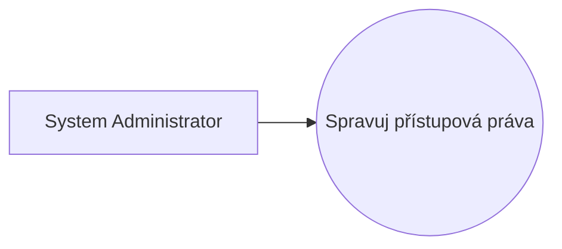
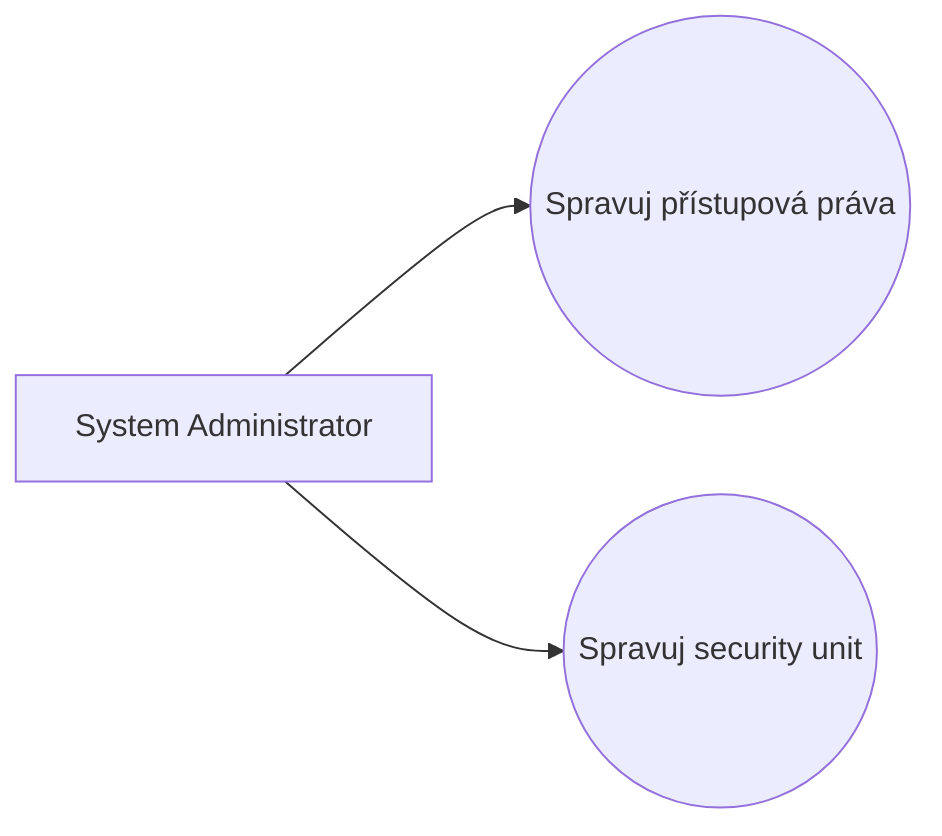
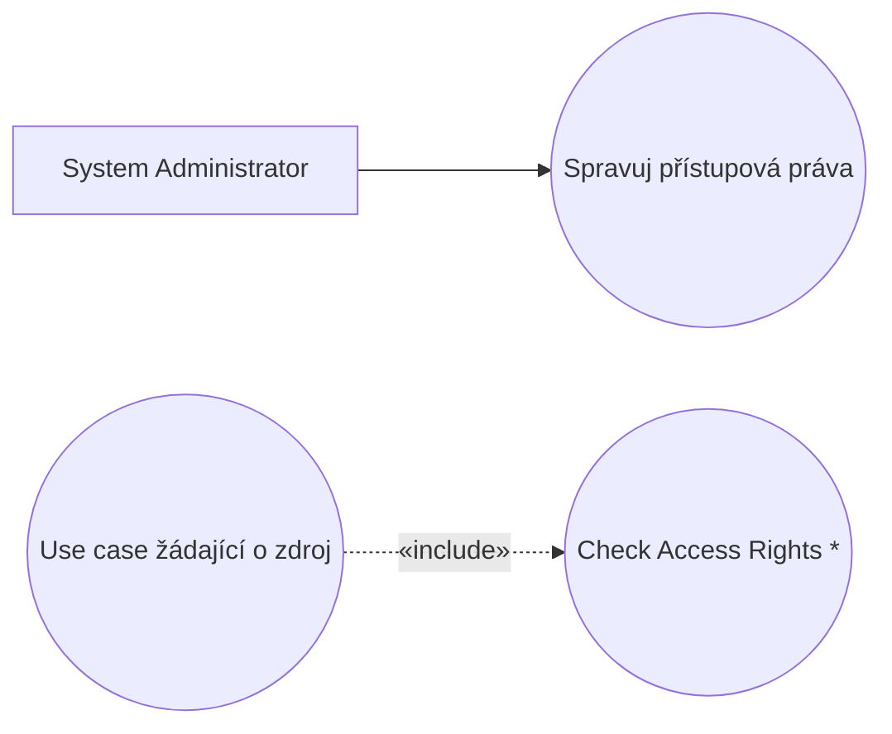
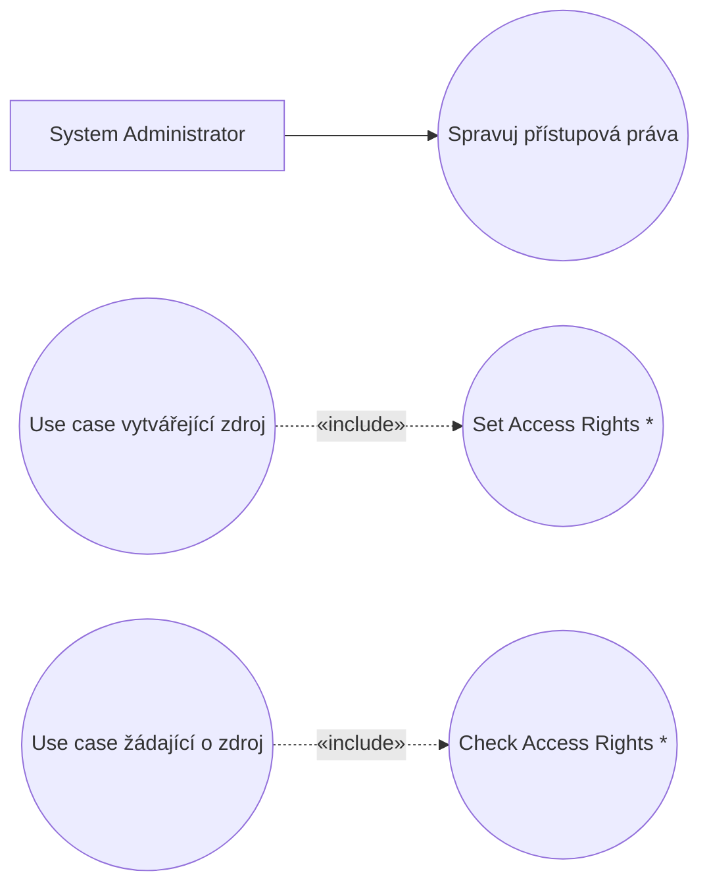
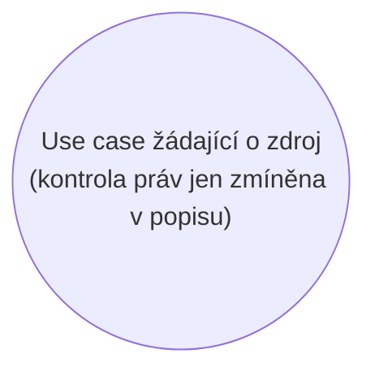

# Blueprint: Access Control

> Zdroj: Övergaard & Palmkvist, Use Cases – Patterns and Blueprints, kap. 27.
> Typ: Use-case blueprint | Characteristics: Common problem, basic solution.
> Klíčová slova: přístupová práva, kontrola přístupových práv, přístup k datům, ochrana informací, úroveň zabezpečení, bezpečnostní politika.

## Problem

Systém má obsahovat zabezpečení přístupu: přístup k informacím a službám systému je dán konkrétními přístupovými právy přidělenými jednotlivým uživatelům.

## Blueprints

### Access Control: Embedded Check

Model tvoří jediný use case `Manage Access Rights` pokrývající registraci a odregistraci přístupových práv. Samotná kontrola práv se v této variantě pouze zmiňuje v popisech use casů, které využívají chráněné zdroje systému — v modelu není vyjádřena explicitně.

**Applicability:** Preferováno, když kontrola přístupových práv nemá být explicitně vyjádřena v modelu.

### Access Control: Dynamic Security Units

Oproti první variantě přibývá use case `Manage Security Unit`, pokrývající registraci a odregistraci tzv. security units — tedy definici toho, které informace a které služby vůbec podléhají kontrole přístupu.

**Applicability:** Preferováno, když kontrola práv nemá být v modelu explicitní, ale definice chráněných zdrojů i správa práv jsou dynamické — lze je měnit za běhu systému.

### Access Control: Explicit Check

Kontrola práv je v modelu explicitní: abstraktní use case `Check Access Rights` popisuje, jak se kontrola provádí, a je vkládán (include) do všech use casů, v nichž se nějaké přístupové právo kontroluje.

**Applicability:** Preferováno, když má být kontrola přístupových práv ke zdroji v modelu explicitní.

### Access Control: Internal Assignment

Pro systémy, kde se informace či funkce přidávají dynamicky a mají automaticky dostat svá přístupová práva, přibývají dva use casy: abstraktní `Set Access Rights` definuje, jak se práva nastaví automaticky při vzniku nové informace/funkce bez účasti `System Administrator` (např. výchozí hodnoty, nebo zkopírování z jiné security unit); druhým je use case modelující jakékoli užití systému, které vytváří nový chráněný zdroj.

**Applicability:** Použije se, když vytváření chráněných zdrojů v systému probíhá dynamicky.

### Access Control: Implicit Details

Provedení kontroly práv se jen zmíní v popisu use casů žádajících o zdroje; všechny ostatní detaily správy přístupu jsou z use-case modelu abstrahovány. Jak se kontrola provádí, zachycuje až realizace modelu (nižší vrstva).

**Applicability:** Použije se, když přístupová práva nemají být v modelu explicitní a žádné detaily řízení přístupu se nemají v use-case modelu zachycovat — typicky když je access control řešen v nižší vrstvě.

## Discussion

Téměř žádný uživatel nesmí mít přístup ke všemu — systém potřebuje mechanismus ochrany dat, zdrojů a funkcí před neoprávněným i nechtěným užitím, od velmi jednoduchého po sofistikovaný. Kniha volí jednoduchý přístup (čtení/aktualizace informací, užití funkcí), který lze z pohledu use casů snadno rozšířit.

V každém use casu, kde je bezpečnost relevantní, musí proběhnout kontrola práv, jakmile systém přistupuje k chráněné informaci nebo aplikuje chráněnou funkci. Kontrolu lze vyjádřit přímo v každém dotčeném use casu (`Embedded Check`); jakmile je ale dotčeno více use casů, hlavní alternativou je `Explicit Check` — extrakce kontroly do abstraktního inclusion use casu. Výhody: kontrola je explicitní, lze ji revidovat samostatně a při změně provedení kontroly se mění jediný use case. Nevýhoda: inclusion use case bývá velmi malý nebo na příliš nízké úrovni abstrakce (viz [mistake-mix-of-abstraction-levels](mistake-mix-of-abstraction-levels.md)); pak jej lze z modelu vypustit a v popisech jen konstatovat, ŽE se práva kontrolují (případně s odkazem na business rule s bezpečnostní politikou, viz [pattern-business-rules](pattern-business-rules.md)). Ponechat abstraktní inclusion use case v modelu je ale vždy bezpečné.

Správa práv musí být v modelu také: `Manage Access Rights` iniciovaný `System Administrator` je typický CRUD use case (viz [pattern-crud](pattern-crud.md)). Pokročilejší řešení dává `Dynamic Security Units` — umožňuje za běhu definovat, co je chráněným zdrojem (např. knihovna dodatečně prohlásí tiskárny za security unit a právo tisku dá jen knihovníkům). Pokud práva vznikají bez administrátora (např. nový soubor dědí práva ze složky), použije se `Internal Assignment`. Když je celá správa přístupu pod úrovní abstrakce modelu, použije se `Implicit Details`.

`Access Control` blueprinty je téměř vždy nutné kombinovat s vhodnou variantou [blueprint-login-and-logout](blueprint-login-and-logout.md) — bez identifikace uživatele nelze práva kontrolovat.

## Example

Online registrační systém konference: účastníci si přes formuláře čtou informace o akcích (přednášky, jídla, zábava) a registrují se na ně; přístup k některým formulářům je omezen. `Form Administrator` formuláře vytváří (`Manage Form` — formulář lze označit jako security unit → varianta `Dynamic Security Units`) a definuje, kdo smí číst a kdo se registrovat (`Manage Access Rights of a Form`). Kontrola je modelována variantou `Explicit Check`: abstraktní `Check Access Rights` je vkládán do `Present Event Information` a `Register to an Event`. Práva administrátora na správu formulářů jsou naopak jen zmíněna v popisech (`Embedded Check`).

Fragment use casu `Zaregistruj se na akci`:

1. **Účastník** zvolí registraci na akci a zadá název formuláře.
2. **Systém** provede vložený use case `Check Access Rights` (je-li formulář security unit, ověří práva číst a registrovat se podle identity přihlášeného uživatele).
3. **Systém** zobrazí formulář; má-li účastník právo registrace, zpřístupní registrační část.
4. **Účastník** zvolí registraci.
5. **Systém** uloží registraci uživatele k akci.

Alternativní větev: nemá-li účastník právo číst obsah formuláře, systém jej informuje a use case končí.
