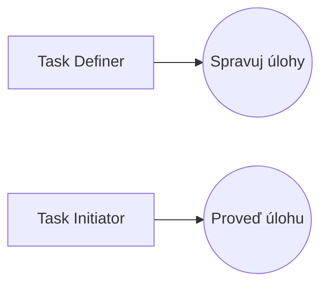
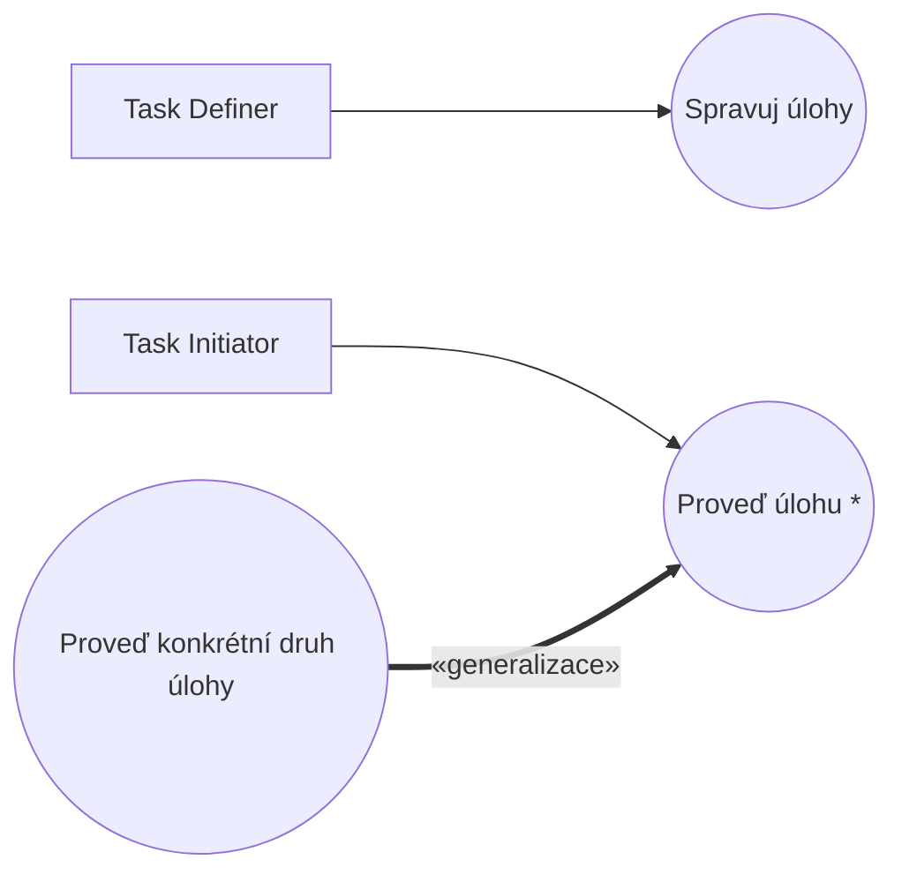
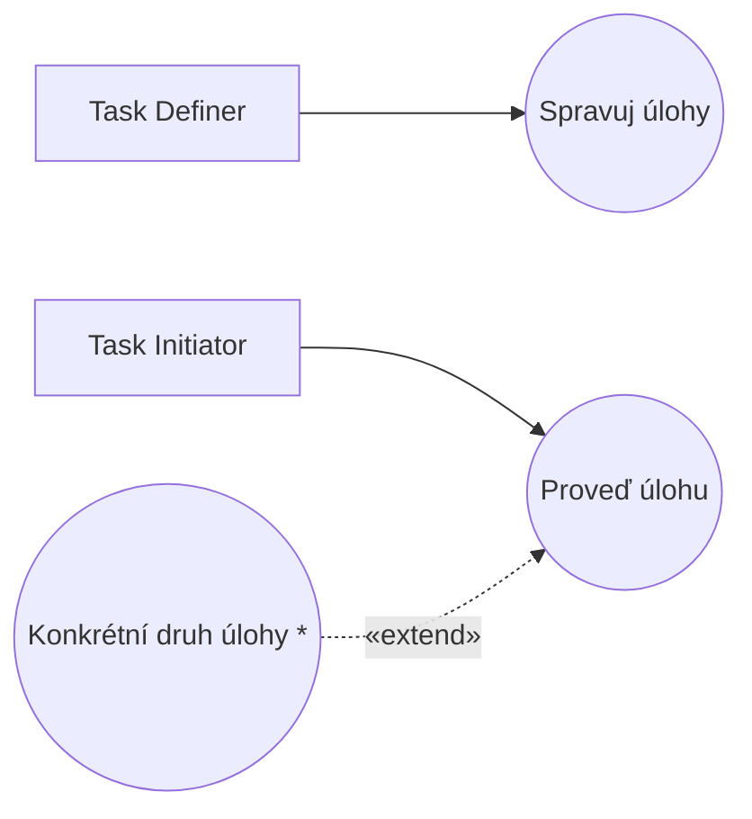
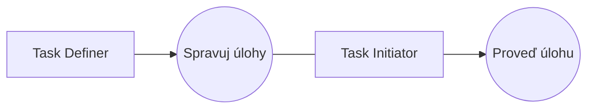

# Blueprint: Future Task

> Zdroj: Övergaard & Palmkvist, Use Cases – Patterns and Blueprints, kap. 28.
> Typ: Use-case blueprint | Characteristics: V některých doménách velmi časté. Pokročilé.
> Klíčová slova: dávková úloha (batch job), odložené provedení, provedení úlohy, registrace úlohy, plánování (scheduling), časově řízená iniciace use casu.

## Problem

Úloha je v systému zaregistrována v jednom okamžiku, ale její skutečné provedení má proběhnout později.

## Blueprints

### Future Task: Simple

Dva use casy: `Manage Task` registruje informace od `Task Definer` o úloze, která se má provést později. `Perform Task` je v pravidelných intervalech iniciován aktérem `Task Initiator`; modeluje výběr úlohy k provedení i její provedení. Jak se provádějí jednotlivé druhy úloh, je popsáno jako alternativní flows tohoto use casu.

**Applicability:** Použije se, když je množina druhů úloh malá (méně než čtyři), pravděpodobně se nebude měnit a popisy provedení jsou krátké.

### Future Task: Specialization

> **Náš kontext:** Metodika v2 s generalizací mezi UC nepracuje — varianta uvedena pro úplnost, u nás nepreferovaná.

`Perform Task` je abstraktní use case modelující provedení úlohy obecně. `Perform Specific Kind of Task` je jeho specializací: popisuje provedení konkrétního druhu úlohy, přičemž výběr a inicializaci úlohy dědí z `Perform Task`.

**Applicability:** Preferováno, když existuje více různých druhů provedení úloh a když má existovat explicitní ošetření neznámého typu úlohy.

### Future Task: Extraction

`Perform Task` je konkrétní use case, který vybere další úlohu a pak ji jednoduše odstraní. Jak se vybraná úloha provede, modelují extension use casy vkládané do `Perform Task` za výběr úlohy.

**Applicability:** Dvojí výhoda: snadné přidávání nových typů úloh a popisy extension use casů se soustředí čistě na provedení úlohy (nic o výběru). Nevýhoda: ošetření neznámého typu úlohy se modeluje dosti neohrabaně (viz Discussion).

### Future Task: Performer Notification

`Manage Task` notifikuje `Task Initiator` při každé registraci nové úlohy nebo změně existující. `Task Initiator` tak má přehled, kdy se mají registrované úlohy provést, a `Perform Task` se iniciuje jen tehdy, když jsou v systému registrované úlohy — ne v pravidelných intervalech.

**Applicability:** Preferováno, když se úlohy registrují nebo provádějí ve velmi nepravidelných intervalech, nebo když je `Task Initiator` založen na pokročilém plánovači.

## Discussion

Přímočaré řešení — jeden use case zahrnující registraci i provedení úlohy — má zásadní vady. Za prvé, na systémové úrovni nejde o jedno atomické užití systému: registrace úlohy je jedno užití, její provedení druhé (u telefonní ústředny čtenář modelu očekává, že objednání i provedení buzení budou uvedeny explicitně). Za druhé, přeplánování a rušení: zrušení/přeplánování úlohy probíhá v systému, tedy v use casu — a protože use casy spolu nekomunikují, nemohl by rušicí use case informovat běžící „úlohový" use case. Za třetí, odstávka systému: při vypnutí systému (údržba) všechny běžící use-case instance zaniknou — zákazník by přišel o buzení či výplatu jen proto, že mezi registrací a provedením proběhla údržba. Řešení: registraci a provedení modelovat samostatnými use casy (samostatnými instancemi) — po náběhu systému se pro provedení vytvoří instance nová.

Registrační use case přijme informace o úloze a omezeních (priorita, čas, návaznosti), spočte podle plánovacího algoritmu, kdy se má úloha provést, a uloží ji do fronty; volitelně notifikuje `Task Initiator` (`Performer Notification`). Roli `Task Initiator` často hraje předdefinovaný proces OS („use case iniciovaný systémovými hodinami/časem"), jindy jiný systém nebo i člověk (např. noční dávky, ranní rozeslání pracovních příkazů).

Provedení konkrétních druhů úloh lze popsat alternativními flows (`Simple` — model zůstane malý, málo předdefinovaných typů), specializacemi nebo extenzemi (obě vhodné, má-li být model rozšiřitelný o nové druhy úloh). Obecně je specializace lepší než extenze: snadno se přidá specializující use case pro výjimečný případ neznámého typu úlohy. V extenzní variantě to nejde — základní use case musí být na extenzích nezávislý a extenze nezávislé navzájem, takže nelze přidat prosté „Otherwise"; podmínka takové extra extenze musí ručně zachytit negaci disjunkce všech ostatních podmínek a při každé nové extenzi se musí měnit — zásadní nevýhoda. U generalizace dává rodičovský use case úplný popis flow (jen abstrahuje detaily provedení); u extenze je base use case „dutý" — jen vybere, odstraní a smaže úlohu. Výhoda extenze: zdůrazňuje, že všechny případy provádějí přesně týž výběrový algoritmus (nelze jej ve specializaci předefinovat), a umožňuje vybrat kolekci smíšených úloh a iterovat přes ni (u generalizace jen úlohy téhož druhu). Při pochybnostech volte generalizaci.

Viz též [pattern-business-rules](pattern-business-rules.md), [pattern-crud](pattern-crud.md), [pattern-commonality](pattern-commonality.md) a [blueprint-message-transfer](blueprint-message-transfer.md).

## Example

Ukázka kombinuje varianty `Specialization` a `Performer Notification`: `Manage Task` (čtyři basic flows: registrace, změna, zrušení úlohy, zobrazení neúspěšných úloh) notifikuje `Task Initiator` o registraci a změnách času. Abstraktní `Perform Task` vybírá úlohu s nejvyšší prioritou a jeho specializace `Generate Invoicing Basis` kompiluje podklady fakturace a odesílá je aktérovi `Financial System` (specializace přidává asociaci na tohoto aktéra).

Fragment `Spravuj úlohy` (flow Registrace úlohy):

1. **Task Definer** zvolí registraci nové úlohy.
2. **Systém** nabídne možné druhy úloh a vyžádá druh, název a čas provedení.
3. **Task Definer** zadá požadované údaje.
4. **Systém** ověří, že čas je v budoucnosti a název unikátní.
5. **Systém** zaregistruje úlohu jako povolenou a pošle `Task Initiator` notifikaci o nové úloze a času jejího provedení.

Fragment `Generate Invoicing Basis` (část Provedení úlohy): systém sebere všechny objednávky označené jako odeslané, pro každou získá zákazníka, adresu, číslo a hodnotu objednávky, informace odešle `Financial System`, po potvrzení označí objednávky jako fakturované. Alternativní větve: bez potvrzení do dvou minut provedení úlohy selže (status failed); nedostupné údaje objednávky → status „manuální fakturace".
