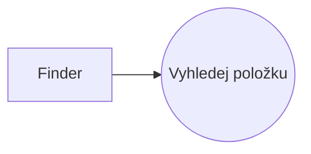
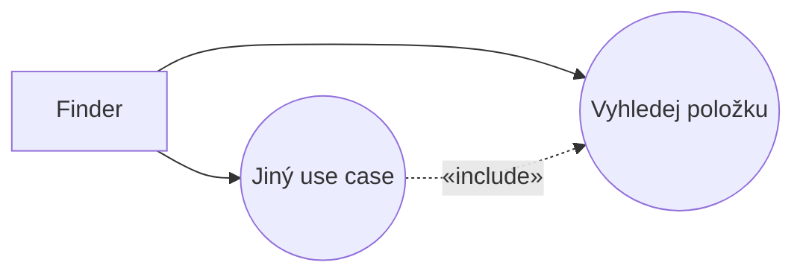
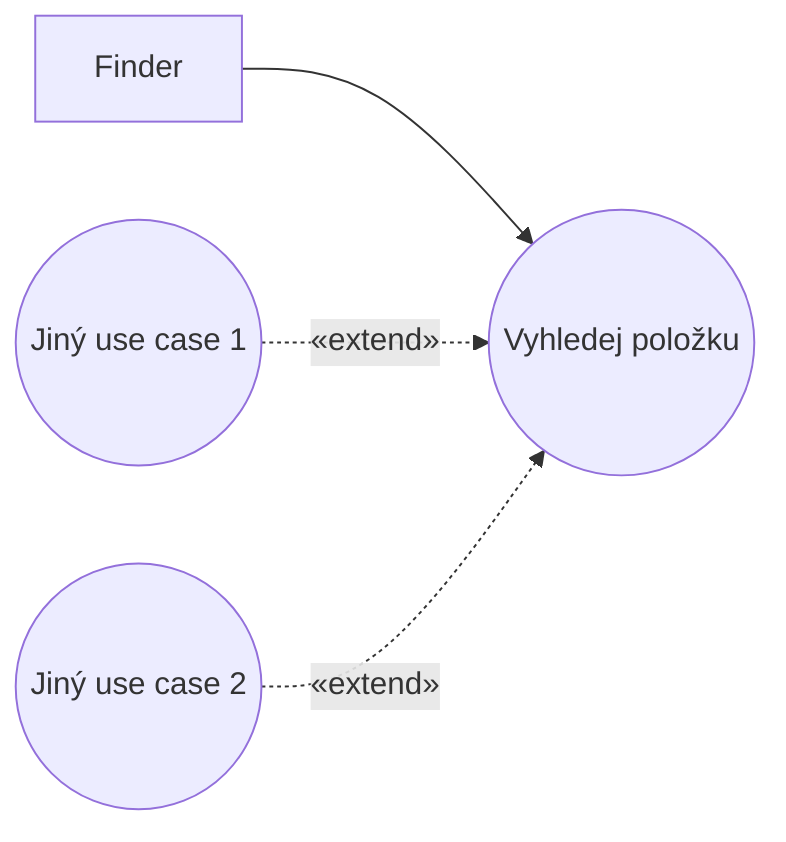

# Blueprint: Item Look-Up

> Zdroj: Övergaard & Palmkvist, Use Cases – Patterns and Blueprints, kap. 29.
> Typ: Use-case blueprint | Characteristics: Velmi časté ve většině domén. Základní řešení.
> Klíčová slova: vyhledání informace, funkční závislost mezi use casy, pořadí vyvolání, pořadí use casů, znovupoužití výsledku vyhledávání, vyhledávání.

## Problem

Systém má uživatelům umožnit vyhledávání položek. Vyhledávací procedura může být samostatná, ale může být využívána i v jiných use casech.

## Blueprints

### Item Look-Up: Standalone

Jediný use case `Look-Up Item`: přijme od aktéra `Finder` vyhledávací kritéria a použije je k identifikaci správné položky v systému.

**Applicability:** Preferováno, když je vyhledání položky samostatným užitím systému a neprovádí se jako součást jiného užití.

### Item Look-Up: Result Usage

Proceduru modelovanou use casem `Look-Up Item` vkládá (include) `Other Use Case` — nalezená položka (či položky) se v něm po vyhledání dále používá. `Look-Up Item` bývá často abstraktní (provádí se jen jako součást jiných use casů), ale není to nutné. Běh začíná v instanci `Other Use Case` a vyhledání je do této instance vloženo.

**Applicability:** Preferováno, když se výsledek vyhledání má znovu použít uvnitř jiných use casů. Jinak je doporučenou variantou `Standalone`.

### Item Look-Up: Open Decision

`Look-Up Item` je rozšiřován (extend) jinými use casy: rozhodnutí, co s výsledkem vyhledání, zůstává otevřené až do doby po vyhledání. Po dokončení vyhledání může být vložen kterýkoli z extension use casů — podmínku buď vyhodnotí systém podle výsledku, nebo `Finder` zvolí, jakou funkci nad výsledkem provést.

**Applicability:** Použít, když se až po prezentaci výsledku ví, co s ním dělat. Nepoužívat, pokud se výsledek vyhledání v jiných use casech nepoužívá, ani pokud je od začátku známo, jaká služba se po vyhledání použije.

## Discussion

Vyhledávání může být samostatným užitím systému (`Standalone` — modeluje se standardně jako use case), nebo součástí jiného užití — pak musí mezi vyhledávacím use casem a use casem využívajícím výsledek existovat vazba. Bez ní by byly oba use casy nezávislé a informace o tom, jaká položka byla v instanci `Look-Up Item` nalezena, by v žádné jiné use-case instanci nebyla dostupná (viz [pattern-use-case-sequence](pattern-use-case-sequence.md)). Aby bylo možné výsledek použít, musí vyhledání proběhnout v téže use-case instanci, která položku používá. A má-li být vyhledávací procedura obecná a znovupoužitelná ve více use casech, nesmí `Look-Up Item` záviset na use casech, které jeho chování využívají — vazba proto směřuje od využívajícího use casu k vyhledávacímu (include, varianta `Result Usage`). Běh pak začíná v instanci využívajícího use casu.

Příklad: ve skladovém systému je `Look-Up Item` konkrétní (dohledání umístění a dostupnosti zboží při telefonátu zákazníka je samostatné užití) a zároveň jej include-uje `Create Order`, protože úředník si při pořizování objednávky nemusí pamatovat číslo položky — oba use casy jsou konkrétní a nezávisle použitelné, vazba include vede z `Create Order` do `Look-Up Item`.

Když rozhodnutí o naložení s výsledkem nelze učinit dříve, než výsledek existuje, musí běh začít use casem `Look-Up Item`; navazující služba používá výsledek jako vstup, takže musí proběhnout v téže instanci — preferovanou vazbou je extend, směrem od use casů potřebujících výsledek k `Look-Up Item` (varianta `Open Decision`). Příklad: správce úloh vyhledá úlohy podle kritérií a pak se u každé nalezené rozhodne, zda ji ihned provést, nebo aktualizovat (přeplánovat, změnit prioritu); `Update Task` i `Perform Task` jsou konkrétní, aby šly iniciovat i samostatně.

Pokud se výsledek v jiných use casech nepoužívá a žádné navazující akce se podle něj neprovádějí, modeluje se vyhledání jako samostatný use case bez vazeb (`Standalone`).

## Example

Letenkový systém (varianta `Result Usage`): `Order Ticket` include-uje `Look-Up Flight`. `Look-Up Flight` je zde abstraktní — předpokládá se, že se nikdy neprovádí samostatně (pro konkrétní podobu viz [pattern-concrete-extension-or-inclusion](pattern-concrete-extension-or-inclusion.md)). Užitečné jsou zde i [pattern-crud](pattern-crud.md) a [pattern-commonality](pattern-commonality.md).

Fragment `Vyhledej let` (abstraktní, prováděn jako součást base use casu):

1. **Systém** si vyžádá odlet, destinaci a preferovaný čas odletu a příletu; je-li v base use casu už vybrán let, nabídne jeho destinaci jako výchozí místo a čas příletu + 1 hodina jako čas odletu.
2. **Úředník** zadá hodnoty.
3. **Systém** dohledá všechny lety mezi zadanými místy s odletem v rozmezí ±3 hodin a zobrazí číslo letu, čas odletu a příletu.
4. Subflow končí; informace o nalezených letech je dostupná v base use casu.

Fragment `Objednej letenku`: úředník zadá zákazníka; systém se dotáže na lety — úředník buď zadá číslo letu přímo, nebo zvolí vyhledání vhodného letu (vloží se `Look-Up Flight` a úředník z výsledku vybere); systém pro každý let odešle rezervační požadavek aktérovi `Airline` a po potvrzení zaregistruje letenku. Alternativní větve: selhání spojení s aerolinkou, žádný let v letence, zrušení rezervace — jen notifikace a návrat do toku.
