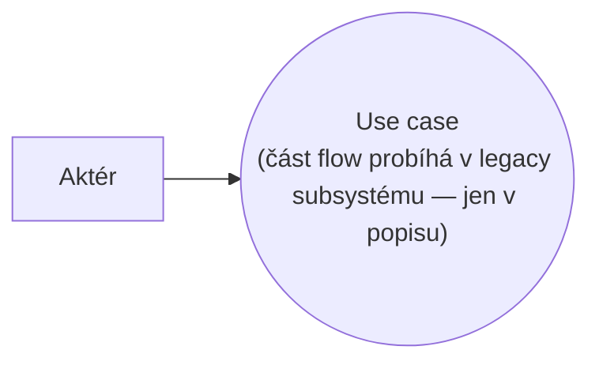
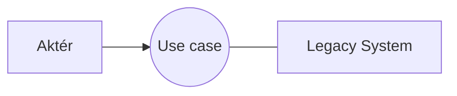

# Blueprint: Legacy System

> Zdroj: Övergaard & Palmkvist, Use Cases – Patterns and Blueprints, kap. 30.
> Typ: Use-case blueprint | Characteristics: Časté. Základní řešení.
> Klíčová slova: vestavění existujícího systému, existující systém, začlenění existujícího systému, starý systém, využití existujícího systému.

## Problem

Systém má zahrnovat nebo využívat již existující (starší) systém.

## Blueprints

### Legacy System: Embedded

Systém zahrnuje legacy systém jako svou součást (subsystém) — legacy systém tedy není v use-case modelu strukturně viditelný, objevuje se pouze v popisech use casů.

**Applicability:** Preferováno, když v use-case modelu nemá být žádná explicitní interakce s legacy systémem. Části use casů prováděné v legacy systému se v popisech uvádějí jen stručně — chování a informace legacy systému se popisují na vyšší úrovni abstrakce než zbytek systému.

### Legacy System: Separate

Legacy systém zůstává mimo nový systém a v modelu vystupuje jako aktér nového systému.

**Applicability:** Použít, když jiné systémy musí mít k legacy systému přímý přístup. Mají-li k chování a informacím legacy systému přistupovat přes nový systém, je lepší varianta `Embedded`.

## Discussion

Problém nastává, když starý a nový systém mají po nějakou dobu žít paralelně (přechod přes řadu verzí nového systému). V principu jsou dvě možnosti: starý systém ponechat vně (aktér) nebo jej zabalit dovnitř nového systému (subsystém), kde bude časem nahrazen novou implementací.

Klíčový faktor: budou-li starý systém dále přímo používat jiné systémy či uživatelé, musí být aktérem (`Separate`) — jeho funkčnost musí zůstat použitelná nezávisle na novém systému. Aktér dostane jméno starého systému; skládá-li se starý systém ze zřetelně oddělených, nezávisle používaných částí, lze jej modelovat i jako kolekci aktérů pojmenovaných po částech. Není-li přímý přístup potřeba, je lepší `Embedded`: umožňuje postupné nahrazování — v každé nové verzi se funkčnost přesouvá z legacy subsystému do jiných subsystémů, až lze legacy subsystém úplně odstranit.

V obou případech je nutné definovat dobře vymezené rozhraní starého systému; jinak hranice obou systémů zůstanou nedefinované, přístup nebude homogenní a systémy se slijí dohromady. U varianty `Separate` rozhraní často realizuje samostatná komponenta mezi aktérem a novým systémem (transformuje interakce a formáty); u `Embedded` je subsystém obalem (wrapper) definujícím všechny operace nad legacy systémem.

Popis use casů: u `Separate` musí use casy explicitně uvádět odesílání a příjem zpráv aktérovi/od aktéra modelujícího starý systém — interakce nesmí být skryta, jinak čtenář mylně usoudí, že funkčnost starého systému pokrývá nový systém. Používat formulace typu „use case pošle informaci o X systému OldSystem, kde se spočte Y a pošle zpět". Transformace formátů se nezmiňuje (řeší rozhraní) a nepopisuje se ani, jak starý systém operace provádí — to je mimo modelovaný systém. Může být ale užitečné popsat, co aktér-legacy systém při interakci dělá, o něco důkladněji, než je u aktérů běžné — jinak čtenář službě neporozumí.

U `Embedded` se use casy popisují normálně; jediný rozdíl je, že části probíhající v legacy subsystému lze popsat abstraktněji než obvykle (už jsou implementované, nebudou se vyvíjet) — jen tolik, aby čtenář pochopil, co vykonávají. To je odchylka od pravidla jednotné úrovně abstrakce popisu, proto je vhodné v popisu explicitně zmínit, že daná část probíhá v legacy subsystému. Jak probíhá transformace informací či interakce s legacy subsystémem, se nepopisuje (design, patří do wrapperu). Když se část legacy subsystému nahrazuje novou implementací, odpovídající části use casů se rozepíší na detailní úroveň zbytku popisu — budou sloužit vývoji nových realizací.

## Example

Skladový systém pro registraci objednávek (`Embedded`; varianta `Separate` nepřináší do popisů nic specifického — interakce se popisují jako běžné interakce s aktéry). Sklad má legacy systém pro plánování rozvozů „kdo dřív přijde" a první verze nového systému jej používá; druhá verze plánuje chytřeji (společný rozvoz blízkých adres). Ukázány dvě verze use casu `Zaregistruj objednávku`:

Verze 1 (legacy část abstraktně):

1. **Úředník** zvolí registraci objednávky a zadá zákazníka, adresu a typ dodávky (spěšná/běžná).
2. **Systém** založí objednávku; **Úředník** zadává položky a počty.
3. **Systém** ověří existenci položek a dostupnost počtů.
4. Po zadání všech položek **Systém** naplánuje objednávku v subsystému Shipping Scheduling (legacy — bez dalších detailů).
5. **Systém** zobrazí shipping ID a **Úředník** jej potvrdí.

Verze 2 nahrazuje krok 4 detailním popisem na úrovni zbytku flow: u spěšné objednávky vznikne nový rozvoz (čas dle business rule BR24); u běžné systém zkontroluje, zda existuje rozvoz v sousedství zákazníka (BR68) a je-li v něm místo (BR10), objednávku do něj přidá, jinak založí nový rozvoz. Alternativní větve (chybějící údaje, storno, neexistující položka, nedostatečný počet) jsou v obou verzích stejné.

Viz též [pattern-business-rules](pattern-business-rules.md), [pattern-crud](pattern-crud.md) a [blueprint-future-task](blueprint-future-task.md).
