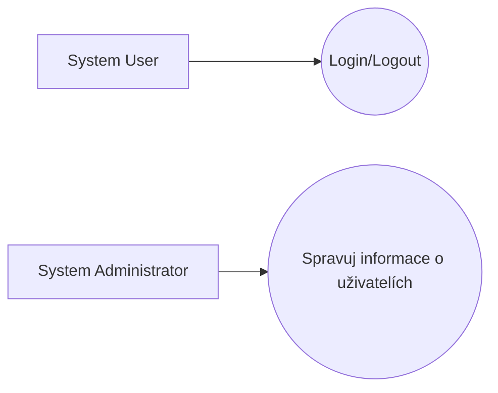
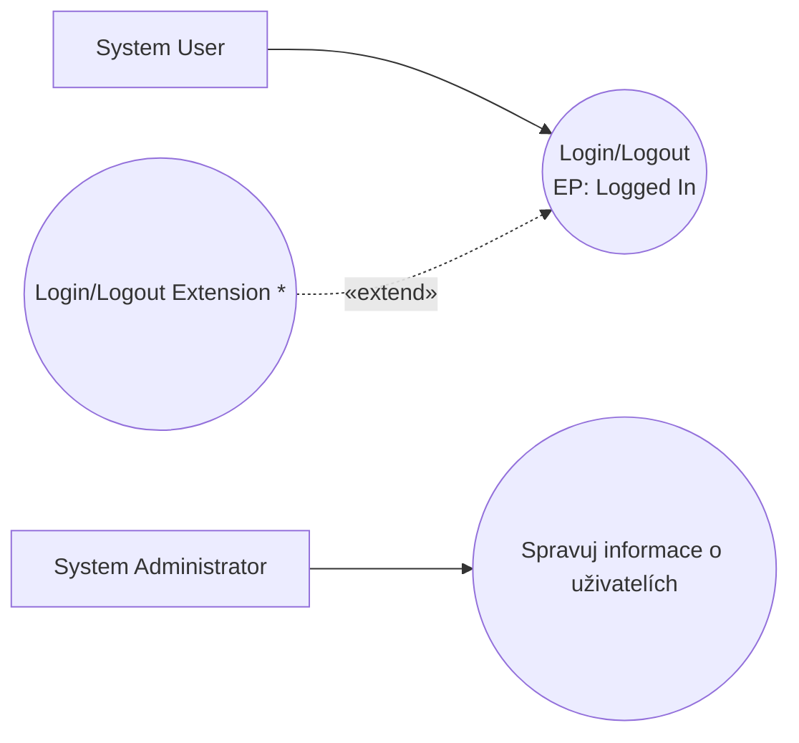
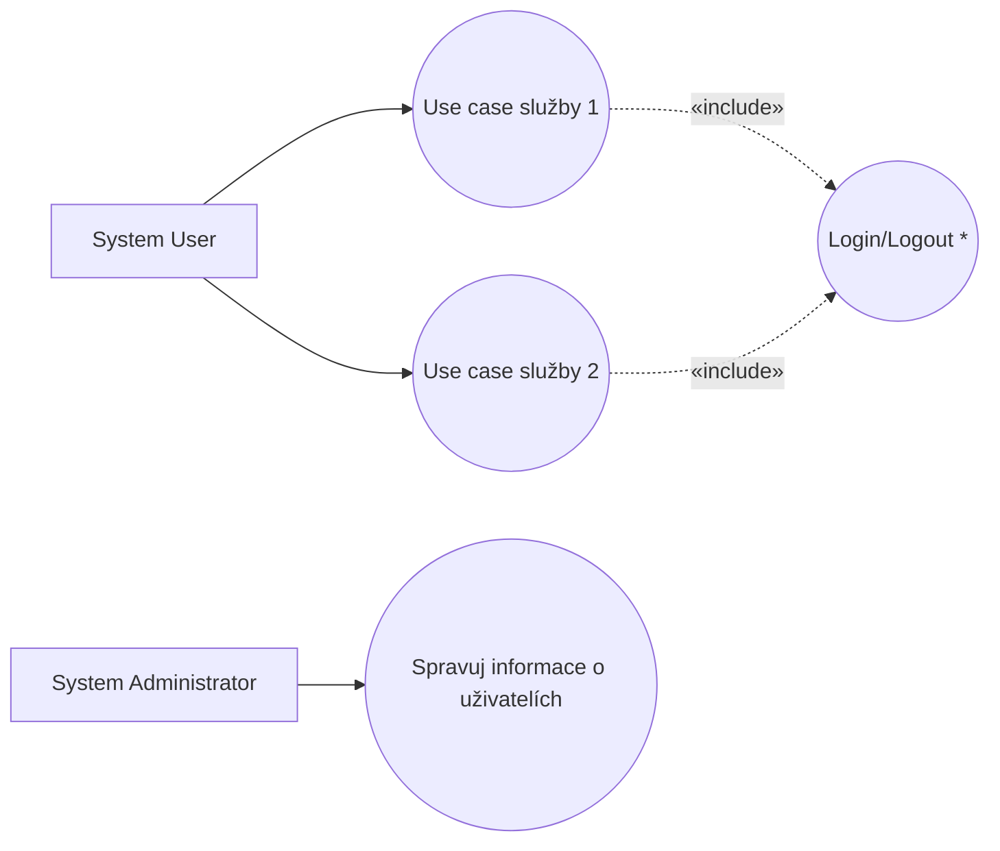
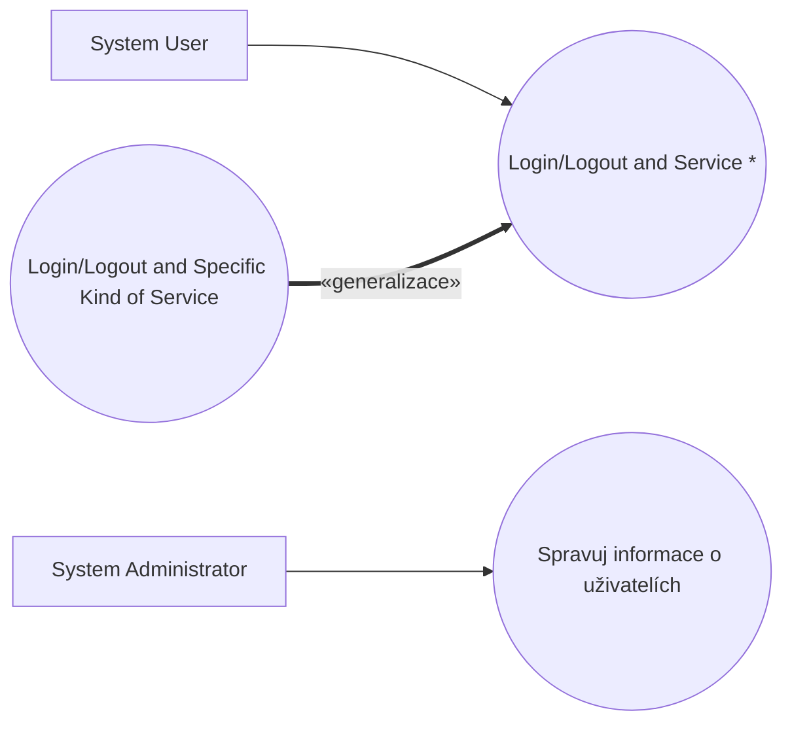
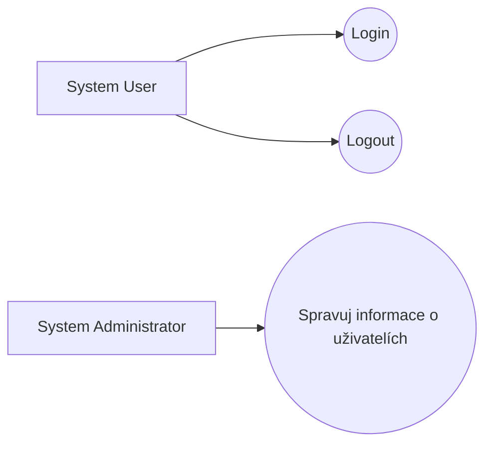

# Blueprint: Login and Logout

> Zdroj: Övergaard & Palmkvist, Use Cases – Patterns and Blueprints, kap. 31.
> Typ: Use-case blueprint | Characteristics: Časté; některé varianty základní, jiné pokročilé.
> Klíčová slova: heslo, PIN, autorizace uživatele, identifikace uživatele, identita uživatele.

## Problem

Uživatelé se před využitím služeb systému musí registrovat nebo identifikovat.

## Blueprints

### Login and Logout: Standalone

Dva use casy: `Login/Logout` modeluje přihlášení i odhlášení (registraci a odregistraci aktuálního uživatele); využívání ostatních use casů je na této proceduře nezávislé — use casy vyžadující přihlášení to uvádějí jako precondition. `Manage User Information` registruje a odregistrovává identity uživatelů a hesla.

**Applicability:** Použít, když login/logout mění stav systému, ale je nezávislý na akcích ostatních use casů systému.

### Login and Logout: Action Addition

Obecná login (a/nebo logout) procedura je rozšířena o systémově specifické akce prováděné při přihlášení či odhlášení. Tyto akce popisuje samostatný use case s vazbou extend na `Login/Logout`.

**Applicability:** Preferováno, když se při přihlášení/odhlášení mají provést dodatečné akce, které jsou ale nezávislé na vlastní login/logout proceduře.

### Login and Logout: Reuse

Login a logout procedury modeluje samostatný use case, který vkládají (include) všechny ostatní use casy vyžadující identifikaci uživatele.

**Applicability:** Preferováno, když každé užití systému musí zahrnovat ověření identity uživatele.

### Login and Logout: Specialization

> **Náš kontext:** Metodika v2 s generalizací mezi UC nepracuje — varianta uvedena pro úplnost, u nás nepreferovaná.

Abstraktní use case modeluje přihlášení, následné provedení obecné služby a odhlášení dohromady; všechny use casy modelující služby téhož druhu jsou jeho specializacemi.

**Applicability:** Preferováno, když je každé užití systému specializací generického use casu obsahujícího login a logout. Výhoda: procedury jsou popsány jednou v rodiči a podobnost dětí je v modelu explicitní.

### Login and Logout: Separate

Varianta `Standalone` s use casem `Login/Logout` rozděleným na dva samostatné use casy.

**Applicability:** Použít jen tehdy, jsou-li popisy obou procedur dost rozsáhlé, nebo když stakeholdeři explicitně požadují, aby byly v modelu oddělené.

## Discussion

Volbu varianty určuje, jak jsou ostatní use casy závislé na login proceduře.

**Nezávislé use casy (`Standalone`):** žádné include/extend vazby mezi login use casem a ostatními. Login use case po ověření hesla zpřístupní (a obvykle zobrazí) množinu služeb; závisí-li množina na přístupových právech, patří výběr do login use casu. Že uživatel musí být přihlášen, řeší precondition ostatních use casů — pozor: má-li systém při každém provedení kontrolovat přihlášení, musí být kontrola explicitní součástí flow; jinak musí splnění precondition zajistit návrhář GUI (nepřihlášený use case nespustí, viz [pattern-use-case-sequence](pattern-use-case-sequence.md)). Include/extend se nepoužívá — tvrdil by závislost a společný běh v jedné instanci, ale login není součástí ostatních use casů ani naopak.

**Dodatečné akce (`Action Addition`):** aplikačně specifické akce při loginu (např. logování neúspěšných přihlášení, kontrola nepřečtených zpráv) patří do samostatného abstraktního extension use casu s extension pointem v `Login/Logout` — login proceduru pak lze realizovat různě (dle security managementu platformy) a aplikační část řešit odděleně. Extension nesmí být konkrétní (neiniciuje jej aktér, spouští ho provedení loginu) a nesmí se vpisovat do popisu loginu (ředil by jej).

**Ověření před každým užitím (`Reuse`, `Specialization`):** musí-li se identita ověřit při každém užití (typicky ATM), popíše se login jednou jako inclusion use case a každá nová služba jej include-uje bez zásahu do login use casu. Jsou-li všechny aplikační use casy téhož druhu (univerzální podmínka generalizace v UML), lze definovat „transakční" rodičovský use case s loginem, obecnou transakcí a logoutem; děti specifikují jen svou transakci, zbytek dědí. Ani jednu z technik nepoužívat, pokud se login neprovádí při každém provedení use casu — podmíněný login by čtenáři modelu chybně pochopili a realizace by se ztížila.

**Bez login use casu:** nepotřebuje-li aplikace informaci o uživateli (login řeší OS), login use case do modelu nepatří, ani precondition. Potřebují-li některé use casy identitu, login use case v modelu být musí (jinak by identita „odnikud" mátla čtenáře); v use casech pak stačí „identita uživatele se získá…" — odkud, je věc designu.

**Logout:** je-li login use case, je potřeba i logout. Obě procedury patří do jednoho use casu se dvěma basic flows (žádná není alternativou druhé) — tvoří jeden konceptuální celek a oddělení (`Separate`) jen zvětšuje model bez přidané hodnoty.

**Manage User Information:** správa identit a hesel musí být v modelu vždy; jde o typický CRUD use case iniciovaný `System Administrator` (viz [pattern-crud](pattern-crud.md)).

## Example

Dvě varianty nad jedním popisem `Login/Logout`: (1) `Standalone` — model s `Login/Logout`, `Manage User Information` a use casem `Order Ticket`, který přihlášení vyžaduje jen preconditions („Clerk musí být přihlášen"), bez vazby na `Login/Logout`. (2) `Action Addition` — abstraktní `Check for Messages` s vazbou extend na `Login/Logout` (extension point `Logged In`): po přihlášení zkontroluje nepřečtené zprávy a případně notifikuje uživatele (viz [blueprint-message-transfer](blueprint-message-transfer.md)).

Fragment `Login/Logout` (basic flow Login):

1. **System User** zvolí přihlášení do systému.
2. **Systém** si vyžádá jméno a heslo.
3. **System User** je zadá.
4. **Systém** ověří existenci uživatele a shodu hesla; při úspěchu zaeviduje přihlášení s datem a časem.
5. **Systém** zobrazí dostupné služby.

Basic flow Logout: po potvrzení systém odebere přístup ke službám a zaeviduje odhlášení s datem a časem. Alternativní větev: neplatné jméno či heslo → notifikace a konec. `Manage User Information` má tři basic flows (registruj, změň, odstraň uživatele) s kontrolami unikátní identity a délky hesla (≥ 10 znaků).
