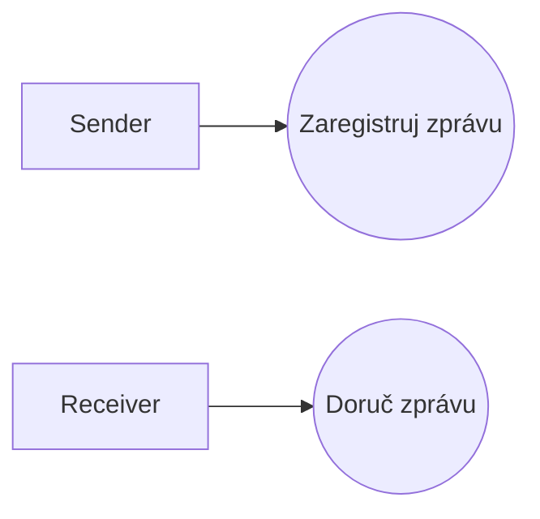
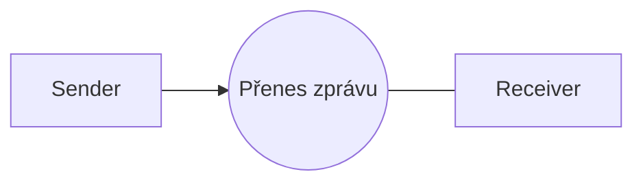
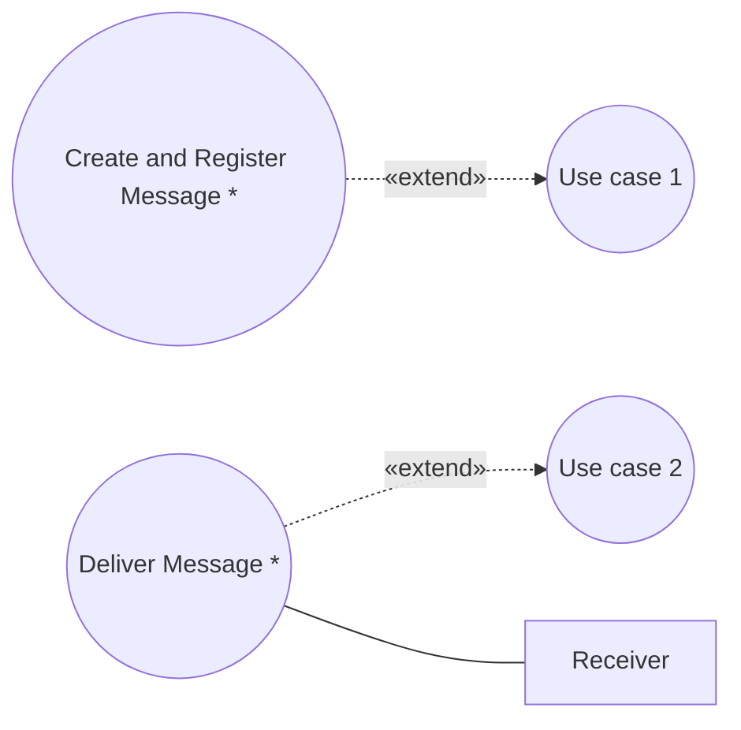

# Blueprint: Message Transfer

> Zdroj: Övergaard & Palmkvist, Use Cases – Patterns and Blueprints, kap. 32.
> Typ: Use-case blueprint | Characteristics: V některých doménách velmi časté. Jednoduché.
> Klíčová slova: dávková úloha, komunikace, e-mail, SMS, systémový alert.

## Problem

Uživatel používá systém k odeslání zprávy jinému uživateli.

## Blueprints

### Message Transfer: Deferred Delivery

Dva use casy: `Register Message` přijme zprávu od aktéra `Sender` a uloží ji k pozdějšímu doručení. `Deliver Message` na žádost aktéra `Receiver` zkontroluje, zda jsou pro něj uloženy zprávy; pokud ano, doručí mu je a případně je ze systému odstraní.

**Applicability:** Preferováno, když zprávy vytváří uživatel systému a příjemci se doručují na jeho žádost.

### Message Transfer: Immediate Delivery

Zprávy se doručují okamžitě a v systému se neukládají. Není-li příjemce při příchodu zprávy dostupný, zpráva se zahodí a nedoručí. Use case pro vyzvedávání zpráv proto není potřeba.

**Applicability:** Použitelné, když zpráva ztrácí relevanci, pokud není přijata okamžitě.

### Message Transfer: Automatic

Odeslání zprávy neiniciuje aktér, ale akce provedená uvnitř systému. Use case `Create and Register Message` modeluje vytvoření a uložení zprávy a má vazbu extend na use case obsahující iniciující akci — vytvoření a uložení se přidá, když instance tuto akci provede. Obdobně doručení zprávy iniciuje provedení use casu, nikoli požadavek aktéra.

**Applicability:** Použít, když zprávy vznikají a doručují se v důsledku akcí uvnitř systému, nikoli akcí aktérů.

## Discussion

Základní situace (`Immediate Delivery`): aktér pošle systému zprávu pro jiného aktéra (či skupinu aktérů), systém dohledá příjemce, určí místo doručení a zprávu doručí. Typické příklady: e-mail a SMS (systém přeloží adresu na místo doručení), skladový systém notifikující nákupčího při poklesu zásob pod práh, dohledový systém přenášející alarmy (vloupání, požár, zaplavení) operátorovi.

Doručení ale může být odloženo: systém je přetížen; zpráva, odesílatel či příjemce mají nízkou prioritu; zpráva má pozdější čas doručení; příjemce je odpojen. Ve všech těchto případech musí systém zprávu uložit a doručit později (`Deferred Delivery`) — např. SMS pro vypnutý telefon se uloží a doručí, jakmile systém zjistí, že se příjemce znovu připojil.

V některých aplikacích odeslání neiniciuje uživatel, ale systém sám — akce uvnitř systému způsobí vytvoření a přenos zprávy. Přidání extra akcí se přednostně modeluje samostatným use casem s vazbou extend na základní use case; vytvoření a odeslání zprávy je proto extension use case rozšiřující use case s akcí, která odeslání způsobila (`Automatic`). Příklad: přístupový systém s kartami — pokusí-li se neoprávněná osoba vstoupit do chráněné zóny, je (dle úrovně zabezpečení) notifikován strážný; use case posílající zprávu strážnému rozšiřuje use case kontrolující oprávnění a odemykající dveře. Zde jde o degenerovanou formu `Automatic`, kde use casy pro vytvoření a doručení zprávy jsou sloučeny do jednoho.

## Example

Skladový systém (varianta `Automatic`, kombinace s [blueprint-login-and-logout](blueprint-login-and-logout.md)): `Clerk` registruje objednávky use casem `Create Order` (extension point `Order Saved`). Abstraktní `Restock Item` rozšiřuje `Create Order`: po uložení objednávky pro každou položku zkontroluje, zda zásoba neklesla pod práh, a případně vytvoří a uloží restock zprávu pro odpovědného nákupčího (typ položky + doporučený počet kusů). Při každém přihlášení uživatele abstraktní `Deliver Message` rozšiřuje `Login/Logout` (extension point `Logged In`): zkontroluje nepřečtené zprávy pro danou identitu a zobrazí je.

Fragment `Deliver Message` (vkládá se do instance `Login/Logout` v bodě `Logged In`):

1. **Systém** zjistí identitu přihlášeného uživatele a zkontroluje, zda pro ni existují zprávy se stavem nepřečtená.
2. **Systém** takové zprávy načte a zobrazí uživateli.
3. **Systém** se u každé zprávy zeptá, co s ní; na pokyn uživatele ji odstraní, jinak ji ponechá v systému.
4. Subflow končí a instance pokračuje dle `Login/Logout` za extension pointem.

Alternativní větve `Create Order`: storno, chybná dodací adresa, chybějící ID/množství položky, nedostatek kusů — notifikace a návrat do toku. Viz též [pattern-crud](pattern-crud.md) a [pattern-optional-service](pattern-optional-service.md).
