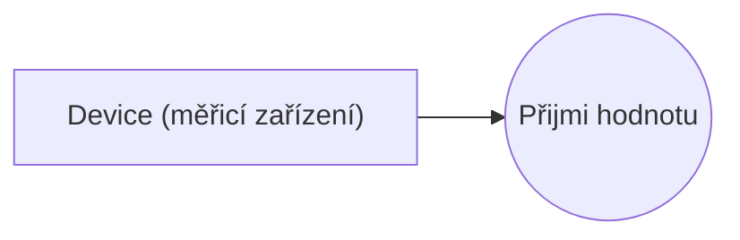

# Blueprint: Passive External Medium

> Zdroj: Övergaard & Palmkvist, Use Cases – Patterns and Blueprints, kap. 33.
> Typ: Use-case blueprint | Characteristics: V některých doménách časté. Pokročilý blueprint.
> Klíčová slova: měření, senzor, nevázané externí médium.

> **Náš kontext:** Okrajové — blueprint cílí na embedded/procesní systémy.

## Problem

Systém má monitorovat nebo řídit externí médium, které je samo o sobě pasivní (např. okolní vzduch nebo kapalinu).

## Blueprints

### Passive External Medium

Jeden aktér a jeden use case. Use case přijímá hodnotu z média vně systému, ale médium samo je pasivní — aktivně systému žádné informace neposílá. Proto se jako aktér modeluje zařízení měřící hodnotu z média, nikoli médium samotné.

**Applicability:** Použije se, když neexistuje zjevný uživatel posílající systému vstup — okolí zkoumá zařízení, které posílá vstup do systému.

## Discussion

V některých doménách je běžné, že vstup systému dodává zařízení v jeho okolí: teploměr předávající aktuální teplotu kapaliny, výškoměr průběžně předávající nadmořskou výšku. Měří se vlastnost média vně systému (kapalina, vzduch), ale médium samo systému žádný stimul neposílá ani systém nevyužívá — vůči systému je pasivní. Bylo by proto nepřirozené prohlásit médium za aktéra posílajícího systému informace (a stejně chybné tvrdit, že systém posílá informace médiu). Je-li externí entita pasivní, případně nevázané médium (kapalina, plyn), modeluje se jako aktér měřicí zařízení: to médium „vyslýchá" a informuje systém o jeho aktuálním stavu — zařízení tedy vůči systému skutečně něco dělá, pasivní médium nikoli.

Důležité zdůraznit: normálně zařízení jako aktéry nemodelujeme — modelujeme osoby za zařízeními; situace s pasivním médiem je výjimka. Obvykle má z užití systému prospěch člověk, který zařízením se systémem komunikuje, kdežto zařízení jen transformuje vstup/výstup do podoby srozumitelné systému a uživateli. Např. tiskárnu účtenek ani čtečku karet nemodelujeme jako aktéry bankomatu — nejsou jeho uživateli, z interakce nic nemají; aktérem je zákazník, který má na užití bankomatu zájem.

Viz též [pattern-crud](pattern-crud.md), [pattern-optional-service](pattern-optional-service.md) a [blueprint-stream-input](blueprint-stream-input.md).

## Example

Systém řízení topení: teploměr (externí zařízení, aktér) dává vstup dvěma use casům řídícím topné těleso. První use case čte hodnoty, a liší-li se o více než 2 stupně od požadované hodnoty, zapne či vypne topení na poloviční výkon. Je-li hodnota o 5 a více stupňů pod požadovanou, spustí se druhý use case: topení běží 1 minutu na plný výkon a pak se vypne (protože plný výkon je povolen jen krátce, je to modelováno jako jeden use case, nikoli přes [blueprint-future-task](blueprint-future-task.md)).

Topné těleso je zde součástí systému, proto není aktérem; kdyby součástí nebylo, modelovalo by se jako aktér asociovaný s oběma use casy. Poznámka: oba use casy začínají stejně, takže na začátku nelze určit, kterou z obou use casů bude instance sledovat — to se pozná až po výpočtu teplotního rozdílu. Další alternativní reakce na hodnotu z teploměru lze doplnit novými use casy.

Fragment `Zapni/vypni topení` (dva basic flows):

1. **Teploměr** předá hodnotu.
2. **Systém** (flow Zapnutí): je-li hodnota o více než 2 stupně nižší než požadovaná a topení neběží, zapne topení na poloviční výkon.
3. **Systém** (flow Vypnutí): je-li hodnota o více než 2 stupně vyšší než požadovaná a topení běží, vypne topení.

Fragment `Spusť topení na plný výkon`: je-li hodnota o 5 a více stupňů pod požadovanou, systém zapne topení na plný výkon, po 1 minutě je vypne a use case končí.
