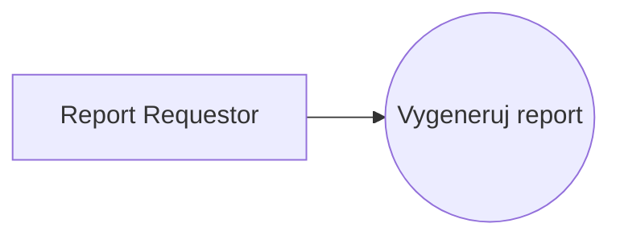
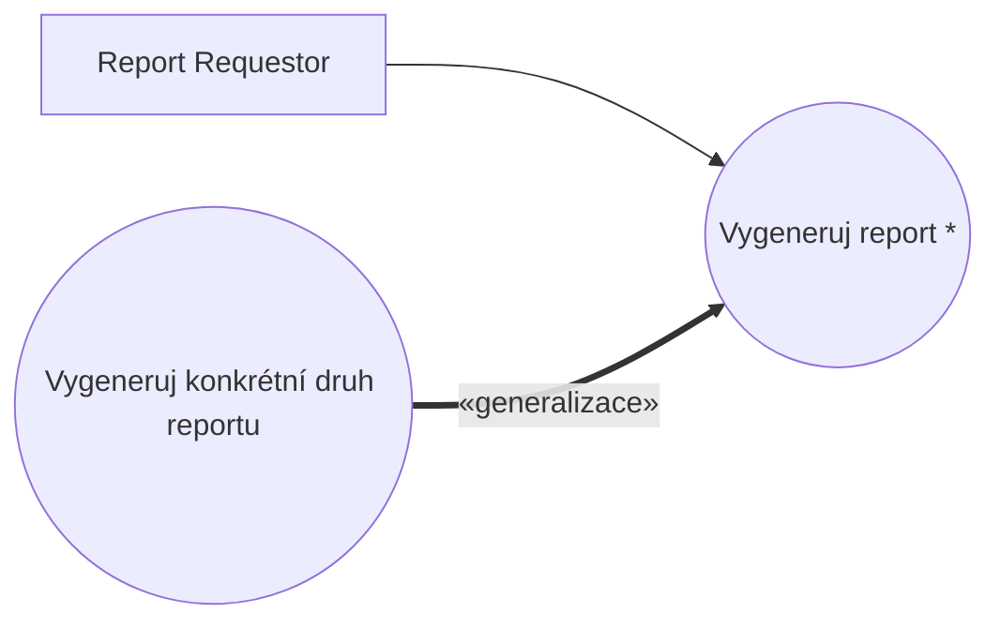
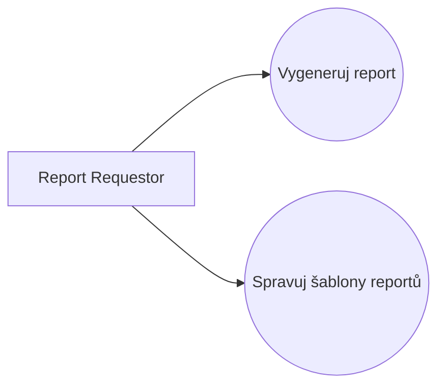

# Blueprint: Report Generation

> Zdroj: Övergaard & Palmkvist, Use Cases – Patterns and Blueprints, kap. 34.
> Typ: Use-case blueprint | Characteristics: V některých doménách velmi časté. Pokročilé.
> Klíčová slova: formátování, tisková šablona, výtisk, report, šablona reportu, šablona.

## Problem

Systém má obsahovat kolekci šablon pro generování různých druhů reportů, které prezentují informace podle definice v šablonách. Šablony definují i formátování reportu apod.

## Blueprints

### Report Generation: Simple

Jediný use case modelující generování všech druhů reportů. Akce specifické pro jednotlivé druhy reportů (např. různé kontroly) jsou popsány jako alternativní flows tohoto use casu.

**Applicability:** Použít, když existuje jen málo (méně než čtyři) variant generování reportu (co za kontroly apod. se provádí), varianty se pravděpodobně nebudou měnit a jsou si dosti podobné.

### Report Generation: Specialization

> **Náš kontext:** Metodika v2 s generalizací mezi UC nepracuje — varianta uvedena pro úplnost, u nás nepreferovaná.

Generickou proceduru generování reportu modeluje abstraktní use case `Generate Report`. Detaily generování konkrétních druhů reportů modelují samostatné use casy, které jsou jeho specializacemi.

**Applicability:** Zvolit, když existuje několik významně odlišných procedur generování reportů.

### Report Generation: Dynamic Templates

Přidán use case `Manage Report Template` — umožňuje dynamické vytváření, změny a mazání šablon reportů za běhu systému.

**Applicability:** Preferováno, když se má množina šablon dynamicky měnit.

## Discussion

Běžný tisk informací stačí v popisu use casu odbýt větou („use case získá cenu každé položky, spočte celkovou cenu a vytiskne…"). V některých business systémech je ale definice toho, co a jak se tiskne, složitější — vyžaduje šablony reportů: šablona určuje, jaké informace se při generování reportu tisknou, a obvykle zahrnuje i layout. Takovou tiskovou proceduru je nutné modelovat explicitně use casy — na jednu dvě věty je příliš složitá.

Východiskem je jeden use case pro správu šablon a druhý pro generování reportů (`Dynamic Templates`). `Generate Report`: aktér zvolí report, use case dohledá příslušnou šablonu, podle definic v ní získá všechny informace k tisku (dle volby aktéra) a odešle je tiskovému zařízení spolu s layoutem ze šablony. Touto technikou stačí jediný use case pro generování a tisk — definice tištěných informací i layout jsou uloženy v systému a různé use casy je mohou číst i měnit.

Pokud ale existují skupiny šablon vyžadující různé kontroly, potvrzení či validace, bývá model srozumitelnější s jedním use casem na každou kategorii reportů. Protože všechny sdílejí stejnou strukturu a chování, vyjádří se obecná procedura samostatným abstraktním use casem, který use casy generující jednotlivé kategorie specializují (`Specialization`): obecná procedura je popsána jednou, varianty (kontroly, validace) se přidávají ve specializacích. Příklad ze skladového systému: tři kategorie reportů — `Generate Order Report` (před generováním kontrola dostupnosti položek objednávky), `Generate Financial Report` (navíc interakce s aktérem `Financial System`) a `Generate Stock List` (rozlišení položek dostupných, prodaných nedodaných a vyprodaných) — vše specializace abstraktního `Generate Report`.

`Manage Report Template` v první variantě chybí — je zbytečný, jsou-li šablony do systému zadrátované; je nutný, má-li být možné šablony za běhu přidávat, měnit a mazat. Jde o běžný administrativní use case (viz [pattern-crud](pattern-crud.md)): přijímá od aktéra text, layout a skripty (co se má načíst z databáze či jak spočítat) a ukládá je pod jménem šablony.

## Example

Kombinace variant `Specialization` a `Dynamic Templates`: abstraktní `Generate Report`, jeho specializace `Generate Order Report` a `Manage Report Template`. Užitečné jsou zde i [pattern-commonality](pattern-commonality.md), [pattern-crud](pattern-crud.md) a [pattern-optional-service](pattern-optional-service.md).

Fragment `Vygeneruj report` (abstraktní):

1. **Report Requestor** zvolí generování reportu.
2. **Systém** nabídne dostupné šablony.
3. **Report Requestor** vybere šablonu.
4. **Systém** zjistí, jaké vstupy šablona vyžaduje, a vyžádá je; **Report Requestor** je dodá.
5. **Systém** načte layout šablony, vyhodnotí skripty z její definice a vygeneruje report.
6. **Systém** zobrazí report s nabídkou tisku; na žádost jej odešle na tiskárnu.

Alternativní větve: chybějící vstupy, storno, selhání skriptu (do reportu se na dané místo vloží chybový text a pokračuje se dalším skriptem).

`Vygeneruj report objednávky` (specializace) předefinovává jen část Výběr šablony: aktér vybere šablonu objednávky a zadá ID objednávky; systém ověří, že objednávka existuje, že všechny odkazované položky jsou dostupné a že objednávka není zamčena kvůli úpravám. Alternativní větve: neexistující objednávka (dotaz na jiné ID), nedostupná položka (poznámka na začátku reportu), zamčená objednávka (konec). `Spravuj šablony reportů`: aktér zadá pro každé pole název, typ, pozici a skript plus název šablony a vstupní parametry skriptů; systém ověří unikátnost názvu a šablonu uloží.
