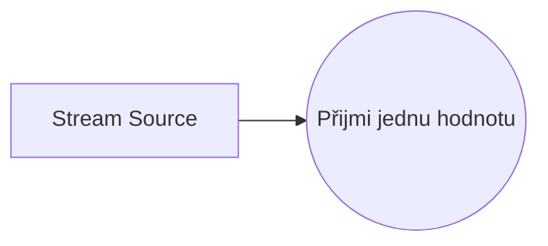
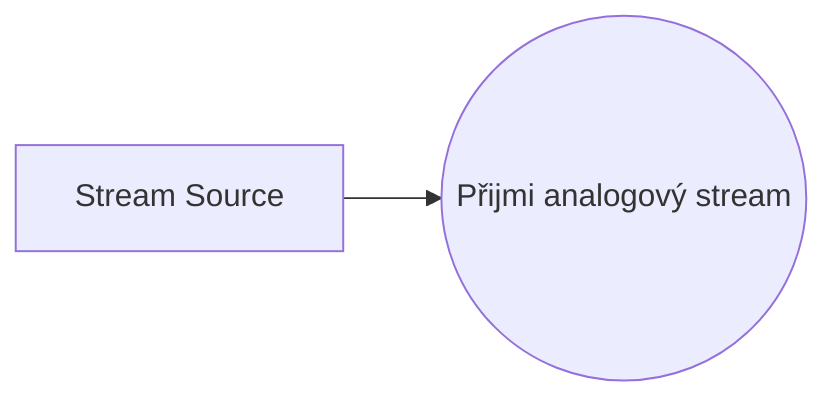

# Blueprint: Stream Input

> Zdroj: Övergaard & Palmkvist, Use Cases – Patterns and Blueprints, kap. 35.
> Typ: Use-case blueprint | Characteristics: V některých doménách časté. Pokročilé.
> Klíčová slova: analogové zařízení, analogový systém, kontinuální systém, diskrétní proud, vstupní signál, vstupní proud (stream).

> **Náš kontext:** Okrajové — blueprint cílí na embedded/procesní systémy.

## Problem

Aktér dodává systému proud (stream) vstupů a jejich zpracování má být popsáno use casy. Řešení závisí na tom, zda proud tvoří diskrétní, nebo spojité hodnoty.

## Blueprints

### Stream Input: Discrete

Jeden aktér produkující vstupní proud diskrétních hodnot a jeden use case, který modeluje příjem jediné hodnoty z proudu.

**Applicability:** Použitelné, když proud tvoří diskrétní hodnoty.

### Stream Input: Analog

Aktér produkuje spojitý proud hodnot; use case modeluje příjem celého analogového proudu.

**Applicability:** Použít, když je vstupní proud analogový.

## Discussion

**Diskrétní hodnoty.** Typické příklady: dohledové systémy čtoucí diskrétní hodnoty produkované jinými systémy, produkční systémy generující výstupy z přijatých vstupů. Use case modeluje konzumaci a zpracování jedné hodnoty z proudu; instance běží velmi krátce a prakticky pořád nějaká v systému běží. Výhoda modelování jedné hodnoty (místo smyčky konzumující celý proud): lze mít více use casů, z nichž každý popisuje zpracování podmnožiny možných vstupních hodnot — jeden use case nemusí pokrýt všechny hodnoty a nové typy hodnot se v dalších verzích modelu přidají novými use casy bez zásahu do existujících. Druhý důvod: smyčka kolem popisu zpracování modelu nic nepřidává — model už zachycuje, co systém se vstupem udělá; jediným efektem je snížení počtu instancí. To láká zejména programátory zvyklé myslet na efektivitu, ale use-case model takové aspekty nezachycuje — počet use-case instancí nemá žádný vliv na výkon výsledné implementace! Use case nesmíme zaměňovat s pravděpodobnou implementací (ta smyčku načítající hodnoty a dispatchující je do rutin klidně mít může). Se smyčkou v use casu bychom navíc museli popsat, kdy a jak se smyčka opouští, co s nerozpoznanou hodnotou (bez smyčky to pokryje samostatný use case) atd. Pokud ovšem proud tvoří pod-sekvence diskrétních hodnot tvořící celek, use case má konzumovat celou pod-sekvenci.

**Analogový proud.** Typický příklad: analogový elektrický zesilovač. Use casy (a jazyky založené na Turingových strojích obecně) pracují jen s diskrétními hodnotami, spojité neumějí dobře. Nejlepší praxe: vstup a kontroly hodnot popsat běžnými technikami popisu use casů, výstupní funkci uvést v samostatné kapitole popisu use casu (lze členit do podsekcí, např. různé chování v různých intervalech vstupu). Jedna use-case instance běží, dokud vstupní proud přichází — zdánlivý rozpor s diskrétním případem, ale ve spojitém analogovém signálu z definice nelze identifikovat oddělené entity vstupu. Popis vypadá jako běžný use case s jedním rozdílem: transformace vstupního proudu je popsána matematickou funkcí, ne operačním popisem (posloupností akcí).

Viz též [pattern-business-rules](pattern-business-rules.md), [pattern-multiple-actors](pattern-multiple-actors.md) a [blueprint-passive-external-medium](blueprint-passive-external-medium.md).

## Example

Use case přijímající jednu hodnotu diskrétního proudu se popisuje jako kterýkoli jiný use case s jedním vstupem — příklad není třeba. Příklad varianty `Analog`: zesilovač přijímající analogový elektrický proud od aktéra `Input Stream Generator` a vydávající zesílený proud aktérovi `Output Stream Receiver`.

Use case `Zesil vstupní proud`:

1. **Systém** začíná, když přijme analogový elektrický proud od `Input Stream Generator`.
2. **Systém** po dobu příjmu proudu vydává zesílený analogový výstup `Output Stream Receiver` podle zesilovací funkce popsané v sekci Function.
3. Use case končí, když vstupní proud přestane přicházet.

Sekce Function pak definuje zesílení matematickou funkcí (napětí kolektoru jako funkce napětí báze, proudového zesílení a odporů obvodu) s odkazem na literaturu — nikoli posloupností akcí.
