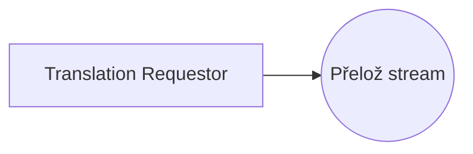
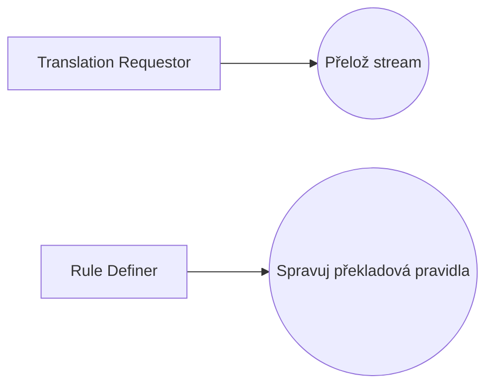

# Blueprint: Translator

> Zdroj: Övergaard & Palmkvist, Use Cases – Patterns and Blueprints, kap. 36.
> Typ: Use-case blueprint | Characteristics: V některých doménách časté. Pokročilé.
> Klíčová slova: kompilátor, šifrování, import, parser, transformace, XML.

## Problem

Systém má přijímat vstupní proud a produkovat výstupní proud na základě překladových pravidel.

## Blueprints

### Translator: Static Definition

Jediný use case `Translate Stream`: přijímá vstupní proud složený z různých druhů tokenů, které dohromady tvoří strukturu, a produkuje výstupní proud na základě vstupu a kolekce překladových pravidel.

**Applicability:** Použít, když se překladová procedura nebude dynamicky měnit.

### Translator: Dynamic Rules

Navíc use case pro správu překladových pravidel: pravidla lze definovat a měnit dynamicky — nejsou v systému staticky zadrátovaná a lze je rozšiřovat bez rekompilace a restartu systému.

**Applicability:** Preferováno, když se překladová pravidla mohou často měnit.

## Discussion

Překladač (kompilátor, XML parser) se v principu modeluje jedním primárním use casem a případně malou kolekcí podpůrných use casů. Primární use case modeluje překladový proces; podpůrné popisují mj. zobrazení čísla verze překladače a úpravy překladových pravidel (mají-li být dynamické, viz `Dynamic Rules`) — ty se definují běžnými technikami (viz [pattern-crud](pattern-crud.md)).

Kompilace obvykle probíhá v několika krocích: kontrola syntaxe (pořadí prvků), vybudování interní reprezentace vstupu, kontrola well-formedness pravidel, případně typová kontrola, a nakonec produkce výstupního proudu podle produkčních pravidel. Protože překlad vstupního proudu zahrnuje všechny tyto kroky, modelují se jedním use casem — celá kompilace je jedno užití systému. Různými vstupními parametry lze provést jen některé kroky, ale to jsou varianty (alternativní flows) normálního toku.

Kroky se nesmějí modelovat jako samostatné use casy, protože se vždy provádějí společně v předdefinovaném pořadí — use case je jen jeden. Chybou by bylo i modelovat kroky jako inclusion use casy include-ované „hlavním" use casem: to je funkční dekompozice use casu `Translate Stream`, tedy zneužití konstruktu use case (viz [mistake-functional-decomposition](mistake-functional-decomposition.md)). Use case modeluje užití systému; inclusion use casy se — kromě vyjádření společných částí — používají jen tehdy, když jsou dost důležité na povýšení na samostatné use casy. Za „krokové" inclusion use casy, které porozumění systému nijak nepřidávají, se vždy platí; funkční dekompozice navíc často odráží vnitřní strukturu systému, a ta se v use-case modelu zrcadlit nemá.

Popis překladového use casu může být klidně členěn do podsekcí (např. po krocích). Nejlepší je zaměřit flow na pořadí kroků, povolené alternativy, dodatečné vstupní parametry a jejich význam a obecné otázky algoritmů. Konkrétní syntaktická, well-formedness, typová a překladová pravidla se mnohem lépe vyjadřují běžnými produkčními pravidly (viz Aho, Sethi, Ullman: Compilers) a zachází se s nimi jako s business rules — patří do samostatné kapitoly či přílohy popisu use casu (viz [pattern-business-rules](pattern-business-rules.md)).

## Example

Varianta `Static Definition`: překlad zdrojového kódu do strojového (use case pro správu pravidel z druhé varianty by byl běžný CRUD use case). Překladová a typová pravidla jsou z textu vyčleněna do sekcí Syntax, Type System a Code Production Rules — jsou specifická pro překládaný jazyk. Relevantní je i [blueprint-stream-input](blueprint-stream-input.md).

Use case `Zkompiluj zdrojový kód`:

1. **Programátor** požádá o kompilaci dodaného proudu se zdrojovým kódem.
2. **Systém** čte proud, kontroluje syntaxi (dle sekce Syntax) a buduje interní reprezentaci programu (parse tree).
3. **Systém** u syntakticky správného programu zkontroluje typovou správnost (dle sekce Type System).
4. **Systém** u typově správného programu vyprodukuje proud spustitelného kódu (dle sekce Code Production Rules) a pošle jej Programátorovi.
5. **Systém** zahodí interní reprezentaci; use case končí.

Alternativní větve: přepínače „jen syntaktická kontrola" / „jen typová kontrola" (konec po příslušném kroku); chybná syntaxe (zobrazení chybné struktury, zotavení zahazováním tokenů do dalšího výrazu, bez typové kontroly a generování kódu); typová chyba (zobrazení chybného příkazu s typovou informací, bez generování kódu); selhání stavby interní reprezentace (chybová zpráva a konec).
