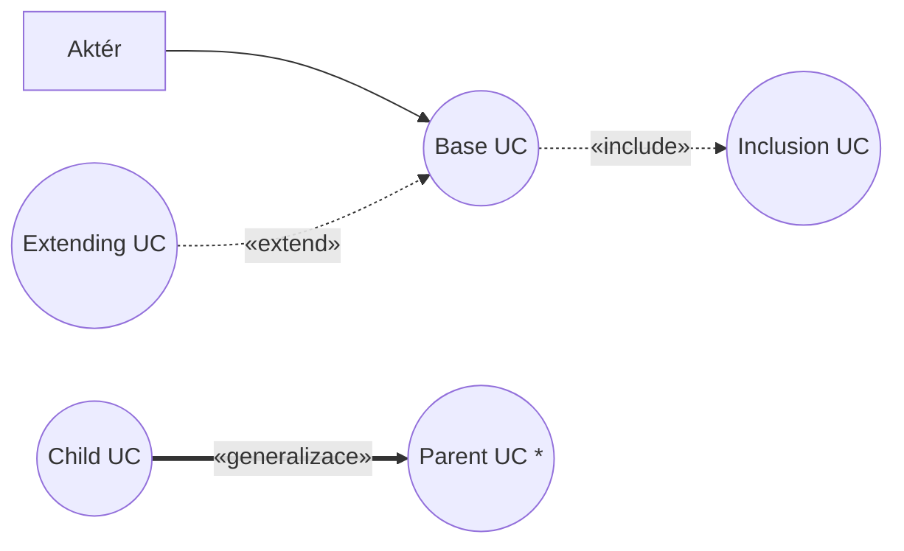

# Knihovna UC vzorů (patterns & blueprints)

Zdroj: Övergaard, Palmkvist — *Use Cases: Patterns and Blueprints* (Addison-Wesley, 2005), části III–V.
Obsah převeden do konvencí projektu (česky, Mermaid, naše scénářové konvence), logika a dekompozice knihy zachována. Sekce Analysis Model z knihy se nepřebírají — realizaci UC řeší náš stack v EA (use case realizace, logické obrazovky, služby).

## Jak knihovnu používat

- **Pattern** = technika strukturování use-case modelu (jak model tvarovat, aby byl udržovatelný a srozumitelný). Nepřenáší se kopií, ale aplikací na vlastní model.
- **Blueprint** = hotový fragment modelu pro opakovanou situaci (login, reporty, řízení přístupu…). Dá se převzít téměř kopií a doladit názvy/detaily.
- **Mistake** = častá strukturální chyba: jak ji poznat (Detection — vhodné pro review a QC kontroly) a jak z ní ven (Way Out).

Při **identifikaci UC** projdi blueprinty (nechybí podpůrné use casy? — registrace uživatelů k loginu, správa šablon k reportům…) a patterny pro volbu granularity a struktury. Při **review** modelu použij mistakes jako checklist. Většina reálných situací kombinuje víc vzorů najednou.

Ke každému vzoru kniha popisuje varianty; volbu mezi nimi řídí **Applicability** u varianty a argumentace v **Discussion**.

## Vztah k našim pravidlům

- [pattern-crud](pattern-crud.md) = naše pravidlo „Spravuj XYZ (CRUDL)" z [use-case-rules](../use-case-rules.md).
- [mistake-functional-decomposition](mistake-functional-decomposition.md), [mistake-micro-use-cases](mistake-micro-use-cases.md) = naše pravidla o granularitě UC; kniha přidává detekční heuristiky.
- Mistakes zde jsou **strukturální** (model); [common-mistakes](../common-mistakes.md) řeší chyby **psaní scénářů** (IF, GUI) — doplňují se, nepřekrývají.
- **Generalizace mezi use casy**: metodika v2 s ní nepracuje. Varianty „Specialization" jsou uvedeny pro úplnost a jsou u nás nepreferované (označeno poznámkou v souborech). Preferuj varianty s include/extend nebo samostatnými UC.

## Mermaid notace (rozšíření konvence ze SKILL.md)

include: base → inclusion; extend: extending → base; generalizace: child → parent (u nás nepreferovaná); abstraktní UC: hvězdička za názvem.

## Katalog — Patterns (kap. 16–26)

| Soubor | Intent (zkráceně) | Varianty |
|---|---|---|
| [pattern-business-rules](pattern-business-rules.md) | Business pravidla vytknout z textu flow do samostatných pravidel referencovaných ze scénářů | Static Definition, Dynamic Modification |
| [pattern-commonality](pattern-commonality.md) | Společnou subsekvenci akcí více UC vyjádřit samostatně | Reuse, Addition, Specialization, Internal Reuse |
| [pattern-component-hierarchy](pattern-component-hierarchy.md) | Mapování top-level UC na prvky hierarchie komponent | Black-Box with Use Cases, Black-Box with Operations, White-Box |
| [pattern-concrete-extension-or-inclusion](pattern-concrete-extension-or-inclusion.md) | Týž flow jako součást jednoho UC i samostatný UC | Extension, Inclusion |
| [pattern-crud](pattern-crud.md) | Krátké jednoduché UC (create/read/update/delete) sloučit do jednoho | Complete, Partial |
| [pattern-large-use-case](pattern-large-use-case.md) | Strukturovat rozsáhlý UC („dlouhý" vs. „tlustý") | Long Sequence, Multiple Paths |
| [pattern-layered-system](pattern-layered-system.md) | UC definované po vrstvách, instance procházejí vrstvami | Reuse, Addition, Specialization, Embedded |
| [pattern-multiple-actors](pattern-multiple-actors.md) | Společné vs. odlišné role aktérů vůči UC | Distinct Roles, Common Role |
| [pattern-optional-service](pattern-optional-service.md) | Oddělit povinné části od volitelně dodávaných služeb | Addition, Specialization, Independent |
| [pattern-orthogonal-views](pattern-orthogonal-views.md) | Různé pohledy na tytéž flows pro různé stakeholdery | Specialization, Description |
| [pattern-use-case-sequence](pattern-use-case-sequence.md) | Vyjádřit časovou posloupnost funkčně nesouvisejících UC | (jedna) |

## Katalog — Blueprints (kap. 27–36)

| Soubor | Problém (zkráceně) | Varianty | Pozn. |
|---|---|---|---|
| [blueprint-access-control](blueprint-access-control.md) | Přístupová práva k informacím a službám | Embedded Check, Dynamic Security Units, Explicit Check, Internal Assignment, Implicit Details | |
| [blueprint-future-task](blueprint-future-task.md) | Úloha registrovaná teď, provedená později | Simple, Specialization, Extraction, Performer Notification | |
| [blueprint-item-look-up](blueprint-item-look-up.md) | Vyhledání položky samostatně i uvnitř jiných UC | Standalone, Result Usage, Open Decision | |
| [blueprint-legacy-system](blueprint-legacy-system.md) | Zapojení existujícího (legacy) systému | Embedded, Separate | |
| [blueprint-login-and-logout](blueprint-login-and-logout.md) | Identifikace uživatele před užitím služeb | Standalone, Action Addition, Reuse, Specialization, Separate | |
| [blueprint-message-transfer](blueprint-message-transfer.md) | Uživatel posílá zprávu jinému uživateli | Deferred Delivery, Immediate Delivery, Automatic | |
| [blueprint-passive-external-medium](blueprint-passive-external-medium.md) | Monitorování/řízení pasivního média | (jedna) | okrajové (embedded) |
| [blueprint-report-generation](blueprint-report-generation.md) | Reporty generované podle šablon | Simple, Specialization, Dynamic Templates | |
| [blueprint-stream-input](blueprint-stream-input.md) | Proud vstupů od aktéra (diskrétní/spojitý) | Discrete, Analog | okrajové (embedded) |
| [blueprint-translator](blueprint-translator.md) | Překlad/konverze vstupního toku dle pravidel | Static Definition, Dynamic Rules | |

## Katalog — Common Mistakes (kap. 37–44)

| Soubor | Chyba (zkráceně) |
|---|---|
| [mistake-alternative-flow-as-extension](mistake-alternative-flow-as-extension.md) | Alternativní flow modelovaný jako extend UC |
| [mistake-business-use-case](mistake-business-use-case.md) | Business proces vydávaný za systémový UC |
| [mistake-communicating-use-cases](mistake-communicating-use-cases.md) | UC „komunikují" mezi sebou vazbami |
| [mistake-functional-decomposition](mistake-functional-decomposition.md) | Funkční dekompozice přes include |
| [mistake-micro-use-cases](mistake-micro-use-cases.md) | Mikro-UC bez samostatné hodnoty |
| [mistake-mix-of-abstraction-levels](mistake-mix-of-abstraction-levels.md) | Míchání úrovní abstrakce v jednom modelu |
| [mistake-multiple-business-values](mistake-multiple-business-values.md) | Jeden UC s více business hodnotami |
| [mistake-security-levels-with-actors](mistake-security-levels-with-actors.md) | Úrovně oprávnění modelované hierarchií aktérů |
