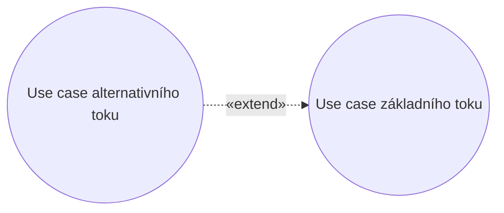
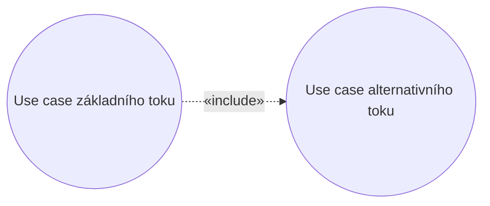

# Mistake: Alternative Flow as Extension

> Zdroj: Övergaard & Palmkvist, Use Cases – Patterns and Blueprints, kap. 37. | Klíčová slova: doplnění toku, alternativní tok, vazba extend, vyčlenění toku

## Fault

Alternativní tok use casu je vymodelován jako extending use case připojený vazbou «extend» k témuž use casu.

## Incorrect Model

Chybný model: alternativní tok je vytržen ze svého use casu do samostatného extending use casu. Vazba «extend» ale znamená, že chování rozšíření se může **přidat** k toku base use casu — nikdy jím nelze **nahradit** část chování base use casu. Vyčleněná alternativa se tedy provede jen navíc k základnímu toku, ne místo něj, což vede k podivnému a nechtěnému chování systému. Ani trik s podmínkou («extend» s negací podmínky z base use casu, true-větev v base, false-větev v rozšíření) nepomůže: base use case se stává závislým na rozšíření — bez něj není úplný, protože mu chybí popis, co se stane při nesplnění podmínky.

## Detection

- Tok extending use casu má **nahradit** část toku base use casu (ne jen se k němu přidat).
- Base use case není bez rozšíření úplný — chybí mu alternativní tok (co dělat, když podmínka neplatí, když něco selže, když aktér zadá neočekávaný vstup).
- Podmínka vazby «extend» je negací podmínky uvnitř base use casu (true-větev v base, false-větev v rozšíření).

## Way Out

- Sluč base a extending use case: tok z rozšíření přesuň zpět do base use casu jako alternativní tok, vazbu «extend» i extending use case z modelu odstraň.
- Extension point v (bývalém) base use casu odstraňovat nemusíš — sám o sobě chování nemění. Neodstraňuj ho, dokud si nejsi jistý, že ho nepoužívá (nebo do budoucna nemá používat) jiný extending use case.
- Pokud je stále žádoucí mít alternativní tok jako samostatný use case, použij místo toho vazbu «include» (base → inclusion): u include závislost base use casu na vloženém use casu nevadí. Podmínkou ale je, že vyčleněný use case má **vlastní business hodnotu** — jinak viz [mistake-micro-use-cases](mistake-micro-use-cases.md).

