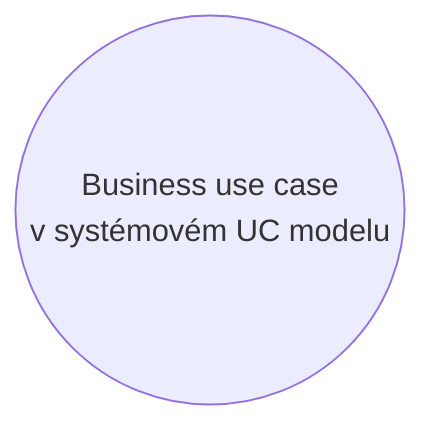

# Mistake: Business Use Case

> Zdroj: Övergaard & Palmkvist, Use Cases – Patterns and Blueprints, kap. 38. | Klíčová slova: business proces, velký use case, úroveň abstrakce, dlouhý use case, více iniciujících aktérů, pauza v use casu

## Fault

Business proces (business use case popisující užití organizace, nikoli systému) je vymodelován jako systémový use case.

## Incorrect Model

Chybný model: v use-case modelu softwarového systému se objeví use case, který ve skutečnosti popisuje jedno použití **businessu**, ne jedno použití **softwaru** — např. „Spravuj objednávku" ve skladu (registrace objednávky, generování pick-listu, fakturace po expedici, registrace platby). Tok se skládá z několika podtoků prováděných v různých okamžicích, v nepravidelných intervalech a případně iniciovaných různými osobami; každý podtok přitom má vlastní hodnotu pro někoho uvnitř organizace, tedy je samostatným systémovým use casem. Business use casy mají navíc jiný účel a jiné stakeholdery a jsou popsané na vyšší úrovni abstrakce — popsány na úrovni vhodné pro systém by byly extrémně dlouhé a složité.

## Detection

- Popis use casu se skládá ze dvou či více částí, které jsou **odpojené** — provádějí se v různých okamžicích. To je rozhodující kritérium: takový use case popisuje, jak jedná business, ne jak se používá systém; často to jde poznat jen z popisu, ne z diagramu.
- Slabé indicie (mohou se vyskytnout i v korektním modelu, ale zaslouží prověření popisu): název začíná na `Handle` / `Manage` / `Perform` + jméno business konceptu; do use casu je zapojeno více aktérů.
- Use case vyžaduje od aktéra vstup, který s velkou pravděpodobností dorazí až výrazně později (nebo vůbec) — to je přerušení, po němž má začít nový use case. (Pokud vstup normálně dorazí prakticky okamžitě, např. potvrzení od jiného systému, patří do jednoho use casu a nepříchod se řeší alternativním tokem s timeoutem.)
- Provádění use casu obsahuje plánovanou dlouhou pauzu, během níž se nic neděje (např. buzení v hotelu: požadavek večer, buzení ráno — a buzení nemusí vůbec nastat). Use case, jehož běh z velké části sestává z nicnedělání, je špatná praxe.

## Way Out

- Rozděl use case: pro každý samostatný úkol prováděný v daném systému a mající vlastní business hodnotu založ nový use case a přesuň do něj odpovídající část původního toku. Původní use case se tím postupně vyprázdní a odstraní se z modelu.
- Kritéria, kde řezat: (1) aktér posílá systému vstup, aniž by ho k tomu systém vyzval — žádné probíhající užití systému na vstup nečeká, začíná nový use case; (2) každé místo toku s výraznou prodlevou (čekání na vstup dodaný při jiné příležitosti) — nový use case s daným aktérem jako iniciátorem, pokrývající to, co se po vstupu stane.
- Business use case byl popsán méně detailně, než systémové use casy potřebují — po zkopírování částí popisu detail doplň.
- Nutné pořadí provádění (dané business tokem) zachyť preconditions v nových use casech (kromě prvního v řadě) — viz [pattern-use-case-sequence](pattern-use-case-sequence.md).
- Stejné řešení platí pro use casy s dlouhou pauzou v běhu — viz [blueprint-future-task](blueprint-future-task.md).
- Pozn.: business use case může být zároveň vhodným systémovým use casem — mapování 1:1 z business modelu není chybou samo o sobě. Klíčové je držet se subjektu modelu: modeluje se podpůrný software, ne business.
