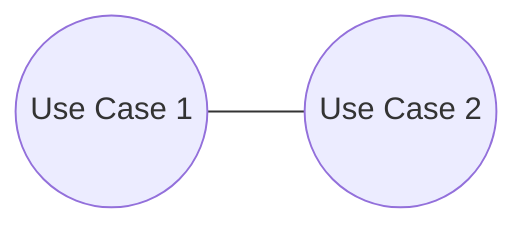

# Mistake: Communicating Use Cases

> Zdroj: Övergaard & Palmkvist, Use Cases – Patterns and Blueprints, kap. 39. | Klíčová slova: závislost mezi use casy, kombinace use casů, interagující use casy, zprávy mezi use casy, rozdělení use casu

## Fault

Dva use casy jsou spojeny asociací, což naznačuje, že spolu use casy komunikují (posílají si zprávy).

## Incorrect Model

Chybný model: asociace mezi dvěma use casy téhož systému. Každý use case ale modeluje **úplné** užití systému — jeho instance provádí celé užití včetně interakcí s okolím a nikdy neposílá zprávy jiné instanci use casu uvnitř téhož systému. Pokud by to dělala, nebylo by její užití úplné (vyžadovala by akce jiné instance); pokud jsou akce druhého use casu pro úplnost užití nutné, musí být součástí prvního use casu. Chyba typicky vzniká, když se vývojáři snaží do UC modelu promítnout **vnitřní strukturu systému** — chování jedné části systému do jednoho use casu, chování jiné části do druhého. Use casy ale modelují užití systému jako celku, ne užití jeho částí, a UC model nesmí nic prozrazovat o vnitřní struktuře (viz [pattern-component-hierarchy](pattern-component-hierarchy.md)).

## Detection

- Jakákoli asociace mezi dvěma use casy = tato chyba; detekce je proto triviální — stačí projít diagramy.
- Jeden use case v popisu toku „volá" druhý use case nebo mu posílá zprávy.
- Rozřezání kopíruje architektonické komponenty/části systému místo užití systému jako celku.

## Way Out

- Sluč oba use casy: definuj nový use case reprezentující celý tok obou dohromady a veškerou komunikaci mezi nimi eliminuj. Postup: urči, kde kombinovaný tok začíná (který z obou use casů přijímá iniciační vstup od aktéra) — tento aktér bude iniciátorem nového use casu; první část nového toku je první část toku tohoto use casu; kde původní tok „volá" druhý use case, volání ignoruj a pokračuj tokem druhého use casu; takto prokládej části obou toků mezi interními voláními, dokud není zachyceno vše. Pak oba původní use casy i asociaci odstraň.
- Je-li nutné use casy ponechat oddělené, sloučení se nehodí — použij místo asociace vztah include nebo extend tak, aby při provedení vznikala jen **jedna** instance use casu:
  - Je-li jeden use case úplný bez druhého, lze od druhého k němu definovat vazbu «extend».
  - Tvoří-li jeden z nich souvislý podtok celého toku (v chybném modelu je z druhého volán jen jednou), může být jeho inclusion use casem («include»).
- Nejspíš nelze žádnou z variant použít okamžitě — přesouvej podtoky mezi oběma use casy, dokud jedna z podmínek není splněna, a teprve pak vazbu include/extend definuj.
