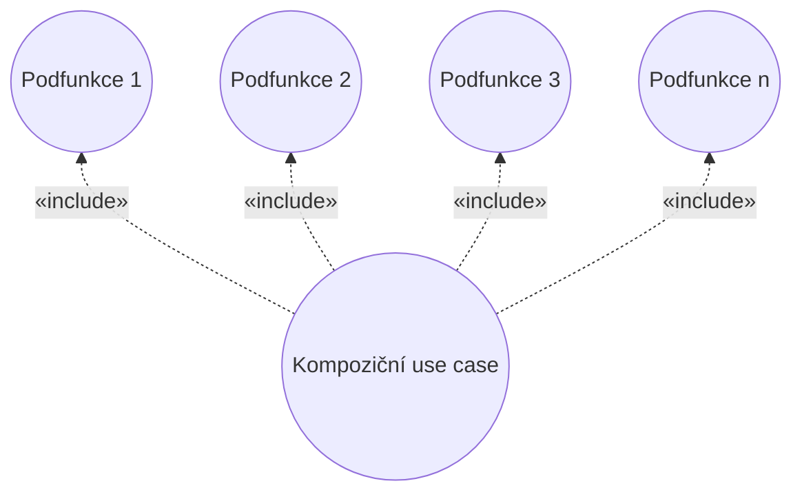

# Mistake: Functional Decomposition

> Zdroj: Övergaard & Palmkvist, Use Cases – Patterns and Blueprints, kap. 40. | Klíčová slova: velký use case, úroveň abstrakce, úrovně use casů, dlouhý use case, rozdělení use casu

## Fault

Jeden velký use case s vazbami «include» na sadu inclusion use casů, z nichž každý modeluje pouhou podfunkci onoho velkého use casu.

## Incorrect Model

Chybný model: tradiční funkční dekompozice aplikovaná na use casy — base use case je jen „skládačkou" vložených use casů. Příklad z knihy: kompilátor rozložený na `Parse Stream`, `Perform Semantic Check`, `Perform Type Check`, `Generate Output` a agregátní use case `Compile Stream` s include vazbami na ně; `Compile Stream` pak neobsahuje prakticky žádné vlastní akce kromě toho, co vkládá. Důsledky: model roste, přibývá dokumentů k údržbě, o vyčleněné use casy nemá zájem žádný stakeholder kromě vývojářů, a hlavně se ztrácí přehled o úplném užití systému.

## Detection

- Nepřiměřeně velký počet vazeb «include» v modelu.
- Base use casy, které kromě toho, co vkládají, v podstatě nic neobsahují.
- Inclusion use casy vkládané jen jediným base use casem.
- Vyčleněný use case nemá vlastní hodnotu pro žádného stakeholdera — jediným důvodem existence je „zviditelnit podfunkci vývojářům" (to není přijatelný důvod).

Legitimní důvody pro vyčlenění podtoku do abstraktního use casu naopak jsou: společný podtok více use casů (commonality), různé konfigurace systému (podtok jen v některých), podtoky definované v různých vrstvách, nebo stakeholder výslovně vyžadující podtok explicitně v modelu.

## Way Out

- Vrať se k základům: ověř, že všechny base use casy skutečně reprezentují **úplná užití systému iniciovaná aktéry**.
- Eliminuj všechny inclusion use casy bez jasné hodnoty pro jiného stakeholdera než vývojáře a sluč je s jejich base use casy: v místě popisu base use casu, kde se vkládá jiný use case, rozhodni, zda vkládaný use case v modelu zůstává; pokud ne, nahraď příkaz k vložení přímo tokem inclusion use casu a vazbu «include» i inclusion use case z modelu odstraň.
- Pokušení funkční dekompozice bývá známkou tak velkého a složitého systému, že je těžké mít zároveň přehled i dostatek detailu — to řeš vzorem [pattern-component-hierarchy](pattern-component-hierarchy.md) nebo [pattern-large-use-case](pattern-large-use-case.md).

> **Náš kontext:** Odpovídá zákazu funkční dekompozice v našich `use-case-rules.md` — use case musí být samostatně spustitelný aktérem a přinášet mu hodnotu; include používáme jen pro skutečně sdílené podtoky, ne pro rozklad na kroky.
