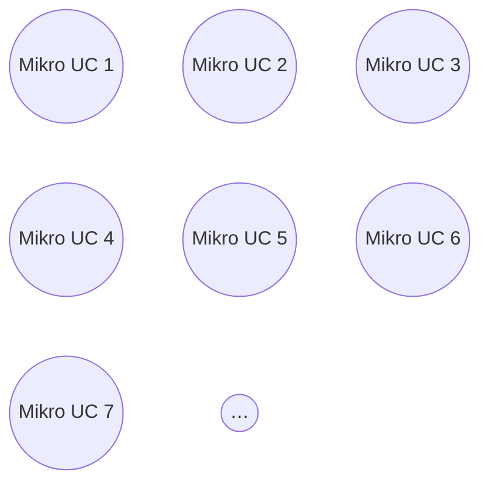

# Mistake: Micro Use Cases

> Zdroj: Övergaard & Palmkvist, Use Cases – Patterns and Blueprints, kap. 41. | Klíčová slova: funkční dekompozice, velký počet use casů, úroveň abstrakce, pořadí use casů, jednoduchá operace, malý use case

## Fault

Jednotlivé operace prováděné uživatelem jsou modelovány jako samostatné use casy — výsledkem je model s obrovským počtem velmi malých use casů.

## Incorrect Model

Chybný model: „mračno" drobných use casů, typicky jeden use case na každou položku menu v GUI — tok sestává z výběru položky uživatelem a odpovědi systému. Příčinou bývá soustředění na to, **jak** se se systémem interaguje (UI), místo na to, **co** s ním uživatel chce udělat. Jediný vstup uživatele s odpovídající reakcí systému zřídka přináší komukoli business hodnotu — nikdo systém nepoužije jen kvůli tomuto jednomu vstupu, nejde tedy o úplné užití. (Takové use casy existují, ale většina use casů sestává z posloupnosti více akcí uživatele.)

## Detection

- Velký počet use casů v modelu.
- Názvy use casů odpovídají jednotlivým operacím / položkám menu.
- Popisové dokumenty mají extrémně krátké toky a téměř žádnou substanci — nikoho nezajímají jednotlivě, jen posloupnosti, v nichž se provádějí.
- Vzniká potřeba vyjadřovat pořadí provádění této hromady use casů; lákavé je i zavést komunikaci mezi use casy — jasný signál, že je něco špatně (viz [mistake-communicating-use-cases](mistake-communicating-use-cases.md)).

## Way Out

- Vyjdi z toho, jak by uživatelé chtěli systém **používat**: pro každou množinu mikro use casů prováděných společně (posloupnost tvořící úplné užití) definuj nový use case.
- Slučuj podle pořadí provádění: založ nový use case pro úplné užití; toky mikro use casů do něj připojuj jeden po druhém v pořadí, v jakém se provádějí (tok prvního = první část nového toku atd.); jakmile je tok mikro use casu připojen, mikro use case z modelu odstraň.
- Výsledné sloučené use casy obsahují akce mikro use casů **přímo ve svém toku**. Nespadni do pasti skládání nových use casů přes vazby «include» na mikro use casy — model by dál obsahoval use casy bez business hodnoty (viz [mistake-functional-decomposition](mistake-functional-decomposition.md)).

> **Náš kontext:** Odpovídá pravidlu v našich `use-case-rules.md` — use case je jen to, co je samostatně spustitelné aktérem a přináší mu hodnotu; jednotlivé operace/obrazovky use casem nejsou.
