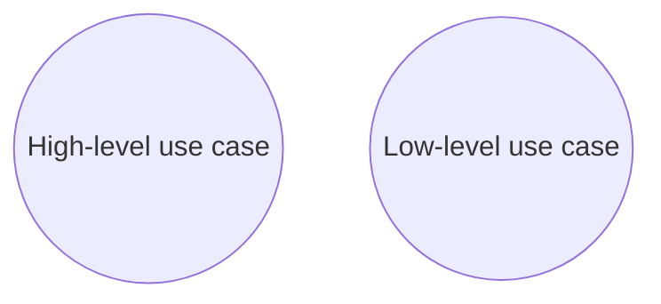
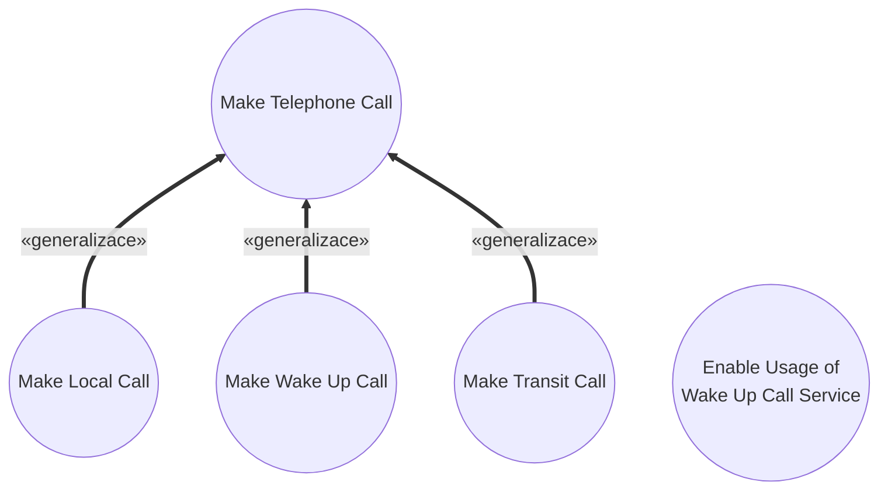

# Mistake: Mix of Abstraction Levels

> Zdroj: Övergaard & Palmkvist, Use Cases – Patterns and Blueprints, kap. 42. | Klíčová slova: business use case, různé kategorie čtenářů, úroveň abstrakce, úroveň detailu, úrovně use casů

## Fault

Use-case model obsahuje use casy definované na různých úrovních abstrakce.

## Incorrect Model

Chybný model: vedle sebe v jednom modelu např. `Make Telephone Call` (obecný tok na vysoké úrovni abstrakce) a `Check Background Noise on a Call Using a Trunk of Type X` (velmi detailní úroveň). Takový model se špatně čte, chápe, realizuje i implementuje. Části služeb systému působí důležitěji jen proto, že jsou rozpracované, zatímco stručně vymodelované části vypadají podružně. Vlastníci a uživatelé systému ocení high-level use casy, ale low-level use casům nerozumějí; vývojáři naopak považují high-level use casy za nedostatečný vstup pro návrh.

## Detection

- Rozdíl bývá patrný už z názvů use casů: některé popisují obecné akce a abstraktní koncepty, jiné detailní akce a konkrétní koncepty.
- Lakmusový test: nech model zrevidovat designéra — zda je dost detailní jako základ pro UC realizaci a návrh. Označí use casy popsané příliš abstraktně (chce víc detailu) a bude si stěžovat na use casy popsané příliš nízko (zabíhají do návrhových otázek).
- Stejnou revizi může udělat business stakeholder (uživatel systému) — bude si stěžovat přesně opačně.

## Way Out

- Finální use-case model musí být dotažen na dost nízkou úroveň abstrakce, aby poskytl dostatečný vstup pro realizaci, návrh a implementaci. Dopracuj proto high-level části modelu tak, aby ladily s low-level částmi: přepiš příliš abstraktní (části) popisů. Popisy musí obsahovat všechny detaily potřebné pro návrh — všechny akce systému nezávislé na platformě a na vnitřní struktuře systému.
- Pozor na opačný extrém: model má stále modelovat **užití** systému a být srozumitelný stakeholderům. Při psaní extrémně detailních popisů hrozí nevědomé vpisování návrhových/implementačních rozhodnutí do toků; a i tak se řada detailů později změní návrhovými rozhodnutími.
- Dopracování high-level částí často znamená nejen zdetailnění popisů, ale i definici nových sad use casů místo těch high-level. Chceš-li původní high-level use casy v modelu ponechat, definuj generalizace od nových low-level konkretizací k high-level use casům:

> **Náš kontext:** Metodika v2 s generalizací mezi UC nepracuje — varianta ponechání high-level use casů přes generalizaci je uvedena pro úplnost, u nás nepreferovaná; high-level use casy raději nahrazujeme novými konkrétními.
