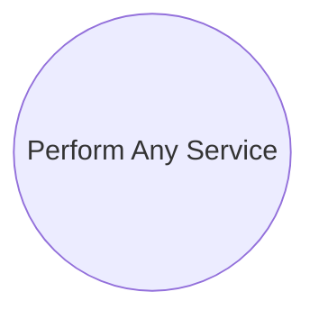

# Mistake: Multiple Business Values

> Zdroj: Övergaard & Palmkvist, Use Cases – Patterns and Blueprints, kap. 43. | Klíčová slova: alternativní tok, business hodnota use casu, velký use case, dlouhý use case

## Fault

Do jednoho use casu je nacpáno příliš mnoho — zachycuje několik cílů či business hodnot najednou.

## Incorrect Model

Chybný model: use case typu „`Do Everything`" / „Perform Any Service". Vzniká často jako přehnaná reakce na příliš mnoho use casů — vývojáři sloučili use casy, které měly zůstat oddělené. Use case má mít jen **jeden cíl**: čtenář pak snadno pochopí jeho účel a hodnotu. Use case s mnoha cíli má mnoho zainteresovaných stakeholderů — rozhodování je komplikované, dělají se chybné předpoklady a kompromisy; velmi obecnou definici čtenáři snadno dezinterpretují a předpokládají, že pokrývá i to, co nenabízí; recenzenti musí číst i to, co je nezajímá. Zrcadlová chyba k [mistake-micro-use-cases](mistake-micro-use-cases.md).

## Detection

- Model má nápadně málo use casů.
- Jednotlivé use casy mají spoustu alternativních toků s **nesourodými cíli**, které nabízejí různé hodnoty různým stakeholderům.
- O jeden use case se zajímá mnoho stakeholderů, z nichž každého zajímá jen malá část.

## Way Out

- Rozděl „Do Everything" use case na několik use casů — jeden pro každou business hodnotu / cíl. Rozdělení nezvyšuje objem vývojové práce (jen počet use casů a dokumentů), ale výrazně zvyšuje srozumitelnost modelu.
- Postup: (1) Nejdřív zreviduj aktéry — často i aktéři zachycují příliš mnoho; zajisti, aby každá role okolí systému interagující s děleným use casem měla samostatného aktéra, případně identifikuj nové aktéry pro jednotlivé role. (2) Pak ber aktéry jednoho po druhém: části velkého use casu, které daný aktér chce využívat, jsou kandidáti na nové use casy. (3) Po identifikaci kandidátů pro všechny aktéry se může ukázat, že některé z nich patří sloučit do `CRUD` use casů — viz [pattern-crud](pattern-crud.md); ostatní kandidáti budou samostatné nové use casy. (4) Po přesunu relevantních částí původního popisu do nových use casů původní use case z modelu odstraň.
