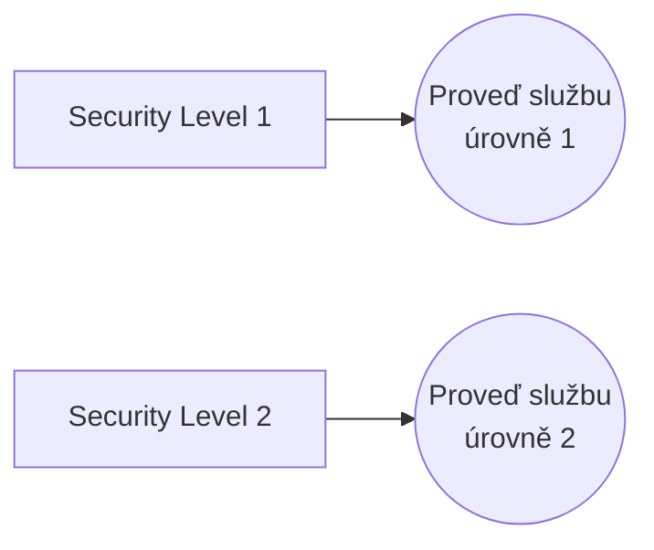

# Mistake: Security Levels with Actors

> Zdroj: Övergaard & Palmkvist, Use Cases – Patterns and Blueprints, kap. 44. | Klíčová slova: přístupová práva, business role

## Fault

Bezpečnostní úrovně omezující, kdo smí používat které služby systému, jsou zachyceny pouze definicí aktérů odpovídajících těmto úrovním.

## Incorrect Model

Chybný model: bezpečnostní úrovně „přilepené" přímo na aktéry. Aktér ale modeluje roli hraném externím uživatelem **z pohledu systému** — tuto roli si uživatel nevolí: jakmile kdokoli (osoba či externí entita) iniciuje daný use case, automaticky hraje roli jeho iniciujícího aktéra. Žádná bezpečnostní kontrola se „magicky" neprovede jen proto, že někdo hraje roli daného aktéra. Kdyby se bezpečnostní požadavky zachytily jen napojením úrovní na aktéry, měl by z pohledu systému kdokoli používající use case daného aktéra jeho bezpečnostní úroveň — což rozhodně nechceme.

## Detection

- Užití systému má být omezeno, ale v modelu chybí explicitní use case pro kontrolu přístupových práv — varovný signál.
- Pro jistotu je nutné projít detaily popisů use casů: kontrola práv může být skryta uvnitř use casů (viz [blueprint-access-control](blueprint-access-control.md)).
- Aktéři pojmenovaní podle bezpečnostních úrovní / oprávnění místo podle rolí užití.

## Way Out

- Aplikuj vhodný `Access Control` blueprint, aby přístupová práva byla explicitně vymodelována — blueprinty pokrývají jak kontrolu práv, tak nastavování práv jednotlivým uživatelům; výběr a aplikaci viz [blueprint-access-control](blueprint-access-control.md).
- Ve většině případů mohou aktéři zůstat beze změny — oprava znamená spíše **doplnění** informací než restrukturalizaci modelu, jde tedy o přímočarý postup.
- Pozn.: aktéři odpovídající business rolím nejsou chybou sami o sobě — role mají v organizaci různé odpovědnosti a používají systém různě; jejich modelování jako aktérů činí model srozumitelným a ověřitelným pro vlastníky a uživatele. Nesmíme ale předpokládat, že aktér = business role, a hlavně nesmíme zapomenout vyjádřit bezpečnost **uvnitř use casů**.
