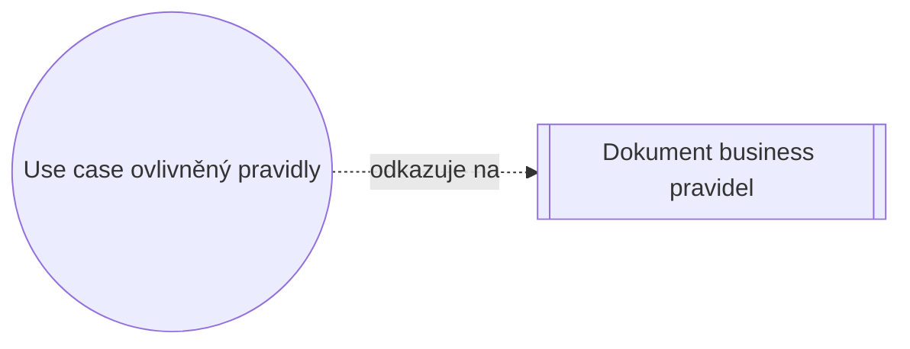
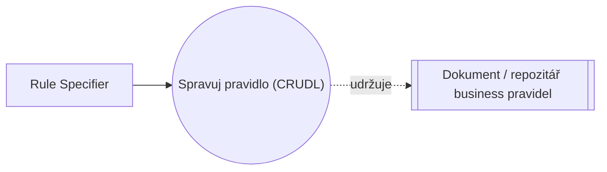

# Pattern: Business Rules

> Zdroj: Övergaard & Palmkvist, Use Cases – Patterns and Blueprints, kap. 16.
> Typ: Description pattern (Static) / Structure + description pattern (Dynamic) | Klíčová slova: definice, legislativní požadavky, seznamy parametrů, politiky, regulace, pravidla, standardy

## Intent

Vyčlenit informace pocházející z politik, pravidel a regulací businessu z popisu scénáře a popsat je jako kolekci business pravidel, na kterou se popisy use casů pouze odkazují. Velmi běžné, jednoduché.

## Patterns

### Business Rules: Static Definition

Aplikuje se na všechny use casy modelující služby, které jsou ovlivněny business pravidly organizace. Neovlivňuje strukturu use-case modelu — týká se pouze popisu use casů. Pravidla jsou popsána v samostatném dokumentu, na který se relevantní popisy use casů odkazují.

**Applicability:** Vhodné, když není potřeba business pravidla dynamicky měnit za běhu systému.

### Business Rules: Dynamic Modification

Model navíc obsahuje jeden use case `Manage Rule`, který business pravidla vytváří, aktualizuje a maže (viz [pattern-crud](pattern-crud.md)).

**Applicability:** Užitečné, když se kolekce pravidel bude měnit dynamicky — tj. za běhu systému.

## Discussion

Většina businessů (banky, medicína, pojišťovny…) má pravidla, regulace, politiky a best practices, které musí každý podpůrný systém respektovat; mohou pocházet od firmy samotné, od vlády, zákazníků či standardů. Souhrnně jim říkáme business pravidla, protože v use-case modelu se s nimi zachází stejně.

Nejjednodušší je pravidla vyjmenovat v dokumentu a dát každému unikátní jméno/identitu; osvědčilo se také definovat je třídním modelem (pravidlo-pojem jako třída, pravidlo-vztah jako asociace, ostatní jako vlastnosti prvků). Business pravidla konstatují fakta o businessu bez ohledu na to, zda je naplní člověk, nebo počítač.

Oddělením specifikace (a případně i implementace) pravidel od zbytku softwaru se business stává agilnějším: pravidla lze měnit, aniž by je brzdily rigidní systémy, a software se snáze přizpůsobuje, protože použití pravidel je explicitní, nikoli zahrabané v kódu. Use casy se identifikují běžným způsobem, mění se jen jejich popis: (1) místo popisu business rozhodnutí přímo ve scénáři se z popisu odkazuje na pravidla, (2) pravidla se popisují v samostatném dokumentu či repozitáři — každé pravidlo je tak popsáno jen jednou, i když ho používá více use casů.

Výhoda i z pohledu řízení projektu: pravidla a use-case model mají obvykle různé vývojové cykly a pravidla schvalují jiní lidé (právníci, experti na standardy), takže je lze revidovat a schvalovat nezávisle. Volba varianty závisí na tom, zda má být možné pravidla měnit za běhu; use case pro správu pravidel se popisuje běžnou technikou ([pattern-crud](pattern-crud.md)). Některé firmy pravidla i implementují odděleně (komponenty, repozitáře, rules produkty, databáze) — změna pravidla (např. úroková sazba) se pak nemusí propisovat do všech aplikací. Vzor je použitelný i na jiné opakující se informace: seznamy atributů, seznamy parametrů, definice, hlavičky, algoritmy apod.

## Example

Zásilková firma: expedice vyžaduje úplnou dodací adresu, logistika alespoň jednu položku v balíku, finance přirážku $2 při hodnotě do $10. Use case `Create Order for Shipping` se na tato pravidla jen odkazuje (Shipping-1 až Shipping-5). Fragment basic flow:

1. **Clerk** zvolí registraci nové objednávky.
2. **Systém** vyžádá dodací adresu a pro každou položku ID a množství.
3. **Clerk** zadá požadované informace; **systém** k položkám zobrazí údaje dle pravidla Shipping-1.
4. **Clerk** požádá o uložení objednávky.
5. **Systém** ověří dodací adresu dle Shipping-2 a počet položek dle Shipping-3.
6. **Systém** doplní přepravní náklady dle Shipping-4, přidělí identitu dle Shipping-5 a objednávku uloží.

Alternativní větve: zrušení registrace, nesprávná adresa, chybějící ID/množství, nedostatek zboží skladem, příliš málo položek — jen naznačeno. Pravidla jsou definována v samostatném dokumentu Business Rules, např. „Shipping-2: Dodací adresa se skládá ze jména, doručovací adresy, města, PSČ a státu příjemce."
