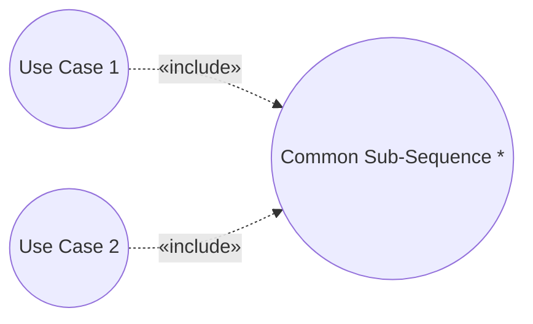
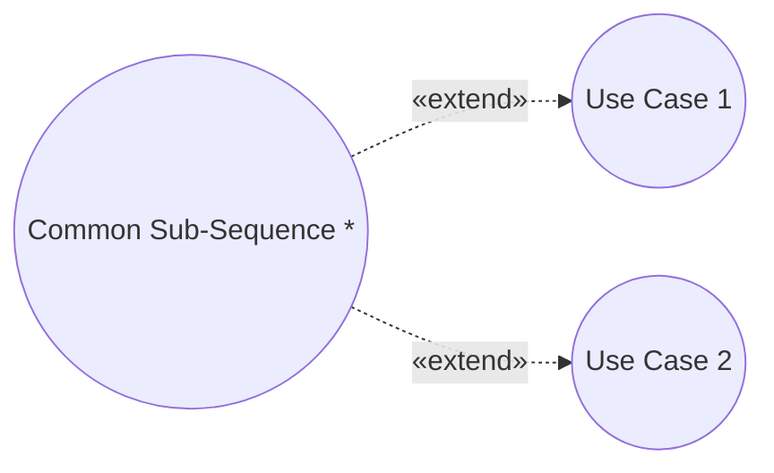
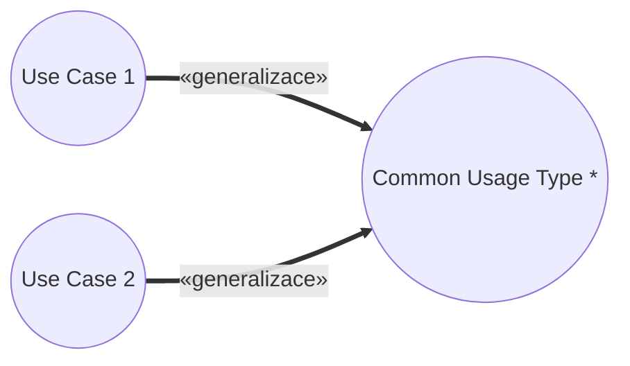

# Pattern: Commonality

> Zdroj: Övergaard & Palmkvist, Use Cases – Patterns and Blueprints, kap. 17.
> Typ: Structure pattern (Reuse, Addition, Specialization) / Description pattern (Internal Reuse) | Klíčová slova: společný typ užití, znovupoužití, stejná subsekvence, podobnosti mezi flow

## Intent

Vyčlenit subsekvenci akcí, která se objevuje na více místech ve scénářích use casů, a vyjádřit ji samostatně. Běžné, základní.

## Patterns

### Commonality: Reuse

Tři use casy: `Common Sub-Sequence` modeluje sekvenci akcí, která se má objevit ve více use casech; ostatní (nejméně dva) modelují užití systému, která tuto společnou subsekvenci sdílejí.

**Applicability:** Subsekvence musí být vcelku — vkládá se jako jeden celek. Ze subsekvence nesmí vést žádné odkazy do míst použití, protože inclusion use case musí být nezávislý na base use casech.

### Commonality: Addition

`Common Sub-Sequence` zde rozšiřuje (extend) use casy sdílející společnou subsekvenci akcí; ostatní use casy modelují flow, která mají být subsekvencí rozšířena.

**Applicability:** Preferované, když jsou ostatní use casy samy o sobě úplné — nepotřebují společnou subsekvenci k tomu, aby modelovaly kompletní užití systému.

### Commonality: Specialization

> **Náš kontext:** Metodika v2 s generalizací mezi UC nepracuje — varianta uvedena pro úplnost, u nás nepreferovaná.

Use casy jsou stejného druhu a modelují se jako specializace use casu `Common Usage Type`. Potomci dědí všechny akce rodiče; mohou přidávat další akce nebo zděděné akce specializovat.

**Applicability:** Použitelné, když jsou užití modelovaná use casy téhož typu a tento typ má být v modelu viditelný.

### Commonality: Internal Reuse

Bez diagramu — jde o techniku popisu jediného use casu (v knize znázorněno jen ikonou dokumentu). Pokud se subsekvence akcí používá na více místech pouze jednoho use casu, nevyčleňuje se do samostatného use casu, ale popíše se v samostatné podsekci popisu daného use casu, na kterou se z jednotlivých míst scénáře odkazuje.

**Applicability:** Preferované, když se společná subsekvence objevuje na více místech pouze v jednom use casu.

## Discussion

Pokud se use casy překrývají jen náhodou a subsekvence se budou vyvíjet nezávisle, není třeba nic dělat. Je-li ale požadavkem, aby subsekvence byly stejné, musí to model vyjádřit: společná subsekvence (včetně svých alternativních větví) se vymodeluje jako samostatný use case a při změně se aktualizuje jen ten. Důležité: společnost musí zahrnovat sekvenci akcí, ne jedinou akci. A pokud neexistuje explicitní požadavek na shodnost, musí být pro zavedení dalšího use casu jiný závažný důvod (např. budoucí reuse) — jinak jen roste složitost modelu bez obhajitelné příčiny.

Volba vztahu: (1) Má-li být subsekvence nezávislá na kontextu užití, použije se include (`Reuse`) — base use casy na inclusion odkazují ze svého flow, opačným směrem odkazy nevedou; celá subsekvence se provádí na jednom místě base use casu (potřebuji-li ji dělit, musí být include pro každou část zvlášť). (2) Přidává-li se nová subsekvence do již existujících use casů, nebo lze-li ji vyjmout, aniž by se staly neúplnými, použije se extend (`Addition`) — existující use casy na rozšíření nijak neodkazují, takže lze extension přidat či odebrat bez dopadu na ně; části extension use casu se mohou vkládat na různá místa, ale musí zachovat své vnitřní pořadí. (3) Provádějí-li use casy podobné úlohy téhož druhu (typy objednávek ve skladu, druhy výrobních direktiv), zavede se rodičovský use case s obecným průběhem a specifika se modelují v potomcích přes generalizaci (`Specialization`). (4) Opakování uvnitř jediného use casu řeší podsekce popisu (`Internal Reuse`) — samostatný use case by jen zvýšil složitost.

Příklady v knihovně: `Reuse` viz blueprinty Item Look-Up a Access Control, `Addition` viz Login and Logout a [pattern-concrete-extension-or-inclusion](pattern-concrete-extension-or-inclusion.md), `Internal Reuse` viz [pattern-large-use-case](pattern-large-use-case.md).

## Example

Skladový systém (varianta Specialization): abstraktní use case `Perform Task` modeluje obecné provedení úlohy — výběr úlohy s nejvyšší prioritou, její provedení (jak, nechává potomkům) a úklid po dokončení. `Generate Pick List` a `Generate Invoicing Basis` jsou jeho specializace. Fragment `Perform Task`:

1. **Task Manager** požádá o spuštění.
2. **Systém** shromáždí úlohy k provedení, které nejsou aktivní, selhané ani odložené; vybere úlohu s nejvyšší prioritou a označí ji jako aktivní.
3. **Systém** úlohu provede. *(specializováno v potomcích)*
4. **Systém** úspěšně provedenou úlohu odstraní.

`Generate Pick List` v kroku 3 sestaví seznam položek k vychystání (lokace ve skladu, množství) a vytiskne jej pro Warehouse Workera; `Generate Invoicing Basis` shromáždí expedované objednávky a odešle podklady fakturace aktéru Financial System. Alternativní větve: selhání úlohy, žádná úloha, nenalezená lokace, chybějící potvrzení — jen naznačeny.
