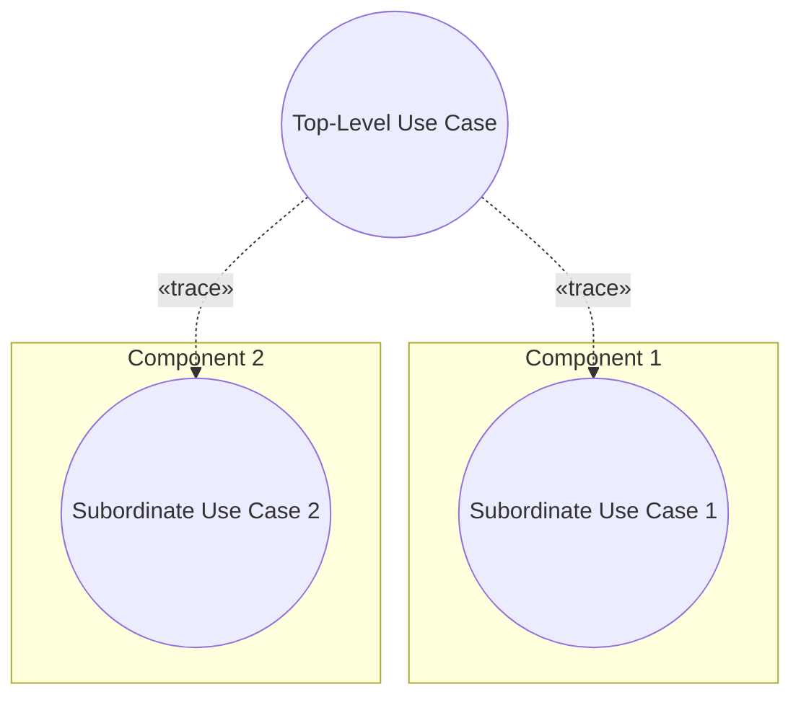
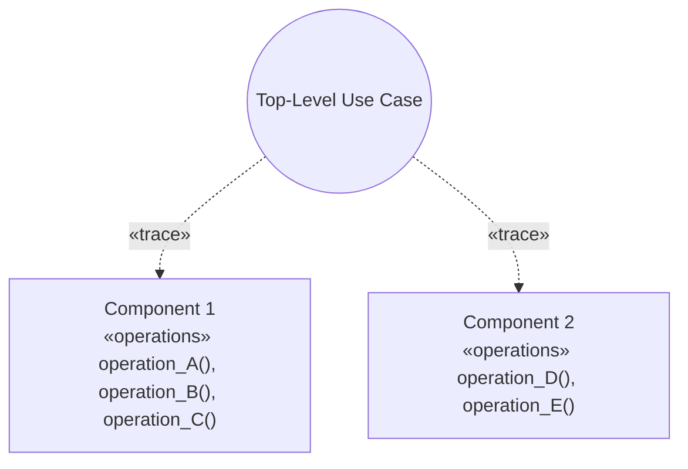
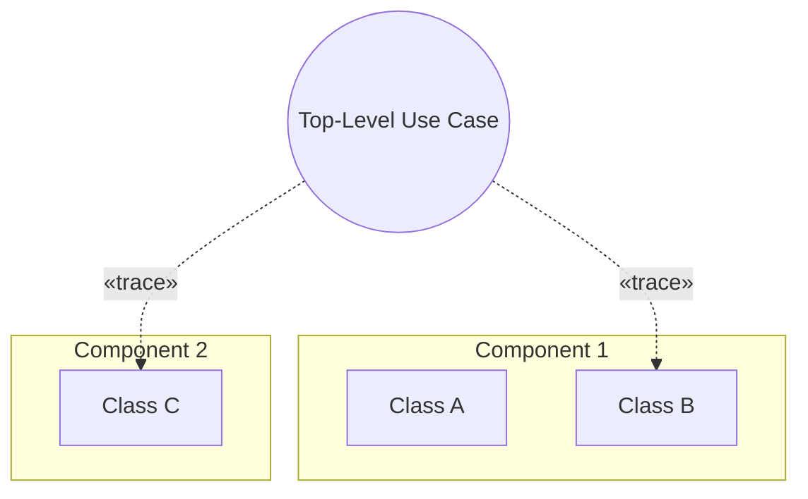

# Pattern: Component Hierarchy

> Zdroj: Övergaard & Palmkvist, Use Cases – Patterns and Blueprints, kap. 18.
> Typ: Structure pattern (všechny varianty) | Klíčová slova: doplnění existujícího flow, komponenta, dekompozice, zapouzdření, subsystém

## Intent

Poskytnout mapování od use casů nejvyšší úrovně, popisujících chování systému jako celku, dolů na listové prvky containment hierarchie, které chování realizují. Běžné, pokročilé.

## Patterns

### Component Hierarchy: Black-Box with Use Cases

Top-level komponenta obsahuje use casy říkající, jak se komponenta používá a jak se chová, aniž odhalují její vnitřní strukturu. Každý top-level use case je namapován (trace) na podmnožinu komponent přímo obsažených v top-level komponentě — jejich instance na provedení use casu spolupracují. Každá nižší komponenta poskytuje black-box specifikaci svého chování pomocí vlastních use casů, čímž odděluje, jak se používá, od toho, jak je vnitřně realizována.

**Applicability:** Preferované, když má být obsah nižší komponenty skryt před jejími uživateli — např. má-li být možné komponentu nahradit jinou nebo restrukturalizovat její vnitřek. Užití nižší komponenty navíc zahrnují sekvence zpráv, ne jen jednotlivé operace.

### Component Hierarchy: Black-Box with Operations

Nižší komponenty jsou specifikovány operacemi místo use casy. Zůstávají nahraditelné a modifikovatelné jako v předchozí variantě, protože operace tvoří black-box specifikaci a skrývají vnitřek komponent.

**Applicability:** Preferované, když okolí používá instance nižších komponent jednoduše a přímočaře a operace nemusí být prováděny v konkrétním pořadí.

### Component Hierarchy: White-Box

White-box specifikace obsažených komponent: top-level use casy se mapují přímo na listy containment hierarchie (třídy uvnitř komponent).

**Applicability:** Použitelné, když obsah nižších komponent nemá být zapouzdřen. Výhoda: snadno pochopitelné mapování a trasovatelnost požadavků shora dolů a zpět. Nevýhoda: úprava či náhrada komponenty vyžaduje změnu mapování top-level use casů (definovaných mimo komponentu) na listové prvky. Pro velké systémy se nedoporučuje — udržovat závislosti mezi top-level use casy a listovými prvky není v praxi možné.

## Discussion

Většina systémů je příliš velká na vývoj vcelku — dělí se top-down na menší části (komponenty/subsystémy), případně se skládá bottom-up z existujících částí. Veškerá funkcionalita vyjádřená use casy celého systému musí být implementována listovými prvky, takže musí existovat mapování top-level use casů na listy — buď ve více krocích (use casy jedné úrovně → komponenty další úrovně atd.), nebo přímo. Vícekrokové mapování umožňuje nahradit či upravit komponentu bez dopadu na mapování top-level use casů; celkové mapování je ale složitější a hůře pochopitelné. U přímého mapování platí argumenty obráceně.

Nahraditelná (black-box) komponenta musí nabízet aspoň stejné operace a používat nanejvýš stejné operace okolí jako její předchůdkyně; žádný vnější prvek nesmí záviset na konkrétním prvku uvnitř komponenty a naopak (asociace nesmí překračovat hranice komponent; v UML to řeší porty). Use case top-level komponenty se proto mapuje jen na komponenty přímo obsažené, ne hlouběji — jinak se ztrácí „plug-and-play".

Operace stačí, když jsou atomické, jednoduché a použitelné v libovolném pořadí (`Black-Box with Operations`). Use casy se hodí, když je chování komponenty složité, používá se ve specifických sekvencích, komponenta má složený vnitřek nebo ji implementuje někdo jiný (`Black-Box with Use Cases`) — komponenta se pak vyvíjí jako samostatný systém. Aktéři use casů komponenty leží vně komponenty, ne nutně vně systému: role aktérů hrají instance sousedních komponent. Fragmenty jednoho top-level use casu se mohou mapovat na několik interních use casů jedné komponenty (v praxi max. ~3) a jeden interní use case může sloužit více top-level use casům. Obě black-box varianty lze míchat; míchat black-box s white-box se nedoporučuje (nekonzistentní míra provázanosti).

Časté chyby: trasování top-level use casů na use casy komponent pomocí include (mísí úrovně abstrakce, náhrada komponenty rozbíjí definici top-level use casu, top-level use case degeneruje na pouhé skládání); generalizace nebo extend jsou ještě horší — systémový use case není téhož typu jako use case komponenty a base use case extend vazby by byl prázdný, což odporuje sémantice. Viz [pattern-crud](pattern-crud.md); souvisí i blueprint Item Look-Up.

## Example

Skladový systém (Black-Box with Use Cases) se dvěma subsystémy: `Order Management` a `Item Management`. Top-level use case `Register Order` je realizován oběma subsystémy: část se mapuje na `Create Order` (Order Management), části na `Check Item` a `Reduce Number of Available Items` (Item Management). Fragment top-level `Register Order`:

1. **Clerk** zvolí registraci objednávky.
2. **Systém** vyžádá jméno a adresu zákazníka; **Clerk** je zadá.
3. **Systém** založí objednávku; **Clerk** zadává identity a počty položek.
4. **Systém** ke každé položce zobrazí popis a ověří dostupné množství.
5. **Clerk** objednávku odešle; **systém** sníží dostupná množství a objednávku uloží.

Uvnitř `Create Order` tytéž kroky probíhají interakcí s aktérem `Item Handler` (rolí, kterou hraje subsystém Item Management): dotaz na existenci položky, popis, dostupné množství, příkaz ke snížení. `Check Item` a `Reduce Number of Available Items` popisují chování Item Managementu vůči obecnému aktérovi `Requestor`. Alternativní větve: chybějící údaje, storno, neexistující položka, nedostatek kusů — jen naznačeny.
