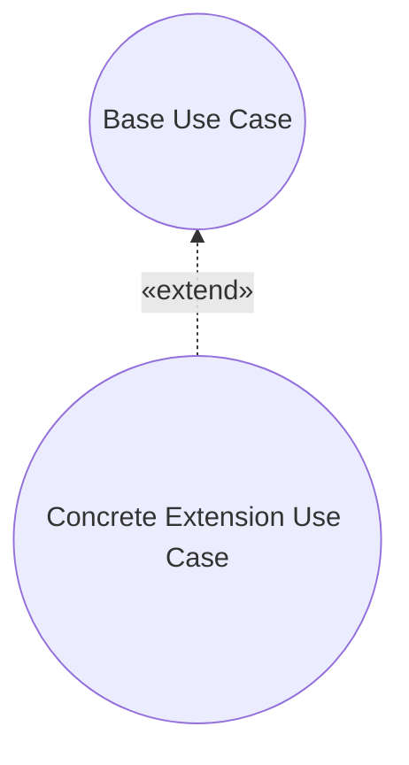
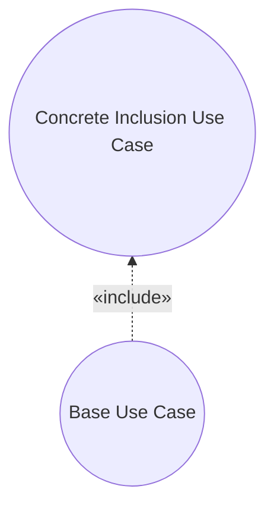

# Pattern: Concrete Extension or Inclusion

> Zdroj: Övergaard & Palmkvist, Use Cases – Patterns and Blueprints, kap. 19.
> Typ: Structure pattern | Klíčová slova: doplnění existujícího flow, úplný subflow, extend, include, reuse, subflow

## Intent

Modelovat týž flow zároveň jako součást jednoho use casu a jako samostatný, úplný use case. Poměrně běžné, základní řešení.

## Patterns

### Concrete Extension or Inclusion: Extension

Dva use casy a extend vazba mezi nimi. Extension use case je konkrétní — může být instanciován samostatně i rozšiřovat base use case. Base use case může být konkrétní i abstraktní.

**Applicability:** Použitelné, když flow může rozšiřovat flow jiného use casu a zároveň být proveden samostatně.

### Concrete Extension or Inclusion: Inclusion

Include vazba z base use casu na inclusion use case, který může být instanciován i samostatně. Base use case může být konkrétní i abstraktní.

**Applicability:** Použitelné, když flow může být vkládán do flow jiného use casu a zároveň být proveden samostatně.

## Discussion

Společný subflow více use casů se — je-li dost podstatný — vyčleňuje do samostatného use casu s include/extend vazbou (viz [pattern-commonality](pattern-commonality.md)); instance use casů to nemění, jen deklarace v modelu. Normálně jsou takto vyčleněné use casy abstraktní: nikdy se neinstancují samostatně, takže nemusí mít pořádný začátek ani interakci s aktérem — jsou to jen deklarace struktury a chování (analogie abstraktní třídy). Nic ale nebrání tomu, aby vyčleněný use case byl zároveň instancovatelný — stejně jako třída může být děděna a současně sama instancována. Use case tedy může mít include vazby od jiných use casů či extend vazby na jiné use casy a přitom být konkrétní.

Jediná záludnost je popis. Řeší se sekcemi Start a End s odstavcem pro každou alternativu:
- **Start:** jeden odstavec pro samostatnou instanci („use case začíná, když aktér…"), druhý pro vložení („Když je use case vkládán do jiných use casů…" — bez jmenování base use casů, inclusion musí zůstat nezávislý). U Extension varianty naopak jeden odstavec na každou extend vazbu: „V use casu XYZ, je-li v extension pointu EP splněna podmínka P, vloží se flow tohoto use casu do instance," plus výčet míst vložení jednotlivých částí.
- **End:** obdobně — „Je-li use case proveden jako samostatná instance…, končí." / „Je-li vkládán, subflow končí a instance pokračuje dle base use casu za místem vložení [kde je k dispozici hodnota R]." / „Rozšiřuje-li use case XYZ, subflow končí a instance pokračuje za extension pointem EP." Pozor: hodnoty získané v extension use casu nejsou v base use casu dostupné — base musí být na extension nezávislý.

Kdy vazbu mezi dvěma konkrétními use casy vůbec zavádět? Jen když má být base use case nějak ovlivněn — např. má použít hodnotu získanou druhým use casem (include), nebo má druhý use case použít hodnotu z base (extend). Instance use casů spolu nekomunikují; sdílení informace vyžaduje jedinou instanci řídící se dvěma provázanými use casy. Vazba se nezavádí jen proto, že se dva use casy provádějí paralelně — aktér klidně používá dva use casy současně (přepínáním oken). Use case může být konkrétní i jako cíl generalizace (např. `Local Call` a `Local Call with Operator` — oba instancovatelné).

## Example

Letenkový systém se třemi konkrétními use casy: `Order Ticket` --«include»--> `Look-Up Flight`; `Present Help` --«extend»--> `Order Ticket` (extension point `Input` u každého vstupu Clerka). Vyhledání letu i nápověda fungují i samostatně; při vložení/rozšíření se chovají kontextově. Fragment `Look-Up Flight`:

1. **Start (samostatně):** **Clerk** požádá o informace o letu; **systém** vyžádá odlet, destinaci a preferovaný čas.
2. **Start (při vložení):** totéž, ale je-li v base use casu vybrán let, **systém** předvyplní jeho destinaci jako výchozí letiště a čas příletu + 1 h jako čas odletu.
3. **Clerk** zadá hodnoty; **systém** vyhledá lety v okně ±3 hodiny a zobrazí číslo letu, odlet a přílet.
4. **End (samostatně):** **Clerk** potvrdí zobrazené informace, use case končí.
5. **End (při vložení):** subflow končí, instance pokračuje dle base use casu za místem vložení; informace o nalezených letech jsou v base use casu k dispozici.

`Present Help` analogicky: samostatně zobrazí obecnou nápovědu, jako rozšíření `Order Ticket` v extension pointu `Input` zobrazí kontextovou stránku; po zavření okna instance pokračuje za extension pointem. Alternativní větev: chybějící vstupy — jen naznačena. Souvisí s [pattern-optional-service](pattern-optional-service.md) a blueprintem Item Look-Up.
