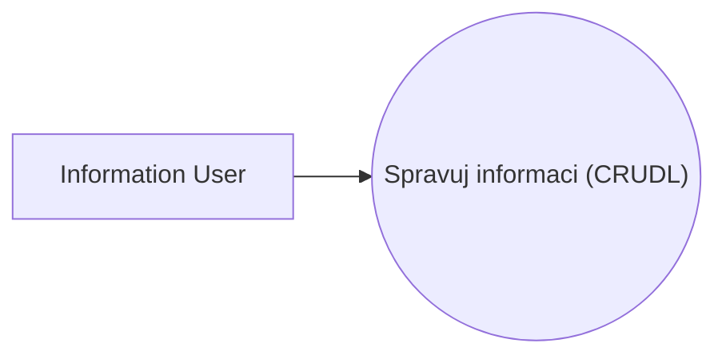
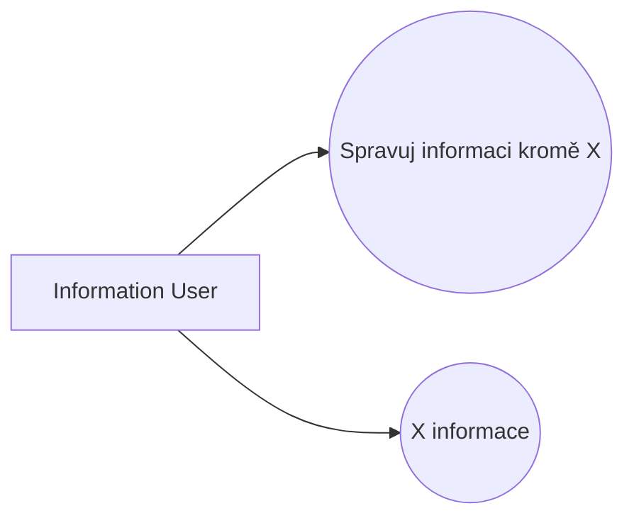

# Pattern: CRUD

> Zdroj: Övergaard & Palmkvist, Use Cases – Patterns and Blueprints, kap. 20.
> Typ: Structure pattern | Klíčová slova: vytvoření dat, čtení dat, aktualizace dat, mazání dat, správa informací, sloučení use casů, krátký flow, jednoduchá operace

> **Náš kontext:** Pattern odpovídá našemu pravidlu „Spravuj XYZ (CRUDL)" z `use-case-rules.md`. CRUD: Complete = naše CRUDL agregace; CRUD: Partial = povolený rozpad, když je jedna operace výrazně složitější; „use case s více basic flows" odpovídá našemu pravidlu promotion Alternate→Basic pro „falešné" alternate scénáře.

## Intent

Sloučit krátké, jednoduché use casy — jako je vytvoření, čtení, aktualizace a smazání informace — do jediného use casu tvořícího konceptuální celek.

## Patterns

### CRUD: Complete

Jediný use case `CRUD Information` (nebo `Manage Information`) modeluje všechny operace, které lze s informací daného druhu provádět: vytvoření, čtení, aktualizaci i smazání.

**Applicability:** Použít, když všechny flows přispívají k téže business hodnotě a všechny jsou krátké a jednoduché.

### CRUD: Partial

Jedna z alternativ use casu je vymodelována jako samostatný use case; zbytek zůstává sloučen.

**Applicability:** Preferované, když je jedna z alternativ významnější, delší nebo výrazně složitější než ostatní.

## Discussion

Systémy často spravují informace, jejichž vytvoření je z pohledu systému triviální: po syntaktické/typové kontrole a případném jednoduchém výpočtu či kontrole business pravidla ([pattern-business-rules](pattern-business-rules.md)) se informace prostě uloží. Čtení, aktualizace a smazání jsou stejně jednoduché — pár vět, jedna dvě drobné alternativy. Jsou to use casy? Ano — někdo používá systém k provedení něčeho. Musí být v modelu? Ano — jinak by model nebyl úplný a stakeholdeři by funkce postrádali (jinak by ani neměly být v systému).

To ale neznamená samostatné use casy pro každou operaci. Podle `CRUD: Complete` se seskupí do jednoho „CRUD" use casu. Výhody: (1) menší model, snazší uchopení; (2) nikdo nestojí o systém jen s podmnožinou operací (např. read a delete bez create a update) — jeden use case `CRUD X` zaručuje, že jsou v modelu všechny čtyři, a každému čtenáři je jasné, kde je hledat; (3) hodnota jednotlivých operací pro stakeholdery je sama o sobě mizivá — hodnotu dává až celek, který tvoří jeden konceptuální celek.

Typická situace, kdy use case nemá jediný basic flow: žádná z operací není „základnější" než ostatní, takže CRUD use case má typicky čtyři basic flows plus pár alternativních. Instance provede právě jednu operaci a zanikne — nečeká na další operaci (tu provede jiná instance téhož use casu). CRUD use case může obsahovat i jiné jednoduché flows (vyhledání položky, jednoduchý výpočet).

Jsou-li jen některé operace jednoduché a jiné složité, seskupí se jednoduché a složité zůstanou samostatné (`CRUD: Partial`). Pokročilé/složité operace se neslučují — budou vyvíjeny, revidovány, navrhovány a implementovány odděleně. Obecné pravidlo při nejistotě: nechat odděleně — rozhodnutí nemění funkcionalitu systému, jen strukturu modelu a její údržbu.

## Example

Ukázka `CRUD: Complete`: use case `CRUD Task` modeluje registraci budoucí úlohy, úpravu registrované a dosud neprovedené úlohy, zrušení úlohy a zobrazení selhaných úloh — čtyři basic flows, žádný není nadřazený ostatním (některé se liší od standardní čtveřice, princip je stejný). Basic flow Register Task:

1. **Task Definer** zvolí registraci nové úlohy.
2. **Systém** nabídne možné druhy úloh a vyžádá druh, název a čas provedení.
3. **Task Definer** zadá požadované informace.
4. **Systém** ověří, že čas je v budoucnosti a název je unikátní.
5. **Systém** zaregistruje úlohu a označí ji jako aktivní (enabled).

Obdobně Modify Existing Task (výběr neaktivní úlohy, úprava vše kromě názvu, kontrola času), Cancel Task (výběr, potvrzení, odstranění) a View Tasks That Failed (výpis úloh se stavem failed). Alternativní větve: zrušení operace kdykoli, neunikátní název či čas v minulosti — jen naznačeny. Užitečné jsou zde i blueprinty Item Look-Up a Future Task.
