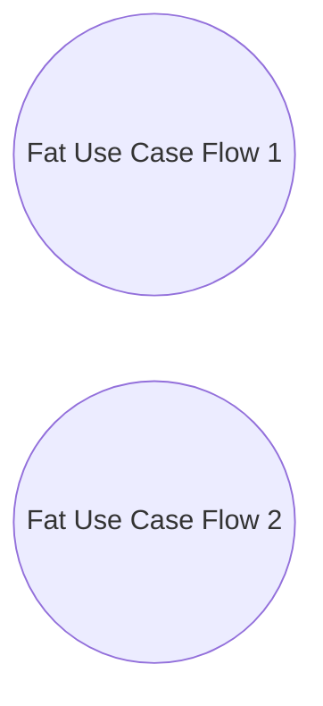

# Pattern: Large Use Case

> Zdroj: Övergaard & Palmkvist, Use Cases – Patterns and Blueprints, kap. 21.
> Typ: Description pattern (Long Sequence) / Structure pattern (Multiple Paths) | Klíčová slova: alternativní flow, rozsáhlý popis use casu, dlouhý use case, více cest, strukturování popisů

## Intent

Strukturovat use case obsahující velké množství akcí. Use case může být velký ve dvou „dimenzích": buď je „dlouhý" — tvořený velmi dlouhou sekvencí akcí — nebo „tlustý" — zahrnuje mnoho různých flows. Středně běžné, základní řešení.

## Patterns

### Large Use Case: Long Sequence

Bez diagramu — jde o techniku popisu (v knize znázorněno jen ikonou dokumentu). Use case sestává z velmi dlouhé sekvence akcí, která se vždy provádí jako jeden celek.

**Applicability:** Nutno zvolit, když by rozdělení velkého use casu vedlo ke dvěma use casům, z nichž jeden se vždy provádí bezprostředně po druhém — aspoň jeden z nich by pak nemodeloval úplné užití systému. Nevyhnutelná daň je velmi dlouhý popis, který vyžaduje chytré strukturování textu.

### Large Use Case: Multiple Paths

Velké užití se modeluje více use casy, z nichž každý modeluje jednu alternativu užití systému.

**Applicability:** Použitelné, když se modelované užití skládá z více alternativních flows. Každý z delších flows lze vymodelovat jako samostatný use case — popisy zůstanou kratší a zvladatelnější, místo slití do jednoho obřího popisu.

## Discussion

Překvapivě častá otázka zní: „Jak velký je use case?" Jednoduchá odpověď (2–3 strany, 4–7 transakcí…) neexistuje; správná odpověď je: use case a jeho popis jsou tak velké, jak musí být. Rada „hlídat popisy delší než tři strany" je dobrá jako varovný signál — příliš dlouhý popis může znamenat, že use case pokrývá příliš mnoho (více business hodnot) nebo je popsán na příliš nízké úrovni detailu. Někdy ale popis dlouhý být musí, protože use case provádí mnoho akcí nebo má mnoho alternativních flows — a pak se nesmí uměle zhušťovat: popis by přišel o potřebné detaily a přestal by být srozumitelný a užitečný pro designéry. Velký use case tedy není automaticky chybný use case.

Pro dlouhý flow (`Long Sequence`) se kromě alternativních flows v samostatných podsekcích nabízejí dvě techniky strukturování: (1) nadpisy uvnitř popisu flow jako v běžném textu — nedoporučuje se však více než dvě úrovně, jinak text zbytečně fragmentuje; (2) vyčlenění souvislých subflows do vlastních podsekcí, odkazovaných z hlavního popisu — spolu s odkazem se v hlavním popisu uvede krátké shrnutí obsahu, takže čtenář získá přehled celého flow a detaily studuje podle potřeby. To se hodí zvlášť tehdy, když popis obsahuje technické detaily nezajímavé pro některé čtenáře (viz [pattern-orthogonal-views](pattern-orthogonal-views.md)). Obě techniky lze kombinovat; cílem zůstává srozumitelnost a revidovatelnost pro všechny stakeholdery — úroveň abstrakce se nemění jen kvůli zkrácení a má být stejná v celém use-case modelu.

Lze-li rozlišit dvě či více stejně důležitých variant use casu, je možné use case rozdělit a varianty povýšit na samostatné use casy (`Multiple Paths`). Mají-li varianty různé business hodnoty, mají být samostatnými use casy vždy; i při stejné hodnotě je lze oddělit kvůli zvladatelnosti popisů. Nikdy ale nedělat samostatný use case z malého alternativního či výjimkového flow — model i popisy by se tím jen znepřehlednily. Sdílí-li několik use casů týž krátký alternativní flow, lze jej vyčlenit do inclusion use casu ([pattern-commonality](pattern-commonality.md)); společná business pravidla se vyčleňují dle [pattern-business-rules](pattern-business-rules.md).

## Example

Ukázka `Long Sequence`: jediný use case `Register Insurance Tender` se čtyřmi aktéry (Insurance Agent, Day-Book, Policy Approver, Approving Committee). Agent, obvykle spolu s budoucím pojistníkem, registruje všechny údaje nabídky životního pojištění; nakonec systém rozhodne, zda jde nabídka k okamžitému schválení, nebo k důkladnějšímu posouzení. Basic flow dává přehled a odkazuje na podsekce s detaily:

1. **Insurance Agent** zvolí registraci nabídky; **systém** se zeptá, zda jde o novou nabídku, nebo existující rozpracovanou (draft), a příslušně ji založí či načte.
2. **Systém** postupně zobrazuje a **Agent** upravuje: údaje pojistníka (viz podsekce Register Policyholder Name), jeho status (viz Register Policyholder Status), oprávněné osoby (viz Register Beneficiaries).
3. **Systém** spočítá předběžné plnění (viz Calculate Preliminary Payout) a zobrazí je.
4. **Agent** doplní platební údaje (viz Register Payment Information).
5. **Systém** zobrazí celou nabídku; **Agent** ji přijme, odloží, nebo smaže.
6. Při přijetí **systém** odešle nabídku do Day-Booku a podle limitů statusu pojistníka nastaví stav „to be approved" (notifikace Policy Approver), nebo „to be evaluated" (notifikace Approving Committee).

Alternativní větev: neplatná identita draftu — jen naznačena. Podsekce Subflows obsahují detailní popisy vyčleněných kroků. Užitečné jsou zde i [pattern-business-rules](pattern-business-rules.md), [pattern-crud](pattern-crud.md) a [pattern-multiple-actors](pattern-multiple-actors.md).
