# Pattern: Layered System

> Zdroj: Övergaard & Palmkvist, Use Cases – Patterns and Blueprints, kap. 22.
> Typ: Structure pattern (Reuse, Addition, Specialization) / Description pattern (Embedded) | Klíčová slova: přístup k nižším vrstvám, aplikačně specifická funkcionalita, směr závislosti, doménová funkcionalita, úroveň abstrakce

## Intent

Strukturovat use-case model tak, aby každý use case byl definován v jedné vrstvě, a pomocí vazeb mezi use casy v různých vrstvách umožnit, aby instance use casu procházely více vrstvami. Běžné ve středních a velkých systémech, pokročilé řešení.

Ve všech variantách jsou dva balíčky (vrstvy) a package import z horní vrstvy do dolní: veřejný (+) obsah dolní vrstvy se stává dostupným v horní vrstvě. Všechny vazby mezi prvky různých vrstev se definují v horní vrstvě. Use case dolní vrstvy je ve své vrstvě veřejný (+), ale v horní vrstvě je importován jako privátní (−), takže se neimportuje do další vrstvy nad ní.

## Patterns

### Layered System: Reuse

```mermaid
graph LR
    subgraph UL["Upper Layer"]
        UUC(("+ Upper UC"))
        LUCi(("&#45; Lower Layer::Lower UC *"))
        UUC -. «include» .-> LUCi
    end
    subgraph LL["Lower Layer"]
        LUC(("+ Lower UC *"))
    end
    UL -. «import» .-> LL
```

Use case definovaný v horní vrstvě má include vazbu na use case definovaný v dolní vrstvě a importovaný do horní. Use case dolní vrstvy je často, ne vždy, abstraktní (viz [pattern-concrete-extension-or-inclusion](pattern-concrete-extension-or-inclusion.md)).

**Applicability:** Vhodné, když instance use casu začíná v horní vrstvě, ale využívá službu definovanou v dolní vrstvě. Nevhodné, když instance začíná v dolní vrstvě.

### Layered System: Addition

```mermaid
graph LR
    subgraph UL["Upper Layer"]
        UUC(("+ Upper UC *"))
        LUCi(("&#45; Lower Layer::Lower UC"))
        UUC -. «extend» .-> LUCi
    end
    subgraph LL["Lower Layer"]
        LUC(("+ Lower UC"))
    end
    UL -. «import» .-> LL
```

Use case horní vrstvy rozšiřuje (extend) use case dolní vrstvy. Instance začíná v dolní vrstvě, ale vkládají se do ní služby definované v horní vrstvě. Use case horní vrstvy je normálně abstraktní — sám o sobě se obvykle neprovádí. Od předchozí varianty se liší jen druhem vazby.

**Applicability:** Použitelné, když instance use casu začíná v dolní vrstvě; nepoužívat, když začíná v horní.

### Layered System: Specialization

```mermaid
graph LR
    subgraph UL["Upper Layer"]
        UUC(("+ Upper UC"))
        LUCi(("&#45; Lower Layer::Lower UC"))
        UUC == «generalizace» ==> LUCi
    end
    subgraph LL["Lower Layer"]
        LUC(("+ Lower UC"))
    end
    UL -. «import» .-> LL
```

> **Náš kontext:** Metodika v2 s generalizací mezi UC nepracuje — varianta uvedena pro úplnost, u nás nepreferovaná.

Use case horní vrstvy je specializací use casu dolní vrstvy (má na něj generalizaci).

**Applicability:** Použitelné, když je horní use case téhož druhu jako dolní (generalizace je taxonomický vztah). Nepoužitelné, kdykoli instance sleduje kombinaci popisů z obou vrstev.

### Layered System: Embedded

Bez diagramu — jde o techniku popisu (v knize znázorněno jen ikonou dokumentu). V dolní vrstvě nejsou k dispozici žádné use casy; přístup k informacím dolní vrstvy se popisuje přímo v popisech use casů horní vrstvy.

**Applicability:** Použít, když horní vrstva provádí nad informacemi dolní vrstvy jen jednotlivé operace, nebo když dolní vrstvu tvoří platforma, kterou nelze měnit. Informace dolní vrstvy se při psaní popisů považují za dostupné v systému.

## Discussion

Netriviální systémy bývají organizovány ve vrstvách: dole obecné/základní části, výše aplikačně specifické. Zásada: prvek smí záviset jen na prvcích téže nebo nižší vrstvy, nikdy vyšší — struktura tak má obecný směr (od specifického k obecnému) a omezují se kruhové závislosti. Zda smí vrstva přistupovat i k vrstvám hlouběji než bezprostředně pod ní, je věc volby; vynucuje se viditelností importovaných prvků (public = viditelné i o vrstvu výš, private = ne). Vzory v knize volí konzervativní přístup (private). Totéž platí při použití frameworku či knihovny komponent — hotové části jdou do dolní vrstvy.

Instance use casu (úplné užití systému) smí procházet více vrstvami, use case samotný ne — patří vždy do jedné vrstvy. Užití zasahující více vrstev se proto rozdělí do několika use casů rozmístěných po vrstvách a spojených vazbami include, extend či generalizace, vždy směřujícími dolů:

- **Jednoduchý přístup k datům dolní vrstvy:** definovat pro to use casy v dolní vrstvě je overkill — byly by triviální a nic by nevysvětlily; použije se `Embedded`.
- **Include (`Reuse`):** flow začíná v horní vrstvě a zčásti pokračuje v dolní (třeba i vícekrát). Např. bankovní systém: dolní vrstva obecné bankovnictví (`View Portfolio`), horní vrstva specifická služba finančního poradenství, která `View Portfolio` includuje.
- **Extend (`Addition`):** flow začíná v dolní vrstvě; include nelze použít (vedl by nahoru), proto extend z horního use casu na dolní. Např. `Deposit Money` (dolní) rozšířený o notifikaci poradce při překročení prahu zůstatku (horní, abstraktní).
- **Kombinace:** instance může začít dole, pokračovat rozšířením nahoře a odtud includovat opět dolní use case (registrace události) atd.
- **Generalizace (`Specialization`):** zejména u frameworků — předdefinované use casy v dolní vrstvě se specializují v aplikační vrstvě; developeři dodají jen specializované části. Např. `Perform Task in Banking` (logování operací s penězi) specializuje obecný `Perform Task` kancelářského systému.

## Example

Bankovní příklad kombinuje varianty Reuse a Addition. Dolní vrstva: `Deposit Money` (konkrétní, extension point `Transaction Completed`) a abstraktní `Register Event`. Horní vrstva: abstraktní `Notify Advisor of Large Balance`, který rozšiřuje `Deposit Money` a includuje `Register Event`. Fragment:

1. **Clerk** zvolí vklad peněz; **systém** vyžádá číslo účtu a částku.
2. **Clerk** zadá údaje; **systém** ověří existenci účtu a povolení vkladu, navýší zůstatek a zaloguje transakci, vytiskne stvrzenku. *(extension point Transaction Completed)*
3. Překročí-li zůstatek práh, vloží se flow `Notify Advisor of Large Balance`: **systém** dohledá vlastníka účtu, zůstatek a odpovědného poradce a notifikuje ho.
4. **Systém** zaregistruje událost dle includovaného `Register Event` (event log: informace o události, datum/čas, identita uživatele).
5. Subflow končí; instance pokračuje dle `Deposit Money` za extension pointem.

Alternativní větve: neexistující účet, účet bez povolení vkladu, nepřiřazený poradce (e-mail hlavnímu poradci) — jen naznačeny. Viz též blueprint Message Transfer: Automatic.
