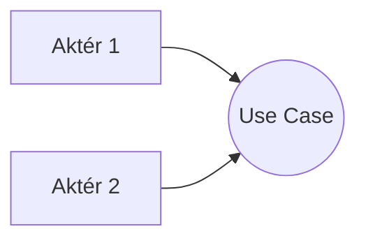
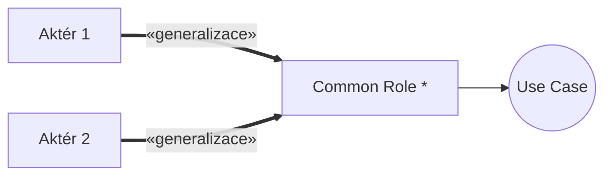

# Pattern: Multiple Actors

> Zdroj: Övergaard & Palmkvist, Use Cases – Patterns and Blueprints, kap. 23.
> Typ: Structure pattern | Klíčová slova: společná role, různé role, generalizace aktérů, překrývající se aktéři, více uživatelů jednoho use casu

## Intent

Zachytit společné rysy aktérů a přitom udržet odlišné role oddělené. Velmi běžné, základní.

## Patterns

### Multiple Actors: Distinct Roles

Jeden use case a (nejméně) dva aktéři.

**Applicability:** Použít, když oba aktéři hrají vůči use casu různé role — interagují s ním odlišně.

### Multiple Actors: Common Role

Oba aktéři hrají vůči use casu tutéž roli. Tuto roli reprezentuje další (obvykle abstraktní) aktér, od kterého oba aktéři dědí generalizací.

**Applicability:** Použitelné, když z pohledu use casu interaguje s každou jeho instancí jen jedna externí entita.

## Discussion

Při identifikaci use casů se často stane, že se s jedním use casem asociují dva aktéři — o užití systému tímto způsobem má zájem více externích entit. Klíčové je zjistit, zda vůči use casu hrají identickou roli, nebo se role liší. Tuto informaci potřebujeme nejen k pochopení detailů use casu, ale i k definici rozhraní systému: kolik externích instancí bude z pohledu use casu interagovat s každou jeho instancí?

Interagují-li s instancí use casu dvě externí instance a chovají-li se odlišně, patří k use casu dva aktéři (`Distinct Roles`). Příklad telefonní ústředny: s use casem `Local Call` jsou asociováni `Caller` i `Callee` — Caller hovor iniciuje, vytáčí číslice a platí za hovor, Callee jej pouze přijímá. Dva aktéři jsou zde správně.

Interaguje-li s každou instancí use casu jen jedna externí entita, musí být s use casem asociován jen jeden aktér — dva aktéři by mylně naznačovali dvě interagující externí instance (`Common Role`). Typicky nastává, když lidé v různých business rolích používají v systému tentýž use case. Pokud se vůči systému jinde chovají odlišně (používají různé use casy), modelují se jako různí aktéři s generalizacemi na abstraktního aktéra reprezentujícího společnou roli. Pokud vůči systému hrají vždy stejnou roli, je relevantní jen společná role a odpovídající aktér je konkrétní — modeluje se pak jen ten jeden.

Příklad letenkového systému: letenku může objednat prodejce i externí agent, ale use case `Order Ticket` mezi nimi nevidí rozdíl — s každou instancí interaguje jedna externí entita. Existují-li už v modelu aktéři `Salesperson` a `Agent` kvůli jiným use casům, zavede se abstraktní aktér `Clerk`, asociuje se s `Order Ticket` a oba aktéři na něj dostanou generalizaci; asociaci tak zdědí. Nejsou-li `Salesperson` a `Agent` potřeba jinde, modeluje se rovnou jen `Clerk`.

## Example

`Local Call` (Distinct Roles) — dvě odlišné role v jedné instanci use casu:

1. **Caller** zvedne sluchátko; **systém** ověří povolení odchozích hovorů, označí Callera jako obsazeného a pošle mu oznamovací tón.
2. **Caller** vytáčí číslice; **systém** analyzuje, zda jich je dost k určení směru hovoru.
3. **Systém** identifikuje Calleeho, označí ho jako obsazeného, požádá síť o spojení, pošle vyzváněcí tón Callerovi a vyzvánění Calleemu.
4. **Callee** hovor přijme; **systém** zastaví tóny.
5. Když **Caller** i **Callee** zavěsí, **systém** požádá síť o rozpojení a oba označí jako volné.

Alternativní větve: zrušení hovoru před přijetím, přerušení a obnovení hovoru — jen naznačeny.

`Order Ticket` (Common Role) — jediný aktér `Clerk`; z popisu use casu není poznat, zda na `Clerk` mají jiní aktéři generalizace. Scénář: Clerk zadá zákazníka, systém ohlásí historii nákupů a VIP status, Clerk zadá nebo vyhledá lety, systém je rezervuje u aerolinek a po potvrzení uloží letenku s rezervačním číslem. Alternativní větve: výpadek spojení s aerolinkou, žádný let, storno rezervace — jen naznačeny. V prvním příkladu se hodí i [pattern-orthogonal-views](pattern-orthogonal-views.md) a [pattern-component-hierarchy](pattern-component-hierarchy.md), ve druhém [pattern-crud](pattern-crud.md).
