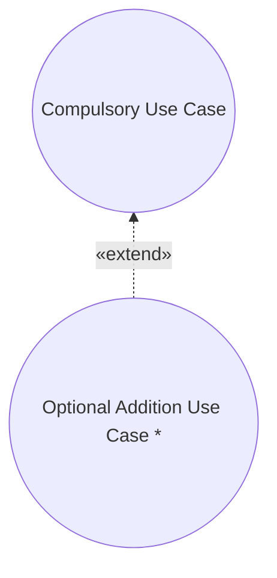
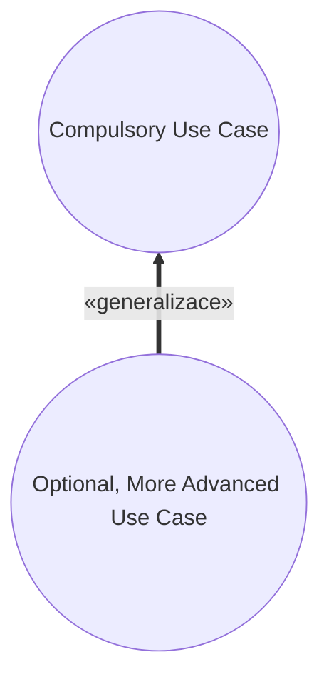
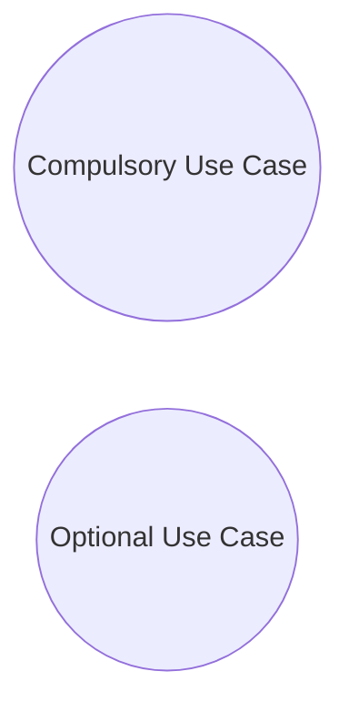

# Pattern: Optional Service

> Zdroj: Övergaard & Palmkvist, Use Cases – Patterns and Blueprints, kap. 24.
> Typ: Structure pattern | Klíčová slova: jednotka objednání, oddělení služeb, konfigurace systému, verze systému

## Intent

Oddělit povinné části use casů od volitelných částí, které lze objednat a dodat samostatně. Běžné, základní řešení.

## Patterns

### Optional Service: Addition

Dva use casy a extend vazba. První modeluje povinné užití systému, druhý volitelný přídavek k prvnímu. Protože druhý use case vyjadřuje jen přidanou část, je abstraktní — sám o sobě se neprovádí. Úplný use case (povinné + volitelné chování) vzniká agregací obou skrze extend.

**Applicability:** Preferované, když je volitelná část čistým přídavkem k povinnému use casu.

### Optional Service: Specialization

> **Náš kontext:** Metodika v2 s generalizací mezi UC nepracuje — varianta uvedena pro úplnost, u nás nepreferovaná.

Povinný use case je specializován do use casu obsahujícího volitelnou část.

**Applicability:** Volí se, když povinný use case obsahuje jednoduchou formu volitelného chování; potomek tuto jednoduchou část specializuje do volitelného, pokročilejšího chování.

### Optional Service: Independent

Nejpřímočařejší varianta: volitelné části se modelují jako samostatné use casy bez vazeb na povinné use casy.

**Applicability:** Použitelné, když je volitelná služba nezávislá na povinných službách.

## Discussion

Z konfiguračního hlediska by bylo katastrofou míchat povinné a volitelné části: povinné se dodávají vždy, volitelné jen na explicitní objednávku. Musí být odděleny nejen v kódu, ale i v modelech — i modely jsou dodávky. Obecněji: části s různými kritérii objednání se oddělují, protože se nedodávají vždy spolu; dvě části mohou být i obě povinné, ale vzájemně se vylučující (plachetnice má kormidelní kolo, nebo kormidelní páku — jedno z toho povinně).

Užití systému často prochází povinnými i volitelnými částmi, takže první návrh use-case modelu obě mísí. Protože ale musí jít dodat verzi modelu pokrývající jen to, co si zákazník objednal, volitelné části se z povinných use casů vyčlení do samostatných use casů: povinný use case pak obsahuje jen akce, které má každá instalace.

Nejzřejmější řešení je extend z volitelné části na povinnou (`Addition`) — jeden z původních účelů extend vazby: přidat k existujícímu modelu části s méně závaznými kritérii objednání beze změn existujících částí. Příklad: textový editor s use casem `Edit Text`; volitelná automatická kontrola pravopisu se vyčlení do abstraktního use casu s extend vazbou (a spolu s administrací slovníku může tvořit balíček celé služby).

Musí-li systém funkci obsahovat vždy — jednoduchou, nebo pokročilou — modeluje se jednoduchá verze jako rodič a pokročilá jako jeho specializace (`Specialization`); základní konfigurace obsahuje rodiče, pokročilejší potomka. Příklad: kontrola pravopisu vždy, ale buď jen zvýraznění chybného slova, nebo automatická oprava — v jedné instalaci smí být jen jedna z variant. Ve variantě tohoto modelu je funkce samotná abstraktním rodičem a jednotlivé verze jsou potomci — doporučeno, když verzí je víc a žádnou nelze považovat za rodiče ostatních.

Jsou-li volitelné části s povinnými nesouvisející (např. výpočet doplňkové statistiky), modelují se jako samostatné use casy bez vazeb (`Independent`).

Pozor: „volitelný" z konfiguračního hlediska nezaměňovat s podmíněným užitím části systému — cílem není vytahovat podmíněné větve do samostatných use casů (to by bylo zcela chybné). Vyčleňují se jen části, které nemají být v každé konfiguraci, a ty ani nemusí ležet v podmíněných větvích. Vzor platí i pro povinnou službu s volbou mezi variantami.

## Example

Ukázka `Addition`: povinný `Create Order` (extension point `Order Saved` — po uložení objednávky) a volitelný abstraktní `Restock Item`, který přidává automatickou kontrolu zásob a generování doobjednávky. Fragment `Create Order`:

1. **Clerk** zvolí registraci nové objednávky; **systém** vyžádá dodací adresu a k položkám ID a počty.
2. **Clerk** vyplní údaje; **systém** k položkám zobrazí název, popis a dostupné množství.
3. **Clerk** požádá o uložení; **systém** zkontroluje adresu a zásoby, sníží skladová množství, přidělí identitu a objednávku uloží. *(extension point Order Saved)*

`Restock Item` (vkládá se vždy v extension pointu Order Saved): pro každou položku objednávky **systém** ověří, zda zásoba neklesla pod práh; pokud ano, vytvoří restock zprávu (odpovědný nákupčí, druh položky, doporučené množství) a pošle ji Clerkovi; poté instance pokračuje dle `Create Order` za extension pointem. Alternativní větve `Create Order`: storno, nesprávná adresa, chybějící údaje, nedostatek kusů — jen naznačeny. Užitečné jsou i blueprinty Message Transfer a [pattern-crud](pattern-crud.md).
