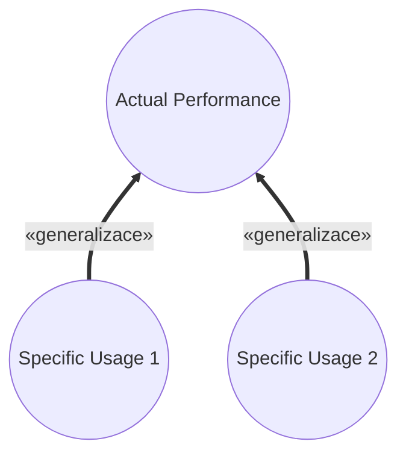

# Pattern: Orthogonal Views

> Zdroj: Övergaard & Palmkvist, Use Cases – Patterns and Blueprints, kap. 25.
> Typ: Structure pattern (Specialization) / Description pattern (Description) | Klíčová slova: různé kategorie čtenářů, vnitřní struktura use-case modelu, úroveň abstrakce, více popisů, uživatelský pohled na model

## Intent

Poskytnout různé pohledy na flows systému, které různí stakeholdeři vnímají odlišně. Ne příliš běžné, pokročilé řešení.

## Patterns

### Orthogonal Views: Specialization

> **Náš kontext:** Metodika v2 s generalizací mezi UC nepracuje — varianta uvedena pro úplnost, u nás nepreferovaná.

Jeden use case a kolekce jeho specializací. Rodič modeluje, co se skutečně provádí uvnitř systému; každý potomek modeluje jedno konkrétní užití rodiče tak, jak je vnímá uživatel.

**Applicability:** Vhodné, když má model explicitně vyjádřit, že několik různých užití systému jsou speciálními případy obecného užití a všechna se interně provádějí stejně, byť je uživatel vnímá odlišně.

### Orthogonal Views: Description

Bez diagramu — jde o techniku popisu (v knize znázorněno jen ikonou dokumentu). Use case zahrnuje mnohem více chování, než uživatelé systému vnímají; modeluje se jako jediný use case a chování „navíc" se popíše v samostatných sekcích popisu use casu.

**Applicability:** Preferované, když různí stakeholdeři vnímají use case různě — někteří si např. nejsou vědomi rozsahu jeho provádění.

## Discussion

U některých systémů (rule-based systémy, meta nástroje) se vnější pohled výrazně liší od vnitřního: uživatel vnímá systém jinak, než jak je skutečně implementován. Uživatelé myslí v konkrétních funkcích, vývojáři ve funkcích, které je třeba implementovat; ostatní stakeholdeři (např. vlastník) patří podle znalosti implementace do jedné z těchto skupin. Příklad: uživatel textového editoru by kontrolu pravopisu, kontrolu gramatiky a návrhy formulací modeloval jako tři use casy; vývojář, který vše implementuje rule-matching technikou (šablona pravidla + tělo), chce use casy pro definici a vyhodnocování pravidel. Oba modely popisují týž systém.

Problém plyne ze dvou hlavních účelů use-case modelu: popsat, jak se systém používá, a být základem realizace. Výjimečně nejde oba cíle naplnit jediným popisem — uživatelský model nepomůže vývojářům implementujícím technikou, která uživatelský pohled neodráží, a vývojářský model zase neodpovídá tomu, jak systém vnímají uživatelé. Pokud se to neřeší explicitně, přinejmenším jedna skupina model nepovažuje za užitečný.

Řešení (`Specialization`): model obsahuje use casy obou stran a pevné vztahy mezi nimi. Každá skupina se soustředí na svou podmnožinu, ale vidí i omezení daná vztahy — use casy druhé skupiny nelze ignorovat. Každý use case, který chtějí uživatelé používat, musí být proveditelný prostředky use casů vývojářů; uživatelské use casy jsou tedy specifickými provedeními vývojářských, což se vyjadřuje generalizací (uživatelské use casy jsou specializace těch realizovaných). I jejich realizace budou speciálními případy realizací rodičů.

Varianta (`Description`): počet akcí uvnitř systému je výrazně větší, než co si vnější pozorovatel uvědomuje (kdo ví, co se děje v telefonní ústředně během hovoru?). Obě skupiny akceptují tentýž model, ale mají protichůdné nároky na popisy: uživatelé by detaily vyloučili, vývojáři na nich trvají. Řešením jsou dva popisy use casu — jeden jak jej vnímají uživatelé, druhý se všemi skutečně prováděnými akcemi. Kvůli riziku nekompatibility dvou dokumentů a redukci jejich počtu se dodatečné popisy často umisťují do samostatných podsekcí popisu use casu: uživatelé chtějí „osekanou" verzi, vývojáři používají úplnou. Souvisí s [pattern-large-use-case](pattern-large-use-case.md).

## Example

Ukázka `Specialization`: `Evaluate and Apply Rules` modeluje skutečné chování systému, `Check Spelling` jak uživatel vnímá jedno z jeho užití. Fragment rodiče `Evaluate and Apply Rules`:

1. **Writer** zvolí vyhodnocení (podmnožiny) pravidel; **systém** načte vybraná, jinak všechna pravidla.
2. **Systém** od začátku textu (či vybrané části) vyhodnocuje každé pravidlo; když pravidlo „vystřelí" (šablona odpovídá textu na aktuální pozici), zobrazí jeho popis Writerovi s volbami: aplikovat tělo pravidla / pokračovat dalším pravidlem / zrušit vyhodnocování.
3. Po vyhodnocení všech pravidel pro aktuální pozici se **systém** posune o slovo dál a opakuje.
4. Na konci textu use case končí.

Potomek `Check Spelling` totéž vypráví uživatelsky: **systém** kontroluje slovo po slovu proti slovníku; nenalezené slovo zobrazí Writerovi s volbami nahradit novým slovem / pokračovat beze změny / přidat slovo do slovníku; konec flow „jak popsáno v use casu Evaluate and Apply Rules". Alternativní větev: Writer může kontrolu kdykoli zrušit — jen naznačena.
