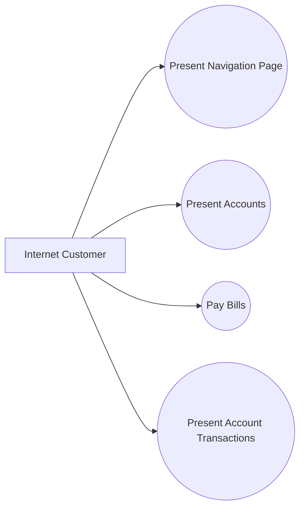

# Pattern: Use-Case Sequence

> Zdroj: Övergaard & Palmkvist, Use Cases – Patterns and Blueprints, kap. 26.
> Typ: Description pattern | Klíčová slova: závislost mezi use casy, pořadí vyvolání, pořadí mezi use casy, precondition, temporální pořadí use casů

## Intent

Vyjádřit temporální pořadí mezi kolekcí use casů, které smějí být vyvolány jen v určitém pořadí, přestože jsou funkčně vzájemně nesouvisející. Velmi běžné, základní řešení.

## Patterns

### Use-Case Sequence

Bez strukturního diagramu — vzor ovlivňuje popisy use casů, mezi nimiž nejsou žádné vazby, ačkoli se mají provádět v určitém pořadí. (Některé use casy mezi sebou vazby mít mohou, ale nikdy se nedefinují kvůli temporálnímu pořadí.) Ilustrace z knižního příkladu — čtyři funkčně nezávislé use casy internetové banky:

**Applicability:** Použít, když mezi use casy existuje temporální pořadí, ale žádná informace získaná instancí jednoho use casu se nemá objevit v instanci jiného.

## Discussion

V mnoha systémech musí uživatel nejprve provést inicializační proceduru (např. login), pak má k dispozici víceméně nezávislé služby a nakonec provádí finalizaci (logout). Ačkoli jsou služby vzájemně nesouvisející, nejsou dostupné všechny najednou — uživatel se k nim naviguje hierarchií menu či grafem webových stránek. Příklad internetové banky: po zadání ID a hesla se zobrazí uvítací stránka se skupinami služeb (účty, portfolio, úvěry…); výběrem skupiny se zobrazí detailnější stránka (čísla účtů, zůstatky) a odtud lze zobrazit transakce vybraného účtu.

Funkčně přitom nic nebrání provést use case kdykoli — např. `Present Account Transactions` bere na vstupu číslo účtu a mohl by běžet kdykoli, pokud by uživatel číslo dodal. Pořadí omezuje uživatelské rozhraní: use case lze iniciovat jen z konkrétních stránek. Jak pořadí vyjádřit? Dvěma způsoby:

- **Preconditions:** precondition use casu říká, v jakém stavu musí systém být při jeho iniciaci — např. u `Present Account Transactions`: „Systém musí právě zobrazovat číslo účtu, který zákazník vybírá." Čtenář pochopí, co muselo proběhnout těsně předtím; specifikátoři GUI a implementátoři podle toho specifikují a implementují rozhraní.
- **Stavový automat:** specifikuje stavy uživatelského rozhraní a přechody mezi nimi; use case proveditelný v daném stavu je uveden na přechodu z tohoto stavu do stavu po jeho provedení. Obvykle popisuje boundary třídu rozhraní, lze jej ale zobecnit na celý systém. Doplňkově lze pořadí vyvolání znázornit i vývojovým/aktivitním diagramem.

Zásadní pravidlo: temporální pořadí se **nevyjadřuje** include ani extend vazbami. Ty popisují vkládání akcí do sekvence akcí jiného use casu (rozšíření instance), ne pořadí mezi různými instancemi. Include/extend se použije jen tehdy, když jeden use case iniciuje sekvenci akcí druhého nebo využívá hodnotu jím spočtenou — pak ale use casy nejsou nezávislé a společně modelují jedno úplné užití systému. Shrnutí: pořadí provádění = preconditions nebo stavový automat; include/extend = iniciace či užití hodnoty.

Autoři vzor přirovnávají ke švédskému stolu (Smorgasbord): všechny pokrmy jsou k dispozici pořád, přesto tradice určuje pořadí — sleď, pak lososy a studené mísy, pak teplá jídla, nakonec dezerty.

## Example

Internetová banka, pořadí vyjádřeno preconditions. Čtyři use casy: `Present Navigation Page` (navigace mezi službami), `Present Accounts`, `Pay Bills` a `Present Account Transactions`. Např. `Present Accounts` má precondition: „Zákazníkovi musí být zobrazena stránka nabízející zobrazení jeho účtů"; `Present Account Transactions`: „Zobrazená stránka musí obsahovat číslo daného účtu." Fragment `Present Accounts`:

1. **Internet Customer** zvolí zobrazení svých účtů.
2. **Systém** si uloží stránku, ze které volba proběhla.
3. **Systém** podle identity zákazníka dohledá jeho účty a ke každému typ, číslo a zůstatek.
4. **Systém** informace zobrazí na nové stránce.
5. Když **Internet Customer** prohlížení ukončí, **systém** obnoví předchozí stránku.

`Pay Bills` obdobně (smyčka zadávání plateb z transakčního účtu; alternativní větev: zákazník nemá transakční účet — jen naznačena). Hodily by se zde i [pattern-crud](pattern-crud.md) a blueprint Future Task.
